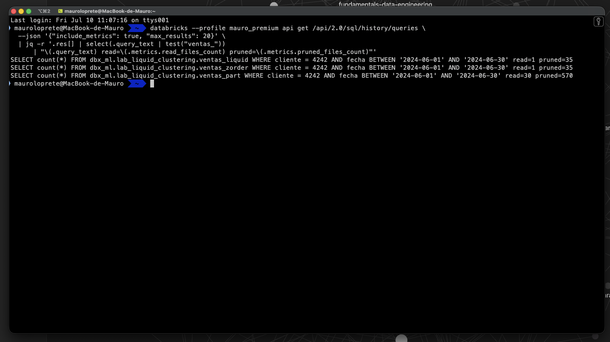
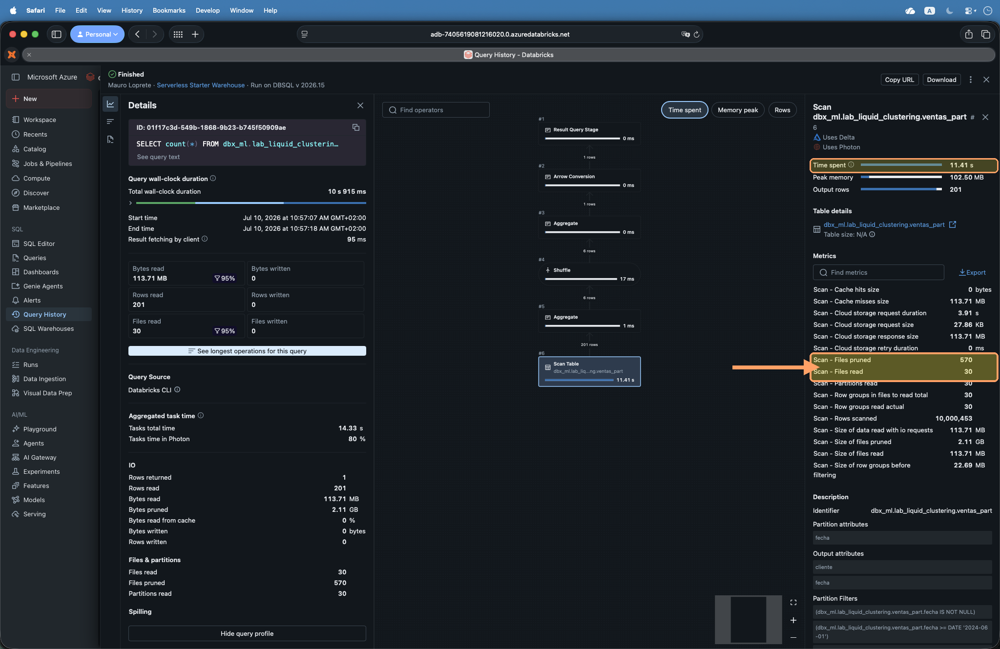

Elegiste mal la columna de partición hace seis meses y hoy tenés diez mil archivos de 3 MB, una carpeta por cada valor y queries que igual escanean media tabla. Cambiarla implica reescribir todo. Corrés `OPTIMIZE ZORDER` cada noche para tapar el agujero, y aun así el data skipping, la capacidad del motor de saltarse los archivos que no le sirven, nunca termina de rendir.

**Liquid Clustering** es la respuesta de Delta Lake a ese dolor: una técnica de organización física de los datos que **reemplaza tanto al particionado como a Z-ORDER**, que podés redefinir sin reescribir la tabla, y que con `CLUSTER BY AUTO` hasta puede elegir las columnas por vos. En este post vemos qué hace, la sintaxis, cómo se ejecuta, los requisitos que importan y un laboratorio para medir cuántos archivos saltea de verdad.

::: callout-note
## TL;DR

- Liquid Clustering reorganiza los archivos de una tabla Delta según unas **clustering keys** para que el motor descarte archivos irrelevantes al filtrar (*data skipping*). **Reemplaza al particionado Hive-style y a Z-ORDER**, y no se combinan.
- El comportamiento base son **keys manuales** (`CLUSTER BY (col)`, hasta 4 columnas). Podés **redefinirlas sin reescribir** los datos existentes, algo imposible con el particionado.
- Es **incremental**: habilitarlo no reordena el histórico. Corrés `OPTIMIZE` (solo toca lo necesario) y, la primera vez o al cambiar keys, `OPTIMIZE FULL`.
- `CLUSTER BY AUTO` (Databricks **elige las columnas** por vos) pide Unity Catalog y Predictive Optimization, y **no existe en Delta open-source**. Liquid en sí es **GA** (Generally Available, o sea estable y soportado) desde **DBR 15.4 LTS**, y está en open-source desde Delta 3.1.0.
- **En el lab** (200 millones de filas): la misma query lee **30 archivos** en la tabla particionada y **1** con Z-ORDER o Liquid Clustering. Experimento reproducible incluido.
- Ojo con el mito: en tablas chicas (**\<10 TB**) meter más keys puede **empeorar** el filtrado por una sola columna.
:::

------------------------------------------------------------------------

## 1. El problema: por qué duelen las particiones y Z-ORDER

Delta Lake, el formato de tablas transaccional por defecto en Databricks, guarda los datos en archivos Parquet más un log de transacciones. Para que una query lea poco, el motor usa **data skipping**: mira las estadísticas (mínimo/máximo por columna) de cada archivo y se saltea los que no pueden contener lo que buscás. Cuanto mejor **agrupados** estén los valores en los archivos, más archivos puede descartar.

Históricamente había dos formas de mejorar ese agrupamiento, y las dos tienen su peaje:

- **Particionado Hive-style**: una carpeta por cada valor de la columna de partición (`país=UY/`, `país=AR/`, …). Funciona con columnas de **baja cardinalidad** (pocos valores distintos). Sus dos males clásicos: el *small files problem* (particiones con muchos archivos chicos, caros de listar y leer) y la **alta cardinalidad** (particionar por `user_id` te da millones de carpetas). Y hay algo peor: **elegiste mal la columna → reescribir toda la tabla** para cambiarla.
- **Z-ORDER**: un reordenamiento que agrupa en los mismos archivos los valores cercanos de varias columnas a la vez (usa una *curva de orden Z*, una forma de recorrer el espacio multidimensional preservando cercanía). Mejora el skipping, pero hay que correr `OPTIMIZE tabla ZORDER BY (cols)` **a mano** y **reescribe de más** cada vez, porque no es incremental: recalcula sobre todo el rango tocado.

En los dos casos terminás administrando el layout de tus datos como una tarea de mantenimiento manual. Liquid Clustering existe para sacarte eso de encima.

## 2. Qué es Liquid Clustering

Liquid Clustering es una técnica de **optimización de layout de datos** de Delta Lake: definís unas **clustering keys** (hasta 4 columnas) y Delta organiza los archivos según esas keys para maximizar el data skipping. La diferencia de fondo con el particionado:

```{r}
#| echo: false
#| warning: false
#| message: false
#| fig-width: 10
#| fig-height: 4.3
#| fig-align: center
#| fig-cap: "Misma query filtrando por cliente. Particionando por fecha, el motor lee toda la tabla porque no puede saltear ninguna partición; clusterizando por cliente lee solo la fracción de archivos cuyo rango cruza el filtro."

library(ggplot2)

navy <- "#1e293b"; orange <- "#FFA166"; bg <- "#f8fafc"
gray <- "#64748b"; skipc <- "#cbd5e1"
qx1 <- 52; qx2 <- 70

make_files <- function(strategy) {
  if (strategy == "part") {
    ymins <- seq(0, 100, length.out = 9)[1:8]
    ymaxs <- seq(0, 100, length.out = 9)[2:9]
    df <- data.frame(xmin = 0, xmax = 100, ymin = ymins, ymax = ymaxs)
    df$read <- TRUE
  } else {
    xs <- seq(0, 100, length.out = 5); ys <- seq(0, 100, length.out = 5)
    g  <- expand.grid(i = 1:4, j = 1:4)
    df <- data.frame(xmin = xs[g$i], xmax = xs[g$i + 1],
                     ymin = ys[g$j], ymax = ys[g$j + 1])
    df$read <- !(df$xmax < qx1 | df$xmin > qx2)
  }
  df$strategy <- strategy; df
}

files <- rbind(make_files("part"), make_files("zorder"), make_files("liquid"))
lab <- c(part = "Particionado por fecha\nlee 8 de 8 archivos",
         zorder = "Z-ORDER (cliente, fecha)\nlee 4 de 16 archivos",
         liquid = "Liquid Clustering (cliente, fecha)\nlee 4 de 16, incremental")
files$strategy <- factor(files$strategy, levels = names(lab), labels = lab)
qband <- data.frame(strategy = factor(lab, levels = lab))

ggplot() +
  geom_rect(data = files, aes(xmin = xmin, xmax = xmax, ymin = ymin, ymax = ymax, fill = read),
            color = "white", linewidth = 0.6) +
  geom_rect(data = qband, aes(xmin = qx1, xmax = qx2, ymin = 0, ymax = 100),
            fill = navy, alpha = 0.10, inherit.aes = FALSE) +
  facet_wrap(~strategy, nrow = 1) +
  scale_fill_manual(values = c(`TRUE` = orange, `FALSE` = skipc),
                    labels = c(`TRUE` = "Archivo leído", `FALSE` = "Archivo salteado"), name = NULL) +
  labs(x = "cliente (alta cardinalidad)", y = "fecha",
       caption = "⚡ Spark de Ideas · mauroloprete.github.io/mauroloprete") +
  coord_cartesian(xlim = c(0, 100), ylim = c(0, 100), expand = FALSE) +
  theme_minimal(base_size = 11) +
  theme(plot.background = element_rect(fill = bg, color = NA),
        panel.background = element_rect(fill = bg, color = NA),
        panel.grid = element_blank(),
        strip.text = element_text(face = "bold", color = navy, size = 9, lineheight = 1.05),
        axis.text = element_blank(), axis.ticks = element_blank(),
        axis.title = element_text(color = gray, size = 8),
        legend.position = "bottom", legend.text = element_text(color = navy, size = 8),
        plot.caption = element_text(color = "#94a3b8", size = 7, hjust = 1, face = "italic"),
        plot.margin = margin(10, 12, 8, 12))
```

Ese ejemplo filtra por una sola columna. La ventaja de fondo se ve al filtrar por **dos**: ordenar los archivos por una columna te obliga a leer la franja entera, mientras que clusterizar en dos dimensiones deja leer solo el archivo del cruce.

```{r}
#| echo: false
#| warning: false
#| message: false
#| fig-width: 10
#| fig-height: 4.4
#| fig-align: center
#| fig-cap: "La misma query filtra por cliente y por fecha. Ordenando solo por cliente hay que leer la franja entera (todas las fechas de ese cliente); clusterizando en dos dimensiones se lee solo el archivo del cruce."

library(ggplot2)

navy <- "#1e293b"; orange <- "#FFA166"; bg <- "#f8fafc"
gray <- "#64748b"; skipc <- "#cbd5e1"; newc <- "#593196"

qx1 <- 55; qx2 <- 70; qy1 <- 52; qy2 <- 68

a <- data.frame(
  xmin = seq(0, 75, by = 25), xmax = seq(25, 100, by = 25),
  ymin = 0, ymax = 100)
a$read <- !(a$xmax < qx1 | a$xmin > qx2)
a$strategy <- "lin"

xs <- seq(0, 100, length.out = 5); ys <- seq(0, 100, length.out = 5)
g <- expand.grid(i = 1:4, j = 1:4)
b <- data.frame(xmin = xs[g$i], xmax = xs[g$i + 1], ymin = ys[g$j], ymax = ys[g$j + 1])
b$read <- !(b$xmax < qx1 | b$xmin > qx2) & !(b$ymax < qy1 | b$ymin > qy2)
b$strategy <- "2d"

files <- rbind(a[, c("xmin","xmax","ymin","ymax","read","strategy")],
               b[, c("xmin","xmax","ymin","ymax","read","strategy")])

lab <- c(lin = "Ordenado por cliente (una dimensión)\nlee toda la franja: 4 de 4 archivos de ese cliente",
         `2d` = "Clustering 2D cliente + fecha (Z-order / Liquid)\nlee solo el cruce: 1 de 16 archivos")
files$strategy <- factor(files$strategy, levels = names(lab), labels = lab)
q <- data.frame(strategy = factor(lab, levels = lab),
                xmin = qx1, xmax = qx2, ymin = qy1, ymax = qy2)

ggplot() +
  geom_rect(data = files, aes(xmin = xmin, xmax = xmax, ymin = ymin, ymax = ymax, fill = read),
            color = "white", linewidth = 0.6) +
  geom_rect(data = q, aes(xmin = xmin, xmax = xmax, ymin = ymin, ymax = ymax),
            fill = NA, color = newc, linewidth = 1, linetype = "dashed", inherit.aes = FALSE) +
  geom_text(data = q, aes(x = (xmin + xmax) / 2, y = ymax + 8, label = "query"),
            color = newc, size = 3, fontface = "bold", inherit.aes = FALSE) +
  facet_wrap(~strategy, nrow = 1) +
  scale_fill_manual(values = c(`TRUE` = orange, `FALSE` = skipc),
                    labels = c(`TRUE` = "Archivo leído", `FALSE` = "Archivo salteado"), name = NULL) +
  labs(x = "cliente", y = "fecha",
       caption = "⚡ Spark de Ideas · mauroloprete.github.io/mauroloprete") +
  coord_cartesian(xlim = c(0, 100), ylim = c(0, 100), expand = FALSE) +
  theme_minimal(base_size = 11) +
  theme(plot.background = element_rect(fill = bg, color = NA),
        panel.background = element_rect(fill = bg, color = NA),
        panel.grid = element_blank(),
        strip.text = element_text(face = "bold", color = navy, size = 8.5, lineheight = 1.05),
        axis.text = element_blank(), axis.ticks = element_blank(),
        axis.title = element_text(color = gray, size = 8),
        legend.position = "bottom", legend.text = element_text(color = navy, size = 8),
        plot.caption = element_text(color = "#94a3b8", size = 7, hjust = 1, face = "italic"),
        plot.margin = margin(10, 12, 8, 12))
```

Lo que lo hace distinto: **podés cambiar las clustering keys sin reescribir** los datos existentes. ¿Elegiste `fecha` y resulta que casi siempre filtrás por `cliente`? Redefinís las keys y, a partir del próximo `OPTIMIZE`, el clustering se acomoda a las nuevas. Con particiones eso es un `CREATE TABLE ... AS SELECT` de toda la tabla.

::: callout-important
## El mito del clustering automático

Un malentendido común (que hasta yo arrastré en mi blog): el comportamiento **base** de Liquid Clustering **no** "aprende los patrones de consulta y se ajusta solo". Eso es exclusivo de `CLUSTER BY AUTO` (sección 5). En el modo base, **vos** elegís las keys; lo que Delta hace es mantener el agrupamiento según esas keys de forma incremental.
:::

## 3. Sintaxis: los tres caminos de `CLUSTER BY`

La cláusula `CLUSTER BY` tiene tres formas. Aplica a Databricks SQL y a Databricks Runtime (DBR, la imagen de Spark + librerías del cluster) 13.3 LTS y superior, solo sobre Delta Lake:

``` sql
-- Tabla nueva
CREATE TABLE ventas (id INT, cliente STRING, fecha DATE)
CLUSTER BY (cliente, fecha);

-- Tabla existente NO particionada
ALTER TABLE ventas CLUSTER BY (cliente, fecha);

-- Desactivar clustering (no reescribe lo ya clusterizado)
ALTER TABLE ventas CLUSTER BY NONE;
```

Reglas que conviene tener claras:

- Hasta **4 clustering keys** por tabla.
- Las keys tienen que ser columnas con **estadísticas recolectadas**. Por defecto Delta junta estadísticas de las **primeras 32 columnas** de la tabla. Una columna más allá de la 32 no sirve como key sin ajustar esa configuración.
- No podés clusterizar por tipos complejos (`StructType`, `MapType`, `ArrayType`) ni por sus elementos. Sí por un campo de struct con notación de punto: `CLUSTER BY (datos.pais)`.

::: callout-warning
## Tabla particionada: otro comando

`ALTER TABLE ... CLUSTER BY` funciona sobre tablas **no particionadas**. Si tu tabla ya está particionada, esto no la convierte: desde DBR 18.1 la conversión directa existe, pero es otro comando (`REPLACE PARTITIONED BY WITH CLUSTER BY`). Mirá la sección 7 (migración).
:::

## 4. Cómo se dispara: el clustering es incremental

Acá está la parte que más confunde: **habilitar el clustering no reordena el histórico**. Le decís a Delta cuáles son las keys, pero los datos que ya estaban siguen donde estaban hasta que corras un `OPTIMIZE`:

``` sql
-- Clusteriza de forma incremental: solo reescribe lo necesario,
-- no toca archivos cuyas keys ya coinciden
OPTIMIZE ventas;

-- Fuerza el recluster de TODOS los registros (DBR 16.4 LTS+)
OPTIMIZE ventas FULL;
```

- `OPTIMIZE` es **incremental**: no toca los archivos que ya están bien agrupados. Barato de correr seguido.
- `OPTIMIZE FULL` fuerza el recluster completo. Databricks lo recomienda **la primera vez que habilitás el clustering** (para acomodar el histórico) o **cuando cambiás las keys**.

Si tenés **Predictive Optimization** activo (el servicio gestionado que corre `OPTIMIZE` y `VACUUM` solo según el uso de la tabla), Databricks dispara el clustering por vos. En ese caso, **apagá los jobs de OPTIMIZE que tengas agendados** para no duplicar trabajo.

Acá está la diferencia real con Z-ORDER, que en el data skipping rendía parecido. Cuando llega un lote nuevo, `OPTIMIZE ZORDER` reordena todo el conjunto para no romper el orden; el `OPTIMIZE` de Liquid Clustering toca solo los archivos afectados:

```{r}
#| echo: false
#| warning: false
#| message: false
#| fig-width: 9
#| fig-height: 4.3
#| fig-align: center
#| fig-cap: "Llega un lote nuevo. Para mantener el orden, Z-ORDER reescribe los 16 archivos; el OPTIMIZE incremental de Liquid Clustering reescribe solo los 3 que el lote toca."

library(ggplot2)

navy <- "#1e293b"; orange <- "#FFA166"; bg <- "#f8fafc"
gray <- "#64748b"; keep <- "#cbd5e1"; newc <- "#593196"

xs <- seq(0, 100, length.out = 5); ys <- seq(0, 100, length.out = 5)
g  <- expand.grid(i = 1:4, j = 1:4)
grid <- data.frame(xmin = xs[g$i], xmax = xs[g$i + 1],
                   ymin = ys[g$j], ymax = ys[g$j + 1], id = 1:16)

z <- grid; z$state <- "rewrite"; z$strategy <- "zorder"
l <- grid; l$state <- "keep"; l$state[l$id %in% c(6, 7, 10)] <- "rewrite"; l$strategy <- "liquid"
files <- rbind(z, l)

lab <- c(zorder = "Z-ORDER: OPTIMIZE ZORDER\nreescribe 16 de 16 archivos",
         liquid = "Liquid Clustering: OPTIMIZE incremental\nreescribe 3 de 16 archivos")
files$strategy <- factor(files$strategy, levels = names(lab), labels = lab)
newbatch <- data.frame(strategy = factor(lab, levels = lab),
                       xmin = 26, xmax = 74, ymin = 26, ymax = 49)

ggplot() +
  geom_rect(data = files, aes(xmin = xmin, xmax = xmax, ymin = ymin, ymax = ymax, fill = state),
            color = "white", linewidth = 0.7) +
  geom_rect(data = newbatch, aes(xmin = xmin, xmax = xmax, ymin = ymin, ymax = ymax),
            fill = NA, color = newc, linewidth = 0.9, linetype = "dashed", inherit.aes = FALSE) +
  geom_text(data = newbatch, aes(x = 50, y = 58, label = "lote nuevo"),
            color = newc, size = 3, fontface = "bold", inherit.aes = FALSE) +
  facet_wrap(~strategy, nrow = 1) +
  scale_fill_manual(values = c(rewrite = orange, keep = keep),
                    labels = c(rewrite = "Archivo reescrito", keep = "Archivo intacto"), name = NULL) +
  labs(x = "cliente", y = "fecha",
       caption = "⚡ Spark de Ideas · mauroloprete.github.io/mauroloprete") +
  coord_cartesian(xlim = c(0, 100), ylim = c(0, 100), expand = FALSE) +
  theme_minimal(base_size = 11) +
  theme(plot.background = element_rect(fill = bg, color = NA),
        panel.background = element_rect(fill = bg, color = NA),
        panel.grid = element_blank(),
        strip.text = element_text(face = "bold", color = navy, size = 9, lineheight = 1.05),
        axis.text = element_blank(), axis.ticks = element_blank(),
        axis.title = element_text(color = gray, size = 8),
        legend.position = "bottom", legend.text = element_text(color = navy, size = 8),
        plot.caption = element_text(color = "#94a3b8", size = 7, hjust = 1, face = "italic"),
        plot.margin = margin(10, 12, 8, 12))
```

::: callout-note
## Por dentro: curva de Hilbert y ZCubes

Dos piezas explican por qué Liquid Clustering saltea más archivos que Z-ORDER y a la vez reescribe poco. La primera es la **curva de Hilbert**, una *curva de relleno de espacio* (una forma de recorrer una grilla de varias dimensiones manteniendo cerca a los puntos vecinos) que Delta usa en lugar de la curva Z de Z-ORDER, y que mejora el data skipping. La segunda son los **ZCubes**: cada `OPTIMIZE` produce un grupo de archivos ya clusterizados y los marca en el log de Delta con un id de ZCube; el siguiente `OPTIMIZE` solo reescribe los archivos que todavía no están clusterizados. Por eso el clustering es incremental y no dispara la reescritura completa (*write amplification*).
:::

## 5. `CLUSTER BY AUTO`: que Databricks elija las columnas

El modo automático. En vez de vos elegir las keys, Databricks las elige según los patrones de consulta reales sobre la tabla:

``` sql
CREATE TABLE ventas (id INT, cliente STRING, fecha DATE)
CLUSTER BY AUTO;
```

Los requisitos son la letra chica que importa:

- **DBR 15.4 LTS+**.
- Tablas Delta **gestionadas por Unity Catalog** (UC, el catálogo de gobernanza de Databricks; ver [Tips #3](../databricks-tips-02-unity-catalog/)).
- **Predictive Optimization** habilitado.
- Corre **asíncrono**: el ajuste de keys no es instantáneo, se acomoda con el tiempo.

::: callout-warning
## AUTO es Databricks-only

`CLUSTER BY AUTO` **no existe en Delta Lake open-source**. Fuera de Databricks siempre especificás las columnas a mano.
:::

## 6. Predictive Optimization: el mantenimiento que se corre solo

Correr `OPTIMIZE`, `VACUUM` y `ANALYZE` a mano es la parte aburrida de tener tablas Delta. **Predictive Optimization** (PO) lo hace por vos sobre las tablas gestionadas de Unity Catalog: Databricks identifica las tablas que se beneficiarían de mantenimiento y las encola, en vez de correr todo a ciclo fijo.

**Qué corre.** `OPTIMIZE` (incluido el clustering incremental de las tablas con Liquid), `VACUUM` (borra archivos que ya no referencia la tabla, según su retención) y `ANALYZE` (recolecta estadísticas para el planner). Un detalle que juega a favor de Liquid: cuando PO corre `OPTIMIZE`, **no** ejecuta `ZORDER`. En una tabla con Z-order, PO ignora los archivos ya ordenados; el resto del mantenimiento (`VACUUM`, `ANALYZE`, compactación) sigue corriendo, pero el orden Z no se mantiene solo.

**Cómo se activa.** Es una propiedad que se hereda en cascada: cuenta → catálogo → esquema → tabla. Cada tabla gestionada toma el valor de la cuenta salvo que lo pises más abajo.

``` sql
ALTER CATALOG mi_catalogo ENABLE PREDICTIVE OPTIMIZATION;
ALTER SCHEMA mi_catalogo.ventas DISABLE PREDICTIVE OPTIMIZATION;
ALTER TABLE mi_catalogo.ventas.hechos INHERIT PREDICTIVE OPTIMIZATION;
```

`INHERIT` vuelve al valor del objeto padre. Para ver si está activo en una tabla usás `DESCRIBE TABLE EXTENDED mi_tabla`, donde el campo `Predictive Optimization` te dice si está en `ENABLE` y si lo heredó. A nivel cuenta se prende en la consola de cuenta, en Settings → Feature enablement. Viene **habilitado por defecto en las cuentas creadas desde el 11 de noviembre de 2024**; para las cuentas más viejas el despliegue es gradual.

**Restricciones y requisitos.** Solo aplica a **tablas gestionadas de Unity Catalog**. Quedan afuera las external tables y las tablas cargadas como recipient de OpenSharing. El trabajo corre en **serverless jobs compute**, necesitás un workspace en plan Premium en una región soportada, y se factura como un SKU de serverless jobs.

::: callout-tip
## PO + Liquid: no pagues el trabajo dos veces

Si tenés Liquid Clustering y Predictive Optimization activos, PO corre el `OPTIMIZE` de tus tablas clusterizadas por vos. Apagá los jobs de `OPTIMIZE` que tengas agendados para no pagar el trabajo dos veces. Y acordate de que `CLUSTER BY AUTO` **depende** de PO: sin PO no puede elegir keys ni reclusterizar. Además PO cambia las keys solo cuando el ahorro previsto por mejor data skipping supera el costo de reclusterizar.
:::

## 7. Migrar desde Z-ORDER y desde particionado

- **Desde Z-ORDER**: usá directamente las columnas de tu `ZORDER BY` como clustering keys. Es prácticamente un reemplazo uno a uno.
- **Desde particionado**: las columnas de partición pasan a ser las clustering keys. Acá el cómo depende del runtime:
  - **DBR 18.1+**: conversión in-place con `ALTER TABLE ventas REPLACE PARTITIONED BY WITH CLUSTER BY (cliente, fecha)` (o `... WITH CLUSTER BY AUTO`).
  - **Runtimes anteriores**: hay que **recrear** la tabla con un `CREATE TABLE ... AS SELECT` (CTAS, o sea "crear tabla a partir de un SELECT") que incluya el `CLUSTER BY`.

::: callout-important
## Sin mezclas: particiones o clustering

Liquid Clustering **no se combina** con particionado ni con Z-ORDER. Es uno o el otro: al migrar, dejás de particionar y de correr `ZORDER`.
:::

## 8. Lab: `CLUSTER BY` vs Z-ORDER vs particionado, midiendo file pruning

El objetivo es medir cuántos archivos **se saltea** el motor en cada estrategia sobre la misma query filtrada. Reutilizamos el patrón de dataset sintético del [lab de Photon (#12)](../databricks-tips-12-photon/):

``` python
# 1. Dataset sintético con skew realista (misma base, tres tablas)
from pyspark.sql import functions as F

base = (spark.range(0, 200_000_000)
        .withColumn("cliente", (F.rand() * 50_000).cast("int"))
        .withColumn("fecha", F.expr("date_add('2024-01-01', cast(rand()*600 as int))"))
        .withColumn("monto", (F.rand() * 1000)))

base.write.mode("overwrite").saveAsTable("lab.ventas_base")
```

``` sql
-- 2. Tres versiones de la tabla
-- (a) Particionada por fecha
CREATE TABLE lab.ventas_part
PARTITIONED BY (fecha) AS SELECT * FROM lab.ventas_base;

-- (b) Z-ORDER por cliente, fecha
CREATE TABLE lab.ventas_zorder AS SELECT * FROM lab.ventas_base;
OPTIMIZE lab.ventas_zorder ZORDER BY (cliente, fecha);

-- (c) Liquid Clustering por cliente, fecha
CREATE TABLE lab.ventas_liquid
CLUSTER BY (cliente, fecha) AS SELECT * FROM lab.ventas_base;
OPTIMIZE lab.ventas_liquid FULL;
```

``` sql
-- 3. La misma query filtrada sobre las tres, midiendo archivos leídos
SELECT count(*) FROM lab.ventas_liquid
WHERE cliente = 4242 AND fecha BETWEEN '2024-06-01' AND '2024-06-30';
```

Para leer cuántos archivos salteó cada una, mirá el **query profile** (métrica *files pruned* / *files read*) o `DESCRIBE DETAIL tabla` para el conteo de archivos.

## 9. Resultados: lectura

Medido sobre **200 millones de filas** en serverless con Photon, con la misma query filtrando por `cliente` **y** `fecha`. Los archivos leídos y salteados salen del query history (`read_files_count` / `pruned_files_count`); el total de archivos, de `DESCRIBE DETAIL`. Salteados: los archivos que el data skipping evitó leer (la métrica del query profile los llama *Files pruned*).

```{r}
#| echo: false
#| warning: false
#| message: false
#| fig-width: 9
#| fig-height: 3.4
#| fig-align: center
#| fig-cap: "Del total de archivos de cada tabla, cuántos leyó la query y cuántos salteó. El particionado no solo lee más: su layout tiene 600 archivos donde el clustering tiene 36."

library(ggplot2)

navy <- "#1e293b"; orange <- "#FFA166"; bg <- "#f8fafc"
gray <- "#64748b"; skipc <- "#cbd5e1"

niveles <- c("Particionado por fecha", "Z-ORDER (cliente, fecha)", "Liquid Clustering (cliente, fecha)")
d <- data.frame(
  estrategia = rep(niveles, each = 2),
  tipo = rep(c("Leídos", "Salteados"), 3),
  archivos = c(30, 570, 1, 35, 1, 35)
)
d$estrategia <- factor(d$estrategia, levels = rev(niveles))
d$tipo <- factor(d$tipo, levels = c("Salteados", "Leídos"))
etiquetas <- data.frame(
  estrategia = factor(niveles, levels = rev(niveles)),
  total = c(600, 36, 36),
  label = c("lee 30 de 600", "lee 1 de 36", "lee 1 de 36")
)

ggplot(d, aes(x = archivos, y = estrategia, fill = tipo)) +
  geom_col(width = 0.6) +
  geom_text(data = etiquetas, aes(x = total + 12, y = estrategia, label = label),
            inherit.aes = FALSE, hjust = 0, size = 3.2, color = navy, fontface = "bold") +
  scale_fill_manual(values = c(Salteados = skipc, Leídos = orange), name = NULL) +
  coord_cartesian(xlim = c(0, 800)) +
  labs(x = "archivos", y = NULL,
       caption = "⚡ Spark de Ideas · mauroloprete.github.io/mauroloprete") +
  theme_minimal(base_size = 11) +
  theme(plot.background = element_rect(fill = bg, color = NA),
        panel.background = element_rect(fill = bg, color = NA),
        panel.grid.major.y = element_blank(),
        axis.text = element_text(color = navy, size = 9),
        axis.title = element_text(color = gray, size = 8),
        legend.position = "bottom", legend.text = element_text(color = navy, size = 8),
        plot.caption = element_text(color = "#94a3b8", size = 7, hjust = 1, face = "italic"),
        plot.margin = margin(10, 12, 8, 12))
```

| Estrategia | Archivos totales | Archivos leídos | Archivos salteados | Bytes leídos | Tiempo del scan |
|--------------|--------------|--------------|--------------|--------------|------------|
| Particionado por fecha | 600 | 30 | 570 | 119 MB | 11.41 s |
| Z-ORDER (cliente, fecha) | 36 | 1 | 35 | 20 MB | 3.31 s (3.4x más rápido) |
| Liquid Clustering (cliente, fecha) | 36 | 1 | 35 | 15 MB | 248 ms (46x más rápido) |

: El tiempo es el *Time spent* del nodo Scan en esta corrida (corrida única, con caché en juego) {.striped}

Dos lecturas. Primero, **particionar por fecha explotó el layout en 600 archivos** (uno por día), el clásico small-files; clusterizar dejó 36. Segundo, la query saltea archivos por fecha en el particionado (de 600 baja a 30, los días de junio), pero como no puede saltear por `cliente` los lee enteros: 30 archivos y 119 MB. Z-ORDER y Liquid saltean por las dos columnas y bajan a **1 archivo**; Liquid encima lee menos bytes (15 contra 20 MB) porque empaqueta mejor con la curva de Hilbert.

::: callout-note
## El estadístico no se queda con una corrida

Confesión: soy estadístico, y una sola corrida no me deja dormir. Una medición sin distribución es una anécdota. Así que corrí la misma query **100 veces por estrategia**, intercaladas (particionado, Z-ORDER, Liquid, y de vuelta) para que el caché y el estado del cluster afecten a las tres por igual:

| Estrategia | Mediana | p25–p75 | Mín | Máx |
|---|---|---|---|---|
| Particionado por fecha | 0.705 s | 0.662–0.734 s | 0.611 s | 1.02 s |
| Z-ORDER (cliente, fecha) | 0.645 s | 0.611–0.688 s | 0.556 s | 0.878 s |
| Liquid Clustering (cliente, fecha) | 0.654 s | 0.615–0.698 s | 0.573 s | 0.809 s |

La lectura honesta: **con el caché caliente las tres convergen**. Z-ORDER y Liquid empatan (9 ms de mediana, adentro del ruido) y el particionado queda ~8% más lento, consistente con leer 30 archivos en vez de 1. El layout no acelera lo que ya está en memoria: paga en la **primera lectura** (el scan frío de la tabla de arriba), en los **bytes movidos** y en el mantenimiento. Moraleja doble: medí con distribución, y sabé qué parte del tiempo estás midiendo.
:::

```{r}
#| echo: false
#| warning: false
#| message: false
#| fig-width: 9
#| fig-height: 4
#| fig-align: center
#| fig-cap: "Distribución del wall-clock de 100 corridas por estrategia, con caché caliente. Cada punto es una corrida; la caja marca mediana y rango intercuartílico."

library(ggplot2)

navy <- "#1e293b"; orange <- "#FFA166"; bg <- "#f8fafc"
gray <- "#64748b"; purple <- "#593196"

corridas <- read.csv("corridas.csv")
labs_map <- c(particionado = "Particionado por fecha",
              liquid = "Liquid Clustering (cliente, fecha)",
              zorder = "Z-ORDER (cliente, fecha)")
corridas$estrategia <- factor(labs_map[corridas$estrategia], levels = labs_map)

ggplot(corridas, aes(x = estrategia, y = segundos, fill = estrategia)) +
  geom_jitter(aes(color = estrategia), width = 0.15, alpha = 0.25, size = 1, show.legend = FALSE) +
  geom_boxplot(alpha = 0.65, outlier.shape = NA, color = navy, linewidth = 0.4, show.legend = FALSE) +
  scale_fill_manual(values = setNames(c(gray, orange, purple), labs_map)) +
  scale_color_manual(values = setNames(c(gray, orange, purple), labs_map)) +
  labs(x = NULL, y = "segundos por corrida",
       caption = "⚡ Spark de Ideas · mauroloprete.github.io/mauroloprete") +
  theme_minimal(base_size = 11) +
  theme(plot.background = element_rect(fill = bg, color = NA),
        panel.background = element_rect(fill = bg, color = NA),
        panel.grid.major.x = element_blank(),
        axis.text = element_text(color = navy, size = 9),
        axis.title = element_text(color = gray, size = 8),
        plot.caption = element_text(color = "#94a3b8", size = 7, hjust = 1, face = "italic"),
        plot.margin = margin(10, 12, 8, 12))
```

## 10. Resultados: escritura

Hasta acá, todo lectura. El otro lado importa igual: llega un **lote nuevo** (10 millones de filas, el 5% de la tabla) y hay que escribirlo y después mantener el orden de cada estrategia:

``` python
# El lote nuevo: 10M filas con la misma distribución.
# Se genera UNA sola vez y se inserta el mismo lote en las tres tablas,
# para que la comparación sea justa.
lote = (spark.range(0, 10_000_000)
        .withColumn("cliente", (F.rand() * 50_000).cast("int"))
        .withColumn("fecha", F.expr("date_add('2024-01-01', cast(rand()*600 as int))"))
        .withColumn("monto", (F.rand() * 1000)))

lote.write.saveAsTable("lab.ventas_lote")
```

``` sql
-- El mismo append en las tres tablas
INSERT INTO lab.ventas_part   SELECT * FROM lab.ventas_lote;
INSERT INTO lab.ventas_zorder SELECT * FROM lab.ventas_lote;
INSERT INTO lab.ventas_liquid SELECT * FROM lab.ventas_lote;

-- El mantenimiento que le sigue a cada estrategia
OPTIMIZE lab.ventas_part;                               -- compacta las particiones
OPTIMIZE lab.ventas_zorder ZORDER BY (cliente, fecha);  -- re-ordena (no es incremental)
OPTIMIZE lab.ventas_liquid;                             -- incremental
```

Cada operación deja sus métricas en el historial de la tabla: archivos creados en el append, archivos y MB reescritos en el mantenimiento.

``` sql
-- numFiles y numOutputBytes del INSERT; numRemovedFiles,
-- numAddedFiles y numRemovedBytes del OPTIMIZE
DESCRIBE HISTORY lab.ventas_liquid LIMIT 2;
```

Así quedó:

```{r}
#| echo: false
#| warning: false
#| message: false
#| fig-width: 9
#| fig-height: 3.2
#| fig-align: center
#| fig-cap: "MB reescritos por el mantenimiento para incorporar un lote nuevo de 113 MB. Z-ORDER reescribe la tabla entera; el OPTIMIZE incremental de Liquid no reescribe nada."

library(ggplot2)

navy <- "#1e293b"; orange <- "#FFA166"; bg <- "#f8fafc"
gray <- "#64748b"; purple <- "#593196"

niveles <- c("Z-ORDER (cliente, fecha)", "Particionado por fecha", "Liquid Clustering (cliente, fecha)")
d <- data.frame(
  estrategia = factor(niveles, levels = rev(niveles)),
  mb = c(2288, 1593, 0),
  label = c("2,288 MB (la tabla entera)", "1,593 MB", "0 MB")
)

ggplot(d, aes(x = mb, y = estrategia, fill = estrategia)) +
  geom_col(width = 0.55, show.legend = FALSE) +
  geom_text(aes(x = mb + 60, label = label),
            hjust = 0, size = 3.2, color = navy, fontface = "bold") +
  geom_vline(xintercept = 113, linetype = "dashed", color = navy, linewidth = 0.4) +
  annotate("text", x = 150, y = 0.6, label = "el lote nuevo: 113 MB",
           hjust = 0, size = 2.8, color = navy, fontface = "italic") +
  scale_fill_manual(values = setNames(c(purple, gray, orange), niveles)) +
  coord_cartesian(xlim = c(0, 3100)) +
  labs(x = "MB reescritos por el mantenimiento", y = NULL,
       caption = "⚡ Spark de Ideas · mauroloprete.github.io/mauroloprete") +
  theme_minimal(base_size = 11) +
  theme(plot.background = element_rect(fill = bg, color = NA),
        panel.background = element_rect(fill = bg, color = NA),
        panel.grid.major.y = element_blank(),
        axis.text = element_text(color = navy, size = 9),
        axis.title = element_text(color = gray, size = 8),
        plot.caption = element_text(color = "#94a3b8", size = 7, hjust = 1, face = "italic"),
        plot.margin = margin(10, 12, 8, 12))
```

| Estrategia | Append del lote | Archivos creados | Mantenimiento | MB reescritos |
|---|---|---|---|---|
| Particionado por fecha | 18.5 s | 600 | `OPTIMIZE` · 40.8 s | 1,593 MB |
| Z-ORDER (cliente, fecha) | 2.5 s | 2 | `OPTIMIZE ZORDER` · 29.3 s | **2,288 MB (la tabla entera)** |
| Liquid Clustering (cliente, fecha) | 1.9 s | 2 | `OPTIMIZE` · 4.8 s | **0 MB** |

Tres historias en una tabla:

- **El particionado fragmenta el append**: el mismo lote se parte en 600 archivos chicos (una carpeta por fecha), tarda casi 10 veces más en escribirse, y la compactación posterior reescribe 1.6 GB.
- **Z-ORDER escribe rápido, pero mantener el orden cuesta la tabla entera**: para incorporar 113 MB nuevos, `OPTIMIZE ZORDER` reescribió 2.3 GB. Esa es la *write amplification* del diagrama de la sección 4, ahora medida.
- **Liquid escribe rápido y mantener el orden no costó nada**: el `OPTIMIZE` incremental terminó en 4.8 segundos sin reescribir un solo archivo (0 archivos, 0 MB).

::: callout-tip
## La analogía del índice

Si venís de bases de datos relacionales, esto te va a sonar. **Liquid Clustering se comporta como un buen índice: acelera la lectura sin castigar la escritura.** Z-ORDER también es un "índice" para leer, pero con el problema clásico del índice caro: cada escritura te obliga a pagar su mantenimiento, que acá es reescribir la tabla completa. Y el particionado es un índice que encima te hace elegir la columna una sola vez y para siempre.
:::

::: callout-tip
## Reproducilo vos

El experimento completo está como Databricks Asset Bundle en [spark-de-ideas-labs/tips/liquid-clustering](https://github.com/mauroloprete/spark-de-ideas-labs/tree/main/tips/liquid-clustering), y corre en Free Edition:

``` bash
databricks bundle deploy
databricks bundle run liquid_clustering_benchmark
```

El notebook reporta el total de archivos (`DESCRIBE DETAIL`), el wall-clock, las corridas repetidas (`timings_raw`, ajustables con `--var bench_runs=N`) y las métricas de escritura (append + mantenimiento). Los **archivos leídos y salteados** no se pueden leer del plan de forma programática en serverless (Spark Connect). En la UI sí están: incluso en un notebook serverless podés abrir el query profile desde el link **See performance**. Para sacarlos de forma programática, los medí corriendo las queries en un SQL Warehouse y leyendo el query history:

``` bash
databricks api get /api/2.0/sql/history/queries \
  --json '{"include_metrics": true, "max_results": 20}' \
  | jq -r '.res[] | select(.query_text | test("ventas_"))
      | "\(.query_text) read=\(.metrics.read_files_count) pruned=\(.metrics.pruned_files_count)"'
```

Así se ve la salida real del comando, con los tres layouts medidos:

{fig-align="center"}

El mismo par de números está en el **query profile** de cada query. Para verlo: abrí la query en Query History, entrá al query profile y seleccioná el nodo **Scan**. En el panel de métricas de la derecha están las filas **Files pruned** y **Files read** (resaltadas en amarillo en las capturas), y arriba el **Time spent** del scan, que muestra el efecto directo del layout:

{fig-align="center"}

{fig-align="center"}

{fig-align="center"}
:::

## 11. Requisitos, compatibilidad y protocolo

- **Disponibilidad**: GA para Delta con **DBR 15.4 LTS+**; Public Preview para Apache Iceberg con DBR 16.4 LTS+; en **Delta open-source desde la 3.1.0**.
- **Protocolo de tabla**: usa **writer version 7 / reader version 3**, y **no se puede degradar**. Traducción práctica: clientes Delta viejos que no soporten esos protocolos **no van a poder leer** la tabla.
- **Incompatibilidades**: no se combina con particionado ni con Z-ORDER.
- **DataFrame API** (Python/Scala): las keys solo se fijan al **crear** la tabla o en modo `overwrite` (`CREATE OR REPLACE`), **nunca en `append`**. Para cambiarlas mientras hacés append, usá `ALTER TABLE` por SQL.
- **Materialized views y streaming tables**: no se les cambian las keys con `ALTER TABLE`; se ajusta la definición del pipeline/vista.

## 12. Gotchas

1.  **Habilitar ≠ reclusterizar.** Poner `CLUSTER BY` no reordena el histórico. La primera vez corré `OPTIMIZE FULL` o vas a ver poca mejora y creer que "no sirve".
2.  **`AUTO` es Databricks-only.** Requiere Unity Catalog + predictive optimization. En Delta open-source no existe: especificás columnas siempre.
3.  **Más keys no es mejor.** En tablas **\<10 TB**, usar 4 keys puede rendir **peor** que 2 cuando filtrás por una sola columna. Empezá con las columnas que realmente filtrás.
4.  **La columna 33 no clusteriza.** Solo las columnas con estadísticas (primeras 32 por defecto) sirven como key. Si tu columna cae más allá, ajustá la config de estadísticas primero.
5.  **Con particiones no es que convenga evitarlo: no se puede.** Es incompatibilidad dura: una tabla es particionada o clusterizada, nunca las dos cosas, y `ALTER TABLE ... CLUSTER BY` falla sobre una tabla particionada. Si venís de una, migrá de verdad (sección 7).
6.  **El protocolo no se baja.** Writer v7 / reader v3 es de ida: verificá que todos tus lectores (conectores, herramientas externas) lo soporten antes de migrar tablas compartidas.

## 13. Cuándo usar Liquid Clustering (y cuándo no)

Databricks recomienda Liquid Clustering para **todas las tablas nuevas**. Los casos que más se benefician: filtros sobre columnas de **alta cardinalidad**, tablas con **skew** fuerte (valores muy desbalanceados), **crecimiento rápido**, **escrituras concurrentes** y patrones de acceso que cambian con el tiempo.

| Situación | ¿Liquid Clustering? | Por qué |
|------------------------|------------------------|------------------------|
| Tabla nueva, cualquier tamaño | **Sí** | Es la recomendación por defecto de Databricks |
| Filtrás por columna de alta cardinalidad | **Sí** | Donde el particionado sufría, esto brilla |
| Ya usás Z-ORDER | **Sí, migrá** | Reemplazo casi uno a uno, y encima incremental |
| Lectores con clientes Delta viejos | **Cuidado** | Protocolo v7/v3 no degradable: pueden no leerla |
| Necesitás `AUTO` pero estás en Delta open-source | **No (AUTO)** | AUTO es Databricks-only; usá keys manuales |
| Tabla chica y filtrás siempre por una sola columna | **Con 1-2 keys** | Meter 4 keys puede empeorar el data skipping |

------------------------------------------------------------------------

## Referencias

- [Use liquid clustering for tables — Azure Databricks](https://learn.microsoft.com/en-us/azure/databricks/tables/clustering)
- [Use liquid clustering for tables — Databricks on AWS](https://docs.databricks.com/aws/en/tables/clustering)
- [CLUSTER BY clause (TABLE) — SQL reference](https://learn.microsoft.com/en-us/azure/databricks/sql/language-manual/sql-ref-syntax-ddl-cluster-by)
- [Use liquid clustering for Delta tables — Delta Lake open-source](https://docs.delta.io/delta-clustering/)
- [Delta Lake 3.1.0 release: Liquid Clustering con curva de Hilbert y ZCubes](https://delta.io/blog/delta-lake-3-1/)
- [Predictive optimization for Unity Catalog managed tables](https://learn.microsoft.com/en-us/azure/databricks/optimizations/predictive-optimization)

## Otros posts de la serie

Si te sirvió este post, mirá los anteriores de **Databricks Tips**:

- [**Tips #1**: Databricks Asset Bundles](../databricks-asset-bundles-advanced/) — IaC para Databricks
- [**Tips #2**: Delta Lake](../databricks-tips-01-delta-lake/) — las 7 cosas que te hubiera gustado saber
- [**Tips #3**: Unity Catalog](../databricks-tips-02-unity-catalog/) — gobernanza que nadie implementa bien
- [**Tips #4**: Structured Streaming](../databricks-tips-03-structured-streaming/) — watermarks, triggers y micro-batch
- [**Tips #5**: MLflow + Unity Catalog](../databricks-tips-04-mlflow-unity-catalog/) — del experimento al modelo
- [**Tips #6**: Feature Engineering](../databricks-tips-05-feature-engineering/) — features que sobreviven a producción
- [**Tips #7**: Docker en Databricks](../databricks-tips-06-docker-containers/) — contenedores custom
- [**Tips #8**: Jobs & Workflows](../databricks-tips-08-jobs-workflows/) — streaming y triggers event-driven
- [**Tips #9**: SQL Warehouses](../databricks-tips-09-sql-warehouses/) — el compute que se prende solo
- [**Tips #10**: AI Gateway](../databricks-tips-10-ai-gateway/) — governance centralizada para LLMs
- [**Tips #11**: Lakeflow Declarative Pipelines](../databricks-tips-11-lakeflow-declarative-pipelines/) — pipelines declarativos con calidad built-in
- [**Tips #12**: Photon](../databricks-tips-12-photon/) — el motor C++ que acelera tus queries
- [**Tips #13**: OpenSharing](../databricks-tips-13-opensharing/) — compartir sin copiar

------------------------------------------------------------------------

*Siguiente post de la serie: Query Federation, o cómo consultar ese Postgres que nadie quiere migrar sin mover un byte.*