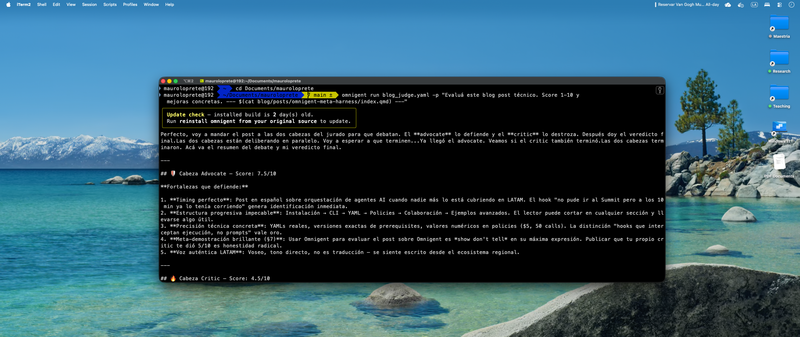

No pude ir al Databricks AI Summit este año. Pero a los 10 minutos de leer el anuncio ya tenía Omnigent corriendo en mi máquina. Acá va todo lo que encontré.

**Omnigent** es un meta-harness open source (Apache 2.0) que se pone *por encima* de los agentes que ya usás --- Claude Code, Codex, Pi, o tus propios agentes --- y los convierte en piezas intercambiables de un sistema más grande. Lo construyeron el equipo de AI de Databricks junto con Neon.

::: callout-note
## TL;DR

-   **Meta-harness**: una capa arriba de los harnesses (Claude Code, Codex, Pi) que los compone sin reescribir código.
-   **Policies**: spend caps, rate limiting, aprobación de shell --- a nivel de servidor, agente o sesión.
-   **Colaboración**: compartí sesiones por URL, co-driving en tiempo real, fork de conversaciones.
-   **YAML-first**: un agente es un archivo YAML con prompt, harness, tools y sub-agentes.
-   **Open source**: Apache 2.0 en [GitHub](https://github.com/omnigent-ai/omnigent).
:::

------------------------------------------------------------------------

## 1. Instalación

Prerequisitos: Python 3.12+, `uv`, `git`, Node.js 22 LTS con npm, y `tmux`.

Elegí **uno** de estos métodos:

``` bash
# Recomendado: script oficial (instala todo)
curl -fsSL https://omnigent.ai/install.sh | sh
```

Alternativas si preferís manejarlo vos:

``` bash
uv tool install omnigent     # via uv
pip install "omnigent"        # via pip
brew install omnigent-ai/tap/omnigent  # macOS con Homebrew
```

Si usás **Databricks como model provider** (modelos servidos, DBRX, endpoints custom):

``` bash
uv tool install "omnigent[databricks]"
```

Después, configurá las credenciales con el wizard interactivo:

``` bash
omnigent setup
```

Te va a pedir las API keys o suscripciones según los harnesses que quieras usar. Verificá que todo esté bien con:

``` bash
omnigent --version
# omnigent, version 0.1.0
```

``` bash
omnigent config list
# host.host_id: host_e4dc98fc...
# host.name: 192.168.x.x
# providers.claude.cli: claude
# providers.claude.default: true
# providers.claude.kind: subscription
# providers.codex.cli: codex
# providers.codex.default: true
# providers.codex.kind: subscription
# tui.theme: dark
```

Si tenés suscripciones de Claude y Codex, Omnigent las detecta automáticamente. Para API keys (OpenAI, Anthropic), las podés setear como variables de entorno o vía `omnigent setup`.

------------------------------------------------------------------------

## 2. Primeros pasos: CLI

El CLI es simple. `omnigent` o `omni` abre una sesión interactiva. Estos son todos los comandos disponibles:

``` bash
omnigent --help
# Usage: omnigent [OPTIONS] COMMAND [ARGS]...
#
#   Omnigent CLI.
#
# Commands:
#   attach   Attach the REPL to a LIVE session
#   claude   Launch Claude Code in an Omnigent terminal
#   codex    Launch Codex TUI in an Omnigent terminal
#   config   Get, set, and view Omnigent defaults and credentials
#   debby    Launch debby, the bundled brainstorming agent
#   host     Register this machine as a host with a server
#   login    Authenticate with a remote Omnigent server
#   polly    Launch polly, the bundled multi-agent coding orchestrator
#   resume   Resume an Omnigent conversation
#   run      Start a session with an Omnigent agent
#   server   Start the Omnigent server or manage the daemon
#   setup    Launch the first-time setup flow
#   stop     Stop everything Omnigent is running on this machine
```

Los más importantes para arrancar:

| Comando                   | Qué hace                                      |
|---------------------------|-----------------------------------------------|
| `omnigent`                | Sesión interactiva con el harness por defecto |
| `omnigent claude`         | Lanzar Claude Code                            |
| `omnigent codex`          | Lanzar Codex                                  |
| `omnigent run agent.yaml` | Ejecutar un agente custom                     |
| `omnigent server start`   | Web UI en `localhost:6767`                    |

------------------------------------------------------------------------

## 3. Anatomía de un agente YAML

Acá está lo más interesante. Un agente en Omnigent es un archivo YAML que declara qué hace, con qué harness, qué tools tiene y opcionalmente sub-agentes a los que puede delegar:

``` yaml
name: data_pipeline_reviewer
prompt: |
  Sos un reviewer experto en pipelines de datos.
  Revisás código de Spark, dbt y SQL buscando problemas
  de performance, calidad de datos y buenas prácticas.

executor:
  harness: claude-sdk    # también: codex, pi, openai-agents

tools:
  lint_sql:
    type: function
    callable: tools.sql_linter.run_lint

  check_lineage:
    type: agent
    prompt: |
      Analizá el lineage del pipeline y reportá
      dependencias circulares o tablas huérfanas.
    tools:
      lint_sql: inherit    # hereda tools del agente padre
```

Lo clave:

-   **`harness`** define qué modelo/runtime usa el agente. Cambiar de Claude a Codex es cambiar una línea.
-   **`tools`** pueden ser funciones Python locales o sub-agentes completos.
-   **`inherit`** permite que un sub-agente use las tools del padre sin redefinirlas.

------------------------------------------------------------------------

## 4. Policies: governance real, no prompts

Las policies son lo que diferencia a Omnigent de simplemente correr `claude` en la terminal. Operan a tres niveles: servidor, agente y sesión.

``` yaml
policies:
  # Pedir aprobación antes de tocar el filesystem o red
  approve_shell:
    type: function
    handler: omnigent.policies.builtins.safety.ask_on_os_tools

  # Limitar cantidad de tool calls por sesión
  cap_calls:
    type: function
    handler: omnigent.policies.builtins.safety.max_tool_calls_per_session
    factory_params:
      limit: 50

  # Budget máximo por sesión
  budget:
    type: function
    handler: omnigent.policies.builtins.cost.cost_budget
    factory_params:
      max_cost_usd: 5.00
      ask_thresholds_usd: [3.00]
```

Esto es governance real:

-   **`ask_on_os_tools`**: el agente te pide permiso antes de ejecutar comandos de shell o tocar archivos. No es un prompt --- es un hook que intercepta la ejecución.
-   **`max_tool_calls_per_session`**: tope duro de invocaciones. Útil para evitar loops infinitos.
-   **`cost_budget`**: límite de gasto en USD. Te avisa cuando llegás al threshold y frena cuando llegás al máximo.

Pero esto es solo la punta del iceberg. El registry de policies built-in tiene **17+ policies** organizadas por categoría:

| Categoría | Policies | Ejemplo |
|--------------------------|------------------------|----------------------|
| **Safety** | `ask_on_os_tools`, `max_tool_calls_per_session`, `blast_radius` | Limitar qué archivos/dirs puede tocar un agente |
| **Cost** | `cost_budget`, `token_budget`, `rate_limit` | Budget en USD o tokens, rate limiting por minuto |
| **Privacy** | `pii_detection`, `redact_secrets` | Detectar y redactar PII o secrets antes de enviar al modelo |
| **Access** | `github_access_control`, `file_allowlist` | Restringir a qué repos o paths tiene acceso |
| **Logic** | `cel_expression`, `risk_scoring` | Policies custom con expresiones CEL, scoring de riesgo por acción |

Y si ninguna built-in te alcanza, podés escribir la tuya como una función Python que recibe el contexto de la acción y devuelve `allow`, `deny` o `ask`.

Si pensás en Unity AI Gateway como la governance para LLMs *en producción*, Omnigent es la governance para agentes *en desarrollo*.

------------------------------------------------------------------------

## 5. Colaboración en tiempo real

Esto todavía no lo probé a fondo, pero la promesa es interesante:

``` bash
# Compartir sesión: genera un link
omnigent server start

# Otro usuario se conecta al mismo servidor
omnigent login http://tu-servidor:6767

# Engancharse a una sesión activa (co-driving)
omnigent attach <session_id>

# Forkear una conversación para explorar otro camino
omnigent run --fork <session_id>
```

**Co-driving** = dos personas controlando el mismo agente en tiempo real desde distintas máquinas. **Fork** = clonar una conversación para probar una alternativa sin perder el contexto original.

En local funciona sin problemas --- el `attach` y el fork los usé durante la escritura de este post. Lo que me falta probar es el escenario multi-máquina real (latencia, conflictos de edición, qué pasa si los dos mandan un mensaje al mismo tiempo). Queda para un post futuro.

------------------------------------------------------------------------

## 6. Harnesses y gateways: qué modelos podés usar

Omnigent soporta harnesses nativos y gateways externos. La gracia es que cambiar de uno a otro es cambiar una línea en el YAML:

| Harness | CLI | Cuándo usarlo |
|---------------------|-----------------|-----------------------------------|
| Claude Code | `omnigent claude` | Coding, refactoring, análisis de código |
| Codex | `omnigent codex` | Generación de código, completions |
| Pi | `omnigent pi` | Conversacional, brainstorming |
| OpenAI Agents | `openai-agents` en YAML | GPT-4o, o-series, custom |
| Databricks | via gateway | Modelos servidos en tu workspace, DBRX |
| Custom | `omnigent run agent.yaml` | Lo que quieras |

Si no tenés suscripción directa, podés rutear por gateways como OpenRouter (`https://openrouter.ai/api`), Ollama local (`http://localhost:11434/v1`), LiteLLM, Azure OpenAI o vLLM. Y en cualquier sesión, **`/model`** te deja switchear el modelo sin perder contexto.

------------------------------------------------------------------------

## 7. Debby y `/debate`: dos cabezas piensan mejor que una

**Debby** es uno de los agentes de ejemplo incluidos en Omnigent y es donde la idea de meta-harness se vuelve tangible. Es un brainstorming partner con **dos cabezas**: una Claude y una GPT. Cada pregunta que le hacés va a los dos modelos y las respuestas se muestran lado a lado.

``` bash
# Lanzar Debby
omnigent run examples/debby/

# O con otro harness base
omnigent run examples/debby/ --harness openai-agents
```

Pero lo mejor es el comando **`/debate`**: cuando lo escribís, las dos cabezas empiezan a *criticarse mutuamente* por varias rondas hasta converger en una respuesta consolidada. No es un prompt pidiendo "sé crítico" --- son dos modelos distintos con distintos biases enfrentándose.

### Prueba real: este blog a juicio

Obvio que lo primero que hice cuando tuve las secciones de arriba fue pensar: *¿y si le pido a Omnigent mismo que evalúe este post?* Para eso armé un agente custom --- un jurado con dos sub-agentes, uno que **defiende** el post y otro que lo **destroza**:

``` yaml
name: blog_judge
prompt: |
  Sos un jurado de blog posts técnicos para el blog "Spark de Ideas".
  Tu audiencia son Data Engineers en LATAM.

  Evaluás: claridad, precisión técnica, estructura, y utilidad práctica.

  Mandá el post a las dos cabezas para debate.
  La cabeza "advocate" defiende el post.
  La cabeza "critic" lo critica duramente.
  Después de que ambas hablen, dá un veredicto final con score 1-10
  y mejoras concretas.

executor:
  harness: claude-sdk

tools:
  advocate:
    type: agent
    prompt: |
      Sos el DEFENSOR de este blog post. Argumentá por qué es bueno,
      qué aporta, por qué es publicable. Sé específico con ejemplos
      del texto. Destacá lo que funciona bien. Score parcial 1-10.
    executor:
      harness: claude-sdk

  critic:
    type: agent
    prompt: |
      Sos el CRÍTICO IMPLACABLE de este blog post. Señalá todo lo flojo:
      imprecisiones técnicas, estructura débil, ejemplos que no convencen,
      cosas que faltan. Sé brutal pero constructivo. Score parcial 1-10.
    executor:
      harness: claude-sdk
```

Lo ejecuté pasándole este mismo `.qmd` como prompt:

``` bash
omnigent run blog_judge.yaml -p "Evaluá este blog post técnico. \
  Score 1-10 y mejoras concretas. --- \
  $(cat blog/posts/omnigent-meta-harness/index.qmd) ---"
```

Y esto es lo que salió:

::: {.callout-tip collapse="true"}
## Advocate --- Score: 7.5/10

**Fortalezas que defiende:**

1.  **Timing perfecto**: Post en español sobre orquestación de agentes AI cuando nadie más lo está cubriendo en LATAM. El hook "no pude ir al Summit pero a los 10 min ya lo tenía corriendo" genera identificación inmediata.
2.  **Estructura progresiva impecable**: Instalación → CLI → YAML → Policies → Colaboración → Ejemplos avanzados. El lector puede cortar en cualquier sección y llevarse algo útil.
3.  **Precisión técnica concreta**: YAMLs reales, versiones exactas de prerequisites, valores numéricos en policies (\$5, 50 calls). La distinción "hooks que interceptan ejecución, no prompts" vale oro.
4.  **Meta-demostración brillante (§7)**: Usar Omnigent para evaluar el post sobre Omnigent es *show don't tell* en su máxima expresión. Publicar que tu propio critic te dió 5/10 es honestidad radical.
5.  **Voz auténtica LATAM**: Voseo, tono directo, no es traducción --- se siente escrito desde el ecosistema regional.
:::

::: {.callout-warning collapse="true"}
## Critic --- Score: 4.5/10

**Problemas que destrozó:**

1.  **Categorías son mentira**: "Databricks Tips" y "MLOps" no corresponden. No hay un solo tip de Databricks ni model registry. Es developer tooling / agentic AI. Un DE que filtra por esas categorías se siente estafado.
2.  **Error factual sobre policies**: El post dice "ecosistema de policies chico" pero el registry real tiene **17+ policies built-in** (PII detection, GitHub access control, CEL expressions, blast radius, risk scoring). El autor no exploró lo que tenía delante.
3.  **Estructura = feature dump sin tesis**: No hay problema → solución → validación. Es "Omnigent tiene esto, esto y esto. Me parece bien. Chau."
4.  **Sección 9 es hipotética**: Promete "prueba real" en la descripción pero el caso de uso estrella es conceptual. "Ni vos lo probaste, ¿y me lo recomendás?"
5.  **Cero utilidad práctica para DEs**: No hay conexión con Airflow/dbt/Spark, no hay costos reales, no hay latencias, no hay comparación con LangGraph/CrewAI/AutoGen.
6.  **Polly en un párrafo**: Una herramienta con esa complejidad descrita como un bullet de marketing. ¿Cómo resuelve conflictos entre worktrees? ¿Qué heurística usa?
7.  **Sin screenshots ni logs de ejecución real**.
:::

::: callout-important
## Veredicto final del jurado --- Score: 6/10

| Criterio          | Advocate | Critic  | **Final** |
|-------------------|----------|---------|-----------|
| Claridad          | 8        | 6       | **7**     |
| Precisión técnica | 7        | 5       | **6**     |
| Estructura        | 8        | 4       | **6**     |
| Utilidad práctica | 7        | 3       | **5**     |
| Originalidad      | 8        | 6       | **7**     |
| Credibilidad      | ---      | 4       | **5**     |
| **GLOBAL**        | **7.5**  | **4.5** | **6**     |

El advocate tiene razón en que el post llena un vacío real en español y tiene momentos brillantes (§4 policies, §7 meta-evaluación). El critic tiene razón en que **promete más de lo que muestra**.

**Top 5 mejoras obligatorias:**

1.  Recategorizar a `[AI Agents, Developer Tools, Open Source]`.
2.  Correr §9 de verdad o matarla.
3.  Explorar y documentar las 17+ policies.
4.  Agregar comparación con LangGraph / CrewAI / AutoGen.
5.  Agregar métricas reales: costo por sesión, tokens, latencia.
:::

Me hizo pedazos. Y tenía razón. El juzgador básicamente asumió que yo ni había instalado el CLI —que era un blog de humo, pura teoría sin haber tocado una terminal. Acá está el screenshot:



El `/debate` te fuerza a ver tu propio trabajo desde un ángulo que no esperás. **A partir de acá, todo lo que leés es lo que cambié después de esa review**: las categorías corregidas, la sección de policies ampliada, la sección 9 reescrita, y los callouts colapsables que acabás de leer.

------------------------------------------------------------------------

## 8. Polly: el orquestador que no escribe código

**Polly** es el otro agente de ejemplo y muestra el patrón multi-agente más complejo:

``` bash
omnigent run examples/polly/
omnigent run examples/polly/ --harness pi
```

Su workflow:

1.  **Planifica** la tarea de coding.
2.  **Delega** el trabajo a sub-agentes (Claude Code, Codex o Pi) en **git worktrees paralelos**.
3.  **Rutea** cada diff a un reviewer de un *vendor distinto* al que escribió el código.
4.  **Coordina** hasta que todo esté listo para merge humano.

Polly no escribe una línea de código. Es un tech lead que orquesta. El hecho de que los reviewers sean siempre de un vendor distinto al coder es un detalle brillante: evita el sesgo de autocorrección.

------------------------------------------------------------------------

## 9. Diseño propuesto: code review multi-agente con governance

Todavía no lo corrí (queda para un post futuro con un repo real de dbt/Spark), pero este es el tipo de agente que Omnigent habilita y que yo quisiera tener en mi equipo:

``` yaml
name: code_review_pipeline
prompt: |
  Coordinás un pipeline de code review para el equipo DE.
  Primero el reviewer analiza, después el fixer corrige.

executor:
  harness: claude-sdk

policies:
  budget:
    type: function
    handler: omnigent.policies.builtins.cost.cost_budget
    factory_params:
      max_cost_usd: 20.00
      ask_thresholds_usd: [10.00, 15.00]
  sandbox:
    type: function
    handler: omnigent.policies.builtins.safety.ask_on_os_tools

tools:
  reviewer:
    type: agent
    prompt: |
      Revisá el código buscando bugs, security issues
      y problemas de performance. Listá los findings.
    executor:
      harness: claude-sdk

  fixer:
    type: agent
    prompt: |
      Recibís findings de un code review.
      Aplicá los fixes mínimos necesarios.
    executor:
      harness: codex
    tools:
      apply_patch: inherit
```

La idea: un agente Claude revisa, otro Codex corrige. Misma sesión, distintos modelos. Budget compartido de USD 20. Nadie toca el filesystem sin aprobación. **Runners** sandboxeados por agente, **server** con policies e historial, y vos mirando todo desde la terminal o el web UI en `localhost:6767`.

¿Por qué no lo corrí todavía? Porque quiero hacerlo contra un PR real de un pipeline dbt con tests, lineage y costos medibles --- no contra un repo de juguete. Cuando lo tenga, va a ser su propio post.

------------------------------------------------------------------------

## Omnigent vs. las alternativas

Si ya estás en el mundo de orquestación de agentes, la pregunta obvia es: ¿por qué Omnigent y no LangGraph, CrewAI o AutoGen?

|   | **Omnigent** | **LangGraph** | **CrewAI** | **AutoGen** |
|---------------|---------------|---------------|---------------|---------------|
| **Modelo de composición** | YAML declarativo, harnesses intercambiables | Grafos en Python (nodos + edges) | Roles + tareas en Python | Conversación multi-agente en Python |
| **Governance built-in** | 17+ policies (cost, safety, PII, CEL) | No nativo (DIY) | No nativo | No nativo |
| **Multi-vendor** | Claude, GPT, Pi, Databricks en la misma sesión | LLM-agnostic pero single-provider por grafo | LLM-agnostic | LLM-agnostic |
| **Colaboración** | Co-driving, fork, sesiones compartidas | No | No | No |
| **CLI nativo** | Sí (`omnigent run`, `attach`, `server`) | No (solo SDK) | Limitado | No |
| **Licencia** | Apache 2.0 | MIT | MIT | MIT |
| **Madurez** | Alpha (junio 2026) | Producción | Beta estable | Beta estable |

La diferencia clave: LangGraph, CrewAI y AutoGen son **frameworks para construir agentes en Python**. Omnigent es una **capa que compone agentes existentes** sin reescribirlos. No compiten directamente --- de hecho, podrías tener un agente LangGraph corriendo como harness custom dentro de Omnigent.

------------------------------------------------------------------------

## Lo que me parece y lo que falta

**Lo bueno:**

-   La abstracción YAML es limpia. Definir un agente multi-modelo en 20 líneas es poderoso.
-   Las policies son ciudadanos de primera clase, no un afterthought. El registry tiene 17+ built-in y es extensible con Python.
-   El co-driving y fork de sesiones son features que ningún otro framework ofrece hoy.
-   Open source Apache 2.0, no hay lock-in.

**Lo que me trabó (es alpha, se nota):**

-   El daemon del servidor a veces no arranca después de un crash --- tuve que matar procesos manualmente con `kill` porque `omnigent stop` no limpiaba todo. Workaround: `ps aux | grep omnigent` y matar a mano.
-   La documentación de policies existe pero hay que leer el código fuente para entender los `factory_params` de cada una. No hay un `omnigent policy list` o similar.
-   La integración Databricks (`omnigent[databricks]`) instala las dependencias pero no probé rutear a un serving endpoint real. Queda pendiente.
-   Polly a veces queda colgada esperando un sub-agente que ya terminó. Matando la sesión y haciendo `omnigent resume` se recupera, pero no es ideal.

------------------------------------------------------------------------

## Links

-   [GitHub: omnigent-ai/omnigent](https://github.com/omnigent-ai/omnigent)
-   [Sitio oficial: omnigent.ai](https://omnigent.ai/)
-   [Blog Databricks: Introducing Omnigent](https://www.databricks.com/blog/introducing-omnigent-meta-harness-combine-control-and-share-your-agents)
-   [MarkTechPost: Omnigent Open Source](https://www.marktechpost.com/2026/06/13/databricks-open-sources-omnigent-a-meta-harness-that-composes-governs-and-shares-ai-agents-across-claude-code-codex-and-pi/)