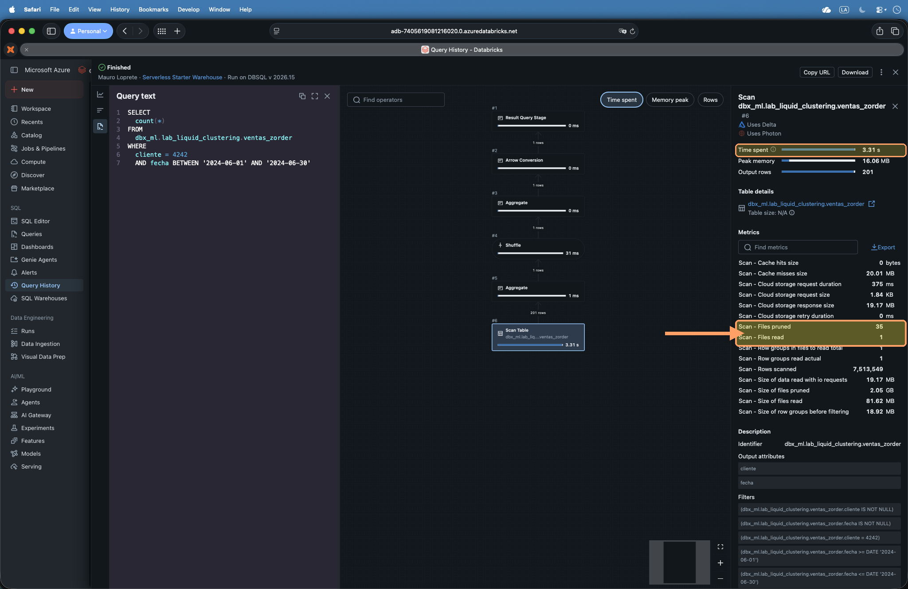
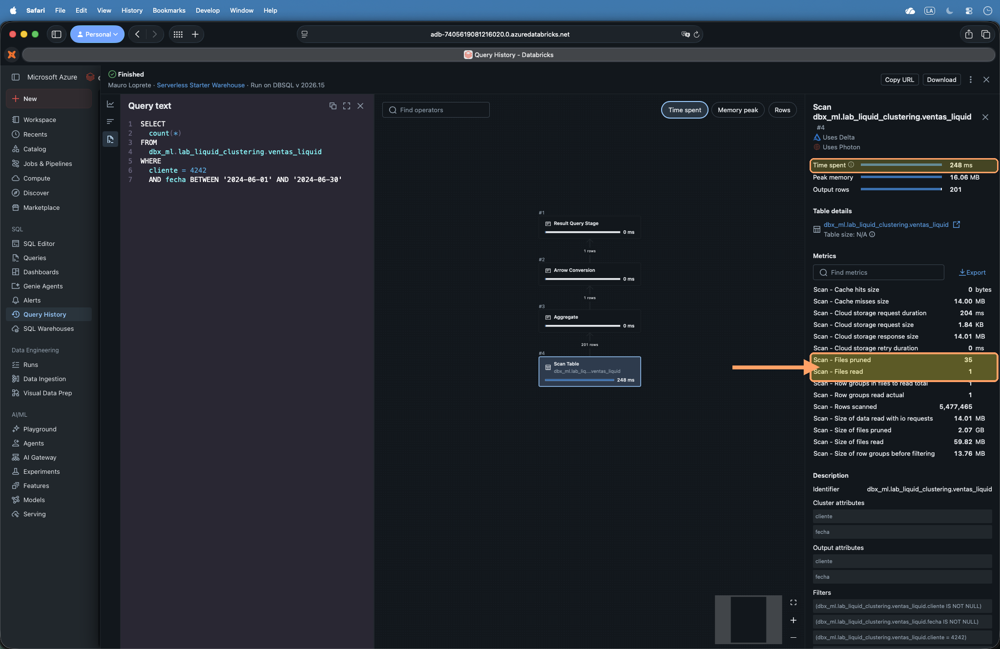

You picked the wrong partition column six months ago and today you have ten thousand 3 MB files, one folder per value, and queries that still scan half the table. Changing it means rewriting everything. You run `OPTIMIZE ZORDER` every night to patch the hole, and even so data skipping, the engine's ability to skip files it doesn't need, never quite delivers.

**Liquid Clustering** is Delta Lake's answer to that pain: a physical data layout technique that **replaces both partitioning and Z-ORDER**, that you can redefine without rewriting the table, and that with `CLUSTER BY AUTO` can even pick the columns for you. In this post we cover what it does, the actual syntax, how it triggers, the requirements that matter, and a lab to measure how many files it actually skips.

::: callout-note
## TL;DR

- Liquid Clustering reorganizes the files of a Delta table according to **clustering keys** so the engine can discard irrelevant files when filtering (*data skipping*). **It replaces Hive-style partitioning and Z-ORDER**, and they don't combine.
- The base behavior is **manual keys** (`CLUSTER BY (col)`, up to 4 columns). You can **redefine them without rewriting** existing data, something impossible with partitioning.
- It's **incremental**: enabling it doesn't reorder history. You run `OPTIMIZE` (it only touches what's needed) and, the first time or when changing keys, `OPTIMIZE FULL`.
- `CLUSTER BY AUTO` (Databricks **picks the columns** for you) requires Unity Catalog and Predictive Optimization, and **doesn't exist in open-source Delta**. Liquid itself is **GA** (Generally Available, meaning stable and supported) since **DBR 15.4 LTS**, and has been in open-source since Delta 3.1.0.
- **In the lab** (200 million rows): the same query reads **30 files** on the partitioned table and **1** with Z-ORDER or Liquid Clustering. Reproducible experiment included.
- Watch out for the myth: on small tables (**\<10 TB**) more keys can make single-column filtering **worse**.
:::

------------------------------------------------------------------------

## 1. The problem: why partitions and Z-ORDER hurt

Delta Lake, the transactional table format Databricks runs on, stores data as Parquet files plus a transaction log. For a query to read little, the engine uses **data skipping**: it looks at each file's statistics (min/max per column) and skips the ones that can't contain what you're looking for. The better **grouped** the values are across files, the more files it can discard.

Historically there were two ways to improve that grouping, and both take their toll:

- **Hive-style partitioning**: one folder per value of the partition column (`país=UY/`, `país=AR/`, …). It works with **low-cardinality** columns (few distinct values). Its two classic ailments: the *small files problem* (partitions with lots of tiny files, expensive to list and read) and **high cardinality** (partitioning by `user_id` gives you millions of folders). And there's something worse: **picked the wrong column → rewrite the whole table** to change it.
- **Z-ORDER**: a reordering that groups nearby values of several columns into the same files (it uses a *Z-order curve*, a way of traversing multi-dimensional space while preserving locality). It improves skipping, but you have to run `OPTIMIZE table ZORDER BY (cols)` **by hand** and it **over-rewrites** every time, because it's not incremental: it recomputes over the whole touched range.

In both cases you end up managing your data layout as a manual maintenance chore. Liquid Clustering exists to take that off your plate.

## 2. What Liquid Clustering is

Liquid Clustering is a **data layout optimization** technique in Delta Lake: you define **clustering keys** (up to 4 columns) and Delta organizes the files according to those keys to maximize data skipping. The fundamental difference from partitioning:

```{r}
#| echo: false
#| warning: false
#| message: false
#| fig-width: 10
#| fig-height: 4.3
#| fig-align: center
#| fig-cap: "Same query filtering by cliente. Partitioned by fecha, the engine reads the whole table because it can't skip any partition; clustered by cliente it reads only the fraction of files whose range crosses the filter."

library(ggplot2)

navy <- "#1e293b"; orange <- "#FFA166"; bg <- "#f8fafc"
gray <- "#64748b"; skipc <- "#cbd5e1"
qx1 <- 52; qx2 <- 70

make_files <- function(strategy) {
  if (strategy == "part") {
    ymins <- seq(0, 100, length.out = 9)[1:8]
    ymaxs <- seq(0, 100, length.out = 9)[2:9]
    df <- data.frame(xmin = 0, xmax = 100, ymin = ymins, ymax = ymaxs)
    df$read <- TRUE
  } else {
    xs <- seq(0, 100, length.out = 5); ys <- seq(0, 100, length.out = 5)
    g  <- expand.grid(i = 1:4, j = 1:4)
    df <- data.frame(xmin = xs[g$i], xmax = xs[g$i + 1],
                     ymin = ys[g$j], ymax = ys[g$j + 1])
    df$read <- !(df$xmax < qx1 | df$xmin > qx2)
  }
  df$strategy <- strategy; df
}

files <- rbind(make_files("part"), make_files("zorder"), make_files("liquid"))
lab <- c(part = "Partitioned by fecha\nreads 8 of 8 files",
         zorder = "Z-ORDER (cliente, fecha)\nreads 4 of 16 files",
         liquid = "Liquid Clustering (cliente, fecha)\nreads 4 of 16, incremental")
files$strategy <- factor(files$strategy, levels = names(lab), labels = lab)
qband <- data.frame(strategy = factor(lab, levels = lab))

ggplot() +
  geom_rect(data = files, aes(xmin = xmin, xmax = xmax, ymin = ymin, ymax = ymax, fill = read),
            color = "white", linewidth = 0.6) +
  geom_rect(data = qband, aes(xmin = qx1, xmax = qx2, ymin = 0, ymax = 100),
            fill = navy, alpha = 0.10, inherit.aes = FALSE) +
  facet_wrap(~strategy, nrow = 1) +
  scale_fill_manual(values = c(`TRUE` = orange, `FALSE` = skipc),
                    labels = c(`TRUE` = "File read", `FALSE` = "File skipped"), name = NULL) +
  labs(x = "cliente (high cardinality)", y = "fecha",
       caption = "⚡ Spark de Ideas · mauroloprete.github.io/mauroloprete") +
  coord_cartesian(xlim = c(0, 100), ylim = c(0, 100), expand = FALSE) +
  theme_minimal(base_size = 11) +
  theme(plot.background = element_rect(fill = bg, color = NA),
        panel.background = element_rect(fill = bg, color = NA),
        panel.grid = element_blank(),
        strip.text = element_text(face = "bold", color = navy, size = 9, lineheight = 1.05),
        axis.text = element_blank(), axis.ticks = element_blank(),
        axis.title = element_text(color = gray, size = 8),
        legend.position = "bottom", legend.text = element_text(color = navy, size = 8),
        plot.caption = element_text(color = "#94a3b8", size = 7, hjust = 1, face = "italic"),
        plot.margin = margin(10, 12, 8, 12))
```

That example filters by a single column. The real advantage shows when filtering by **two**: sorting files by one column forces you to read the entire stripe, while clustering in two dimensions lets you read only the file at the intersection.

```{r}
#| echo: false
#| warning: false
#| message: false
#| fig-width: 10
#| fig-height: 4.4
#| fig-align: center
#| fig-cap: "The same query filters by cliente and by fecha. Sorted only by cliente, you have to read the whole stripe (every fecha for that cliente); clustered in two dimensions, only the file at the intersection gets read."

library(ggplot2)

navy <- "#1e293b"; orange <- "#FFA166"; bg <- "#f8fafc"
gray <- "#64748b"; skipc <- "#cbd5e1"; newc <- "#593196"

qx1 <- 55; qx2 <- 70; qy1 <- 52; qy2 <- 68

a <- data.frame(
  xmin = seq(0, 75, by = 25), xmax = seq(25, 100, by = 25),
  ymin = 0, ymax = 100)
a$read <- !(a$xmax < qx1 | a$xmin > qx2)
a$strategy <- "lin"

xs <- seq(0, 100, length.out = 5); ys <- seq(0, 100, length.out = 5)
g <- expand.grid(i = 1:4, j = 1:4)
b <- data.frame(xmin = xs[g$i], xmax = xs[g$i + 1], ymin = ys[g$j], ymax = ys[g$j + 1])
b$read <- !(b$xmax < qx1 | b$xmin > qx2) & !(b$ymax < qy1 | b$ymin > qy2)
b$strategy <- "2d"

files <- rbind(a[, c("xmin","xmax","ymin","ymax","read","strategy")],
               b[, c("xmin","xmax","ymin","ymax","read","strategy")])

lab <- c(lin = "Sorted by cliente (one dimension)\nreads the whole stripe: 4 of 4 files for that cliente",
         `2d` = "2D clustering cliente + fecha (Z-order / Liquid)\nreads only the intersection: 1 of 16 files")
files$strategy <- factor(files$strategy, levels = names(lab), labels = lab)
q <- data.frame(strategy = factor(lab, levels = lab),
                xmin = qx1, xmax = qx2, ymin = qy1, ymax = qy2)

ggplot() +
  geom_rect(data = files, aes(xmin = xmin, xmax = xmax, ymin = ymin, ymax = ymax, fill = read),
            color = "white", linewidth = 0.6) +
  geom_rect(data = q, aes(xmin = xmin, xmax = xmax, ymin = ymin, ymax = ymax),
            fill = NA, color = newc, linewidth = 1, linetype = "dashed", inherit.aes = FALSE) +
  geom_text(data = q, aes(x = (xmin + xmax) / 2, y = ymax + 8, label = "query"),
            color = newc, size = 3, fontface = "bold", inherit.aes = FALSE) +
  facet_wrap(~strategy, nrow = 1) +
  scale_fill_manual(values = c(`TRUE` = orange, `FALSE` = skipc),
                    labels = c(`TRUE` = "File read", `FALSE` = "File skipped"), name = NULL) +
  labs(x = "cliente", y = "fecha",
       caption = "⚡ Spark de Ideas · mauroloprete.github.io/mauroloprete") +
  coord_cartesian(xlim = c(0, 100), ylim = c(0, 100), expand = FALSE) +
  theme_minimal(base_size = 11) +
  theme(plot.background = element_rect(fill = bg, color = NA),
        panel.background = element_rect(fill = bg, color = NA),
        panel.grid = element_blank(),
        strip.text = element_text(face = "bold", color = navy, size = 8.5, lineheight = 1.05),
        axis.text = element_blank(), axis.ticks = element_blank(),
        axis.title = element_text(color = gray, size = 8),
        legend.position = "bottom", legend.text = element_text(color = navy, size = 8),
        plot.caption = element_text(color = "#94a3b8", size = 7, hjust = 1, face = "italic"),
        plot.margin = margin(10, 12, 8, 12))
```

What makes it different: **you can change the clustering keys without rewriting** existing data. Picked `fecha` and it turns out you almost always filter by `cliente`? Redefine the keys and, from the next `OPTIMIZE` on, the clustering settles around the new ones. With partitions that's a `CREATE TABLE ... AS SELECT` of the whole table.

::: callout-important
## The automatic clustering myth

A common misunderstanding (one my own documentation carried): the **base** behavior of Liquid Clustering does **not** "learn query patterns and adjust itself". That's exclusive to `CLUSTER BY AUTO` (section 5). In base mode, **you** pick the keys; what Delta does is maintain the grouping by those keys incrementally.
:::

## 3. Syntax: the three flavors of `CLUSTER BY`

The `CLUSTER BY` clause comes in three flavors. It applies to Databricks SQL and Databricks Runtime (DBR, the cluster's image of Spark plus libraries) 13.3 LTS and above, Delta Lake only:

``` sql
-- New table
CREATE TABLE ventas (id INT, cliente STRING, fecha DATE)
CLUSTER BY (cliente, fecha);

-- Existing NON-partitioned table
ALTER TABLE ventas CLUSTER BY (cliente, fecha);

-- Disable clustering (doesn't rewrite already clustered data)
ALTER TABLE ventas CLUSTER BY NONE;
```

Rules worth having clear:

- Up to **4 clustering keys** per table.
- Keys must be columns with **collected statistics**. By default Delta collects statistics for the **first 32 columns** of the table. A column beyond the 32nd can't be a key without adjusting that configuration.
- You can't cluster by complex types (`StructType`, `MapType`, `ArrayType`) or their elements. You can by a struct field with dot notation: `CLUSTER BY (datos.pais)`.

::: callout-warning
## Partitioned table: different command

`ALTER TABLE ... CLUSTER BY` works on **non-partitioned** tables. If your table is already partitioned, this doesn't convert it: since DBR 18.1 direct conversion exists, but it's a different command (`REPLACE PARTITIONED BY WITH CLUSTER BY`). See section 7 (migration).
:::

## 4. How it triggers: clustering is incremental

Here's the part that confuses people the most: **enabling clustering doesn't reorder history**. You tell Delta what the keys are, but the data that was already there stays where it was until you run an `OPTIMIZE`:

``` sql
-- Clusters incrementally: only rewrites what's needed,
-- doesn't touch files whose keys already match
OPTIMIZE ventas;

-- Forces reclustering of ALL records (DBR 16.4 LTS+)
OPTIMIZE ventas FULL;
```

- `OPTIMIZE` is **incremental**: it doesn't touch files that are already well grouped. Cheap to run often.
- `OPTIMIZE FULL` forces a complete recluster. Databricks recommends it **the first time you enable clustering** (to settle the history) or **when you change keys**.

If you have **Predictive Optimization** on (the managed service that runs `OPTIMIZE` and `VACUUM` on its own based on table usage), Databricks triggers the clustering for you. In that case, **turn off any scheduled OPTIMIZE jobs** so you don't duplicate work.

Here's the real difference with Z-ORDER, which performed similarly on data skipping. When a new batch lands, `OPTIMIZE ZORDER` reorders the whole set to keep the ordering; Liquid Clustering's `OPTIMIZE` touches only the affected files:

```{r}
#| echo: false
#| warning: false
#| message: false
#| fig-width: 9
#| fig-height: 4.3
#| fig-align: center
#| fig-cap: "A new batch lands. To keep the ordering, Z-ORDER rewrites all 16 files; Liquid Clustering's incremental OPTIMIZE rewrites only the 3 the batch touches."

library(ggplot2)

navy <- "#1e293b"; orange <- "#FFA166"; bg <- "#f8fafc"
gray <- "#64748b"; keep <- "#cbd5e1"; newc <- "#593196"

xs <- seq(0, 100, length.out = 5); ys <- seq(0, 100, length.out = 5)
g  <- expand.grid(i = 1:4, j = 1:4)
grid <- data.frame(xmin = xs[g$i], xmax = xs[g$i + 1],
                   ymin = ys[g$j], ymax = ys[g$j + 1], id = 1:16)

z <- grid; z$state <- "rewrite"; z$strategy <- "zorder"
l <- grid; l$state <- "keep"; l$state[l$id %in% c(6, 7, 10)] <- "rewrite"; l$strategy <- "liquid"
files <- rbind(z, l)

lab <- c(zorder = "Z-ORDER: OPTIMIZE ZORDER\nrewrites 16 of 16 files",
         liquid = "Liquid Clustering: incremental OPTIMIZE\nrewrites 3 of 16 files")
files$strategy <- factor(files$strategy, levels = names(lab), labels = lab)
newbatch <- data.frame(strategy = factor(lab, levels = lab),
                       xmin = 26, xmax = 74, ymin = 26, ymax = 49)

ggplot() +
  geom_rect(data = files, aes(xmin = xmin, xmax = xmax, ymin = ymin, ymax = ymax, fill = state),
            color = "white", linewidth = 0.7) +
  geom_rect(data = newbatch, aes(xmin = xmin, xmax = xmax, ymin = ymin, ymax = ymax),
            fill = NA, color = newc, linewidth = 0.9, linetype = "dashed", inherit.aes = FALSE) +
  geom_text(data = newbatch, aes(x = 50, y = 58, label = "new batch"),
            color = newc, size = 3, fontface = "bold", inherit.aes = FALSE) +
  facet_wrap(~strategy, nrow = 1) +
  scale_fill_manual(values = c(rewrite = orange, keep = keep),
                    labels = c(rewrite = "File rewritten", keep = "File untouched"), name = NULL) +
  labs(x = "cliente", y = "fecha",
       caption = "⚡ Spark de Ideas · mauroloprete.github.io/mauroloprete") +
  coord_cartesian(xlim = c(0, 100), ylim = c(0, 100), expand = FALSE) +
  theme_minimal(base_size = 11) +
  theme(plot.background = element_rect(fill = bg, color = NA),
        panel.background = element_rect(fill = bg, color = NA),
        panel.grid = element_blank(),
        strip.text = element_text(face = "bold", color = navy, size = 9, lineheight = 1.05),
        axis.text = element_blank(), axis.ticks = element_blank(),
        axis.title = element_text(color = gray, size = 8),
        legend.position = "bottom", legend.text = element_text(color = navy, size = 8),
        plot.caption = element_text(color = "#94a3b8", size = 7, hjust = 1, face = "italic"),
        plot.margin = margin(10, 12, 8, 12))
```

::: callout-note
## Under the hood: Hilbert curve and ZCubes

Two pieces explain why Liquid Clustering skips better than Z-ORDER while rewriting little. The first is the **Hilbert curve**, a *space-filling curve* (a way of traversing a multi-dimensional grid keeping neighboring points close) that Delta uses instead of Z-ORDER's Z curve, and which improves data skipping. The second is **ZCubes**: each `OPTIMIZE` produces a group of already-clustered files and tags them in the Delta log with a ZCube id; the next `OPTIMIZE` only rewrites the files not yet clustered. That's why clustering is incremental and doesn't trigger a full rewrite (*write amplification*).
:::

## 5. `CLUSTER BY AUTO`: let Databricks pick the columns

The automatic mode. Instead of you picking the keys, Databricks picks them based on the table's actual query patterns:

``` sql
CREATE TABLE ventas (id INT, cliente STRING, fecha DATE)
CLUSTER BY AUTO;
```

The requirements are the fine print that matters:

- **DBR 15.4 LTS+**.
- Delta tables **managed by Unity Catalog** (UC, Databricks' governance catalog; see [Tips #3](../databricks-tips-02-unity-catalog/)).
- **Predictive Optimization** enabled.
- It runs **asynchronously**: key adjustment isn't instant, it settles over time.

::: callout-warning
## AUTO is Databricks-only

`CLUSTER BY AUTO` **doesn't exist in open-source Delta Lake**. Outside Databricks you always specify the columns by hand.
:::

## 6. Predictive Optimization: the maintenance that runs itself

Running `OPTIMIZE`, `VACUUM` and `ANALYZE` by hand is the boring part of owning Delta tables. **Predictive Optimization** (PO) does it for you on Unity Catalog managed tables: Databricks identifies the tables that would benefit from maintenance and queues them, instead of running everything on a fixed schedule.

**What it runs.** `OPTIMIZE` (including the incremental clustering of Liquid tables), `VACUUM` (removes files the table no longer references, per its retention) and `ANALYZE` (collects statistics for the planner). A detail that plays in Liquid's favor: when PO runs `OPTIMIZE`, it does **not** execute `ZORDER`. On a table with Z-order, PO ignores the already-ordered files; the rest of the maintenance (`VACUUM`, `ANALYZE`, compaction) keeps running, but the Z ordering doesn't maintain itself.

**How to enable it.** It's a property inherited in cascade: account → catalog → schema → table. Every managed table takes the account value unless you override it lower down.

``` sql
ALTER CATALOG mi_catalogo ENABLE PREDICTIVE OPTIMIZATION;
ALTER SCHEMA mi_catalogo.ventas DISABLE PREDICTIVE OPTIMIZATION;
ALTER TABLE mi_catalogo.ventas.hechos INHERIT PREDICTIVE OPTIMIZATION;
```

`INHERIT` goes back to the parent object's value. To check whether it's active on a table use `DESCRIBE TABLE EXTENDED mi_tabla`, where the `Predictive Optimization` field tells you whether it's `ENABLE` and whether it was inherited. At the account level you turn it on in the account console, under Settings → Feature enablement. It comes **enabled by default for accounts created on or after November 11, 2024**; for older accounts the rollout is gradual.

**Restrictions and requirements.** It only applies to **Unity Catalog managed tables**. External tables and tables loaded as OpenSharing recipients are out. The work runs on **serverless jobs compute**, you need a workspace on the Premium plan in a supported region, and it's billed as a serverless jobs SKU.

::: callout-tip
## PO + Liquid: don't pay for the work twice

If you have Liquid Clustering and Predictive Optimization on, PO runs the `OPTIMIZE` for your clustered tables. Turn off any scheduled `OPTIMIZE` jobs so you don't pay for the work twice. And remember that `CLUSTER BY AUTO` **depends** on PO: without PO it can't pick keys or recluster. Also, PO changes keys only when the predicted savings from better data skipping outweigh the reclustering cost.
:::

## 7. Migrating from Z-ORDER and from partitioning

- **From Z-ORDER**: use your `ZORDER BY` columns directly as clustering keys. It's practically a one-to-one replacement.
- **From partitioning**: the partition columns become the clustering keys. How depends on the runtime:
  - **DBR 18.1+**: in-place conversion with `ALTER TABLE ventas REPLACE PARTITIONED BY WITH CLUSTER BY (cliente, fecha)` (or `... WITH CLUSTER BY AUTO`).
  - **Earlier runtimes**: you have to **recreate** the table with a `CREATE TABLE ... AS SELECT` (CTAS, meaning "create table from a SELECT") that includes the `CLUSTER BY`.

::: callout-important
## No mixing: partitions or clustering

Liquid Clustering does **not combine** with partitioning or Z-ORDER. It's one or the other: when you migrate, you stop partitioning and stop running `ZORDER`.
:::

## 8. Lab: `CLUSTER BY` vs Z-ORDER vs partitioning, measuring file pruning

The goal is to measure how many files the engine **skips** under each strategy for the same filtered query. We reuse the synthetic dataset pattern from the [Photon lab (#12)](../databricks-tips-12-photon/):

``` python
# 1. Synthetic dataset with realistic skew (same base, three tables)
from pyspark.sql import functions as F

base = (spark.range(0, 200_000_000)
        .withColumn("cliente", (F.rand() * 50_000).cast("int"))
        .withColumn("fecha", F.expr("date_add('2024-01-01', cast(rand()*600 as int))"))
        .withColumn("monto", (F.rand() * 1000)))

base.write.mode("overwrite").saveAsTable("lab.ventas_base")
```

``` sql
-- 2. Three versions of the table
-- (a) Partitioned by fecha
CREATE TABLE lab.ventas_part
PARTITIONED BY (fecha) AS SELECT * FROM lab.ventas_base;

-- (b) Z-ORDER by cliente, fecha
CREATE TABLE lab.ventas_zorder AS SELECT * FROM lab.ventas_base;
OPTIMIZE lab.ventas_zorder ZORDER BY (cliente, fecha);

-- (c) Liquid Clustering by cliente, fecha
CREATE TABLE lab.ventas_liquid
CLUSTER BY (cliente, fecha) AS SELECT * FROM lab.ventas_base;
OPTIMIZE lab.ventas_liquid FULL;
```

``` sql
-- 3. The same filtered query on all three, measuring files read
SELECT count(*) FROM lab.ventas_liquid
WHERE cliente = 4242 AND fecha BETWEEN '2024-06-01' AND '2024-06-30';
```

To read how many files each one skipped, check the **query profile** (the *files pruned* / *files read* metrics) or `DESCRIBE DETAIL table` for the file count.

## 9. Results: reads

Measured on **200 million rows** on serverless with Photon, with the same query filtering by `cliente` **and** `fecha`. Files read and skipped come from the query history (`read_files_count` / `pruned_files_count`); total files, from `DESCRIBE DETAIL`. Skipped: the files data skipping avoided reading (the query profile calls the metric *Files pruned*).

```{r}
#| echo: false
#| warning: false
#| message: false
#| fig-width: 9
#| fig-height: 3.4
#| fig-align: center
#| fig-cap: "Out of each table's total files, how many the query read and how many it skipped. Partitioning doesn't just read more: its layout has 600 files where clustering has 36."

library(ggplot2)

navy <- "#1e293b"; orange <- "#FFA166"; bg <- "#f8fafc"
gray <- "#64748b"; skipc <- "#cbd5e1"

niveles <- c("Partitioned by fecha", "Z-ORDER (cliente, fecha)", "Liquid Clustering (cliente, fecha)")
d <- data.frame(
  estrategia = rep(niveles, each = 2),
  tipo = rep(c("Read", "Skipped"), 3),
  archivos = c(30, 570, 1, 35, 1, 35)
)
d$estrategia <- factor(d$estrategia, levels = rev(niveles))
d$tipo <- factor(d$tipo, levels = c("Skipped", "Read"))
etiquetas <- data.frame(
  estrategia = factor(niveles, levels = rev(niveles)),
  total = c(600, 36, 36),
  label = c("reads 30 of 600", "reads 1 of 36", "reads 1 of 36")
)

ggplot(d, aes(x = archivos, y = estrategia, fill = tipo)) +
  geom_col(width = 0.6) +
  geom_text(data = etiquetas, aes(x = total + 12, y = estrategia, label = label),
            inherit.aes = FALSE, hjust = 0, size = 3.2, color = navy, fontface = "bold") +
  scale_fill_manual(values = c(Skipped = skipc, Read = orange), name = NULL) +
  coord_cartesian(xlim = c(0, 800)) +
  labs(x = "files", y = NULL,
       caption = "⚡ Spark de Ideas · mauroloprete.github.io/mauroloprete") +
  theme_minimal(base_size = 11) +
  theme(plot.background = element_rect(fill = bg, color = NA),
        panel.background = element_rect(fill = bg, color = NA),
        panel.grid.major.y = element_blank(),
        axis.text = element_text(color = navy, size = 9),
        axis.title = element_text(color = gray, size = 8),
        legend.position = "bottom", legend.text = element_text(color = navy, size = 8),
        plot.caption = element_text(color = "#94a3b8", size = 7, hjust = 1, face = "italic"),
        plot.margin = margin(10, 12, 8, 12))
```

| Strategy | Total files | Files read | Files skipped | Bytes read | Scan time |
|---|---|---|---|---|---|
| Partitioned by fecha | 600 | 30 | 570 | 119 MB | 11.41 s |
| Z-ORDER (cliente, fecha) | 36 | 1 | 35 | 20 MB | 3.31 s (3.4x faster) |
| Liquid Clustering (cliente, fecha) | 36 | 1 | 35 | 15 MB | 248 ms (46x faster) |

: The time is the Scan node's *Time spent* in this run (single run, cache in play) {.striped}

Two takeaways. First, **partitioning by fecha exploded the layout into 600 files** (one per day), the classic small-files problem; clustering left 36. Second, the query does skip files by fecha on the partitioned table (from 600 down to 30, the days of June), but since it can't skip by `cliente` it reads them whole: 30 files and 119 MB. Z-ORDER and Liquid skip by both columns and drop to **1 file**; Liquid also reads fewer bytes (15 vs 20 MB) because it packs better with the Hilbert curve.

::: callout-note
## The statistician doesn't settle for one run

Confession: I'm a statistician, and a single run doesn't let me sleep. A measurement without a distribution is an anecdote. So I ran the same query **100 times per strategy**, interleaved (partitioned, Z-ORDER, Liquid, and around again) so the cache and cluster state affect all three equally:

| Strategy | Median | p25–p75 | Min | Max |
|---|---|---|---|---|
| Partitioned by fecha | 0.705 s | 0.662–0.734 s | 0.611 s | 1.02 s |
| Z-ORDER (cliente, fecha) | 0.645 s | 0.611–0.688 s | 0.556 s | 0.878 s |
| Liquid Clustering (cliente, fecha) | 0.654 s | 0.615–0.698 s | 0.573 s | 0.809 s |

The honest reading: **with a warm cache, all three converge**. Z-ORDER and Liquid tie (9 ms of median difference, well within noise) and partitioning ends up ~8% slower, consistent with reading 30 files instead of 1. The layout doesn't speed up what's already in memory: it pays off on the **first read** (the cold scan in the table above), on the **bytes moved** and on maintenance. Double takeaway: measure with a distribution, and know which part of the time you're measuring.
:::

```{r}
#| echo: false
#| warning: false
#| message: false
#| fig-width: 9
#| fig-height: 4
#| fig-align: center
#| fig-cap: "Wall-clock distribution of 100 runs per strategy, warm cache. Each point is one run; the box marks the median and interquartile range."

library(ggplot2)

navy <- "#1e293b"; orange <- "#FFA166"; bg <- "#f8fafc"
gray <- "#64748b"; purple <- "#593196"

corridas <- read.csv("corridas.csv")
labs_map <- c(particionado = "Partitioned by fecha",
              liquid = "Liquid Clustering (cliente, fecha)",
              zorder = "Z-ORDER (cliente, fecha)")
corridas$estrategia <- factor(labs_map[corridas$estrategia], levels = labs_map)

ggplot(corridas, aes(x = estrategia, y = segundos, fill = estrategia)) +
  geom_jitter(aes(color = estrategia), width = 0.15, alpha = 0.25, size = 1, show.legend = FALSE) +
  geom_boxplot(alpha = 0.65, outlier.shape = NA, color = navy, linewidth = 0.4, show.legend = FALSE) +
  scale_fill_manual(values = setNames(c(gray, orange, purple), labs_map)) +
  scale_color_manual(values = setNames(c(gray, orange, purple), labs_map)) +
  labs(x = NULL, y = "seconds per run",
       caption = "⚡ Spark de Ideas · mauroloprete.github.io/mauroloprete") +
  theme_minimal(base_size = 11) +
  theme(plot.background = element_rect(fill = bg, color = NA),
        panel.background = element_rect(fill = bg, color = NA),
        panel.grid.major.x = element_blank(),
        axis.text = element_text(color = navy, size = 9),
        axis.title = element_text(color = gray, size = 8),
        plot.caption = element_text(color = "#94a3b8", size = 7, hjust = 1, face = "italic"),
        plot.margin = margin(10, 12, 8, 12))
```

## 10. Results: writes

So far, all reads. The other side matters just as much: a **new batch** lands (10 million rows, 5% of the table) and you have to write it and then maintain each strategy's ordering:

``` python
# The new batch: 10M rows with the same distribution.
# It gets generated ONCE and the same batch is inserted into all
# three tables, so the comparison is fair.
lote = (spark.range(0, 10_000_000)
        .withColumn("cliente", (F.rand() * 50_000).cast("int"))
        .withColumn("fecha", F.expr("date_add('2024-01-01', cast(rand()*600 as int))"))
        .withColumn("monto", (F.rand() * 1000)))

lote.write.saveAsTable("lab.ventas_lote")
```

``` sql
-- The same append on all three tables
INSERT INTO lab.ventas_part   SELECT * FROM lab.ventas_lote;
INSERT INTO lab.ventas_zorder SELECT * FROM lab.ventas_lote;
INSERT INTO lab.ventas_liquid SELECT * FROM lab.ventas_lote;

-- The maintenance that follows for each strategy
OPTIMIZE lab.ventas_part;                               -- compacts the partitions
OPTIMIZE lab.ventas_zorder ZORDER BY (cliente, fecha);  -- re-sorts (not incremental)
OPTIMIZE lab.ventas_liquid;                             -- incremental
```

Every operation leaves its metrics in the table history: files created by the append, files and MB rewritten by the maintenance.

``` sql
-- numFiles and numOutputBytes from the INSERT; numRemovedFiles,
-- numAddedFiles and numRemovedBytes from the OPTIMIZE
DESCRIBE HISTORY lab.ventas_liquid LIMIT 2;
```

This is how it went:

```{r}
#| echo: false
#| warning: false
#| message: false
#| fig-width: 9
#| fig-height: 3.2
#| fig-align: center
#| fig-cap: "MB rewritten by maintenance to absorb a new 113 MB batch. Z-ORDER rewrites the whole table; Liquid's incremental OPTIMIZE rewrites nothing."

library(ggplot2)

navy <- "#1e293b"; orange <- "#FFA166"; bg <- "#f8fafc"
gray <- "#64748b"; purple <- "#593196"

niveles <- c("Z-ORDER (cliente, fecha)", "Partitioned by fecha", "Liquid Clustering (cliente, fecha)")
d <- data.frame(
  estrategia = factor(niveles, levels = rev(niveles)),
  mb = c(2288, 1593, 0),
  label = c("2,288 MB (the whole table)", "1,593 MB", "0 MB")
)

ggplot(d, aes(x = mb, y = estrategia, fill = estrategia)) +
  geom_col(width = 0.55, show.legend = FALSE) +
  geom_text(aes(x = mb + 60, label = label),
            hjust = 0, size = 3.2, color = navy, fontface = "bold") +
  geom_vline(xintercept = 113, linetype = "dashed", color = navy, linewidth = 0.4) +
  annotate("text", x = 150, y = 0.6, label = "the new batch: 113 MB",
           hjust = 0, size = 2.8, color = navy, fontface = "italic") +
  scale_fill_manual(values = setNames(c(purple, gray, orange), niveles)) +
  coord_cartesian(xlim = c(0, 3100)) +
  labs(x = "MB rewritten by maintenance", y = NULL,
       caption = "⚡ Spark de Ideas · mauroloprete.github.io/mauroloprete") +
  theme_minimal(base_size = 11) +
  theme(plot.background = element_rect(fill = bg, color = NA),
        panel.background = element_rect(fill = bg, color = NA),
        panel.grid.major.y = element_blank(),
        axis.text = element_text(color = navy, size = 9),
        axis.title = element_text(color = gray, size = 8),
        plot.caption = element_text(color = "#94a3b8", size = 7, hjust = 1, face = "italic"),
        plot.margin = margin(10, 12, 8, 12))
```

| Strategy | Batch append | Files created | Maintenance | MB rewritten |
|---|---|---|---|---|
| Partitioned by fecha | 18.5 s | 600 | `OPTIMIZE` · 40.8 s | 1,593 MB |
| Z-ORDER (cliente, fecha) | 2.5 s | 2 | `OPTIMIZE ZORDER` · 29.3 s | **2,288 MB (the whole table)** |
| Liquid Clustering (cliente, fecha) | 1.9 s | 2 | `OPTIMIZE` · 4.8 s | **0 MB** |

Three stories in one table:

- **Partitioning fragments the append**: the same batch gets split into 600 tiny files (one folder per fecha), takes almost 10 times longer to write, and the follow-up compaction rewrites 1.6 GB.
- **Z-ORDER writes fast, but keeping the ordering costs the whole table**: to absorb 113 MB of new data, `OPTIMIZE ZORDER` rewrote 2.3 GB. That's the *write amplification* from the section 4 diagram, now measured.
- **Liquid writes fast and keeping the ordering cost nothing**: the incremental `OPTIMIZE` finished in 4.8 seconds without rewriting a single file (0 files, 0 MB).

::: callout-tip
## The index analogy

If you come from relational databases, this will sound familiar. **Liquid Clustering behaves like a good index: it speeds up reads without punishing writes.** Z-ORDER is also a read "index", but with the classic expensive-index problem: every write makes you pay for its maintenance, which here means rewriting the entire table. And partitioning is an index that also forces you to pick the column once and forever.
:::

::: callout-tip
## Reproduce it yourself

The full experiment is available as a Databricks Asset Bundle at [spark-de-ideas-labs/tips/liquid-clustering](https://github.com/mauroloprete/spark-de-ideas-labs/tree/main/tips/liquid-clustering), and it runs on Free Edition:

``` bash
databricks bundle deploy
databricks bundle run liquid_clustering_benchmark
```

The notebook reports the total file count (`DESCRIBE DETAIL`), wall-clock, the repeated runs (`timings_raw`, adjustable with `--var bench_runs=N`) and the write metrics (append + maintenance). **Files read and skipped** can't be read from the plan programmatically on serverless (Spark Connect). In the UI they are there: even in a serverless notebook you can open the query profile from the **See performance** link. To get them programmatically, I measured by running the queries on a SQL Warehouse and reading the query history:

``` bash
databricks api get /api/2.0/sql/history/queries \
  --json '{"include_metrics": true, "max_results": 20}' \
  | jq -r '.res[] | select(.query_text | test("ventas_"))
      | "\(.query_text) read=\(.metrics.read_files_count) pruned=\(.metrics.pruned_files_count)"'
```

This is the actual output of that command, with all three layouts measured:

{fig-align="center"}

The same pair of numbers lives in each query's **query profile**. To see it: open the query in Query History, enter the query profile and select the **Scan** node. In the metrics panel on the right you'll find the **Files pruned** and **Files read** rows (highlighted in yellow in the screenshots), and above them the scan's **Time spent**, which shows the layout's direct effect:

{fig-align="center"}

{fig-align="center"}

{fig-align="center"}
:::

## 11. Requirements, compatibility and protocol

- **Availability**: GA for Delta with **DBR 15.4 LTS+**; Public Preview for Apache Iceberg with DBR 16.4 LTS+; in **open-source Delta since 3.1.0**.
- **Table protocol**: it uses **writer version 7 / reader version 3**, and it **can't be downgraded**. In practice: old Delta clients that don't support those protocols **won't be able to read** the table.
- **Incompatibilities**: it doesn't combine with partitioning or Z-ORDER.
- **DataFrame API** (Python/Scala): keys can only be set when **creating** the table or in `overwrite` mode (`CREATE OR REPLACE`), **never on `append`**. To change them while appending, use `ALTER TABLE` via SQL.
- **Materialized views and streaming tables**: keys aren't changed with `ALTER TABLE`; you adjust the pipeline/view definition.

## 12. Gotchas

1.  **Enabling ≠ reclustering.** Setting `CLUSTER BY` doesn't reorder history. The first time, run `OPTIMIZE FULL` or you'll see little improvement and conclude it "doesn't work".
2.  **`AUTO` is Databricks-only.** It requires Unity Catalog + Predictive Optimization. In open-source Delta it doesn't exist: you always specify columns.
3.  **More keys isn't better.** On tables **\<10 TB**, 4 keys can perform **worse** than 2 when filtering by a single column. Start with the columns you actually filter by.
4.  **Column 33 doesn't cluster.** Only columns with statistics (first 32 by default) work as keys. If your column falls beyond that, adjust the statistics config first.
5.  **With partitions it's not that you shouldn't: you can't.** It's a hard incompatibility: a table is either partitioned or clustered, never both, and `ALTER TABLE ... CLUSTER BY` fails on a partitioned table. If you're coming from one, migrate for real (section 7).
6.  **The protocol doesn't go back down.** Writer v7 / reader v3 is one-way: check that all your readers (connectors, external tools) support it before migrating shared tables.

## 13. When to use Liquid Clustering (and when not to)

Databricks recommends Liquid Clustering for **all new tables**. The cases that benefit most: filters on **high-cardinality** columns, tables with heavy **skew** (badly unbalanced values), **fast growth**, **concurrent writes** and access patterns that change over time.

| Situation | Liquid Clustering? | Why |
|------------------------|------------------------|------------------------|
| New table, any size | **Yes** | It's Databricks' default recommendation |
| You filter by a high-cardinality column | **Yes** | Where partitioning suffered, this shines |
| You already use Z-ORDER | **Yes, migrate** | Almost a one-to-one replacement, and incremental on top |
| Readers with old Delta clients | **Careful** | v7/v3 protocol not downgradable: they may not be able to read it |
| You need `AUTO` but you're on open-source Delta | **No (AUTO)** | AUTO is Databricks-only; use manual keys |
| Small table always filtered by a single column | **With 1-2 keys** | 4 keys can make data skipping worse |

------------------------------------------------------------------------

## References

- [Use liquid clustering for tables — Azure Databricks](https://learn.microsoft.com/en-us/azure/databricks/tables/clustering)
- [Use liquid clustering for tables — Databricks on AWS](https://docs.databricks.com/aws/en/tables/clustering)
- [CLUSTER BY clause (TABLE) — SQL reference](https://learn.microsoft.com/en-us/azure/databricks/sql/language-manual/sql-ref-syntax-ddl-cluster-by)
- [Use liquid clustering for Delta tables — Delta Lake open-source](https://docs.delta.io/delta-clustering/)
- [Delta Lake 3.1.0 release: Liquid Clustering with Hilbert curve and ZCubes](https://delta.io/blog/delta-lake-3-1/)
- [Predictive optimization for Unity Catalog managed tables](https://learn.microsoft.com/en-us/azure/databricks/optimizations/predictive-optimization)

## Other posts in the series

If this post was useful, check out the previous **Databricks Tips**:

- [**Tips #1**: Databricks Asset Bundles](../databricks-asset-bundles-advanced/) — IaC for Databricks
- [**Tips #2**: Delta Lake](../databricks-tips-01-delta-lake/) — the 7 things you wish you'd known
- [**Tips #3**: Unity Catalog](../databricks-tips-02-unity-catalog/) — governance nobody implements well
- [**Tips #4**: Structured Streaming](../databricks-tips-03-structured-streaming/) — watermarks, triggers and micro-batch
- [**Tips #5**: MLflow + Unity Catalog](../databricks-tips-04-mlflow-unity-catalog/) — from experiment to model
- [**Tips #6**: Feature Engineering](../databricks-tips-05-feature-engineering/) — features that survive production
- [**Tips #7**: Docker on Databricks](../databricks-tips-06-docker-containers/) — custom containers
- [**Tips #8**: Jobs & Workflows](../databricks-tips-08-jobs-workflows/) — streaming and event-driven triggers
- [**Tips #9**: SQL Warehouses](../databricks-tips-09-sql-warehouses/) — the compute that turns itself on
- [**Tips #10**: AI Gateway](../databricks-tips-10-ai-gateway/) — centralized governance for LLMs
- [**Tips #11**: Lakeflow Declarative Pipelines](../databricks-tips-11-lakeflow-declarative-pipelines/) — declarative pipelines with built-in quality
- [**Tips #12**: Photon](../databricks-tips-12-photon/) — the C++ engine that speeds up your queries
- [**Tips #13**: OpenSharing](../databricks-tips-13-opensharing/) — sharing without copying

------------------------------------------------------------------------

*Next in the series: SCD (Slowly Changing Dimensions) in Delta, and how a good layout makes Type 2 MERGEs cheaper.*
