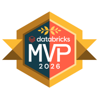

::: {.justify}
Data Engineer at [F1RST (Santander Group)](https://www.santander.com/). I teach at the [School of Economics and Business (UdelaR)](https://www.fcea.edu.uy/) and share what I learn on my blog and podcast, [Spark de Ideas](https://open.spotify.com/show/20WqZma0iLDYbg9wAEfv0w). In the open-source world, I'm the author of [metasurvey](https://metasurveyr.github.io/metasurvey/), an R package for reproducible survey processing currently under review at [rOpenSci](https://github.com/ropensci/software-review/issues/752).
:::

::: columns

::: {.column width="40%"}

## Interests

- Data Engineering & Architecture
- Reproducible Research
- Survey Data Infrastructure
- Statistical Learning
- MLOps & Model Deployment

:::

::: {.column width="60%"}

## Education

#####  B.Sc. in Statistics, 2024
###### Universidad de la República, Uruguay (GPA: 9.07/10) {style="color: gray"}

## Recognition

::: {.cert-row}

::: {.cert-card}

::: {.cert-info}
[Databricks MVP]{.cert-name}

[Databricks, 2026]{.cert-issuer}
:::
:::

:::

## Certifications

::: {.cert-row}

::: {.cert-card}

::: {.cert-info}
[Data Engineer Professional]{.cert-name}

[Databricks, 2025]{.cert-issuer}
:::
:::

::: {.cert-card}

::: {.cert-info}
[Data Engineer Associate]{.cert-name}

[Databricks, 2025]{.cert-issuer}
:::
:::

:::

:::

:::

##  Latest posts

::: {#ultimos-posts}
:::

[See all posts ](blog/index.qmd){.btn .btn-outline-dark .btn-sm}
