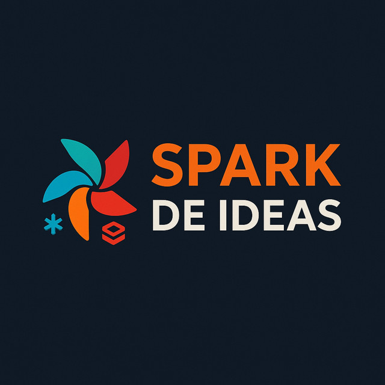
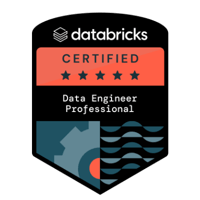

## {data-background-color="#1e293b" visibility="uncounted"}

::: {style="color: white; text-align: center; margin-top: 0.5em;"}

{width=180 style="border-radius: 20px; box-shadow: 0 10px 30px rgba(0,0,0,0.5);"}

[**Spark de Ideas**]{style="font-size: 1.6em; color: #FFA166; display: block; margin-top: 0.3em;"}

[La chispa de la ingeniería de datos en español]{style="font-size: 0.9em; color: #94a3b8;"}

:::

## {data-background-color="#1e293b"}

::: {style="color: white; text-align: center; margin-top: 1em;"}

### Mauro Loprete

[Data Engineer @ F1rst · Docente @ UDELAR]{style="font-size: 0.95em;"}

{width=120 style="display: inline-block; margin: 0.3em 0.5em;"}

[DABs en producción desde 2024]{style="color: #94a3b8; font-size: 0.85em;"}

:::

::: {.notes}
Presentarme brevemente. Data Engineer en F1rst, donde usamos DABs para gestionar todos los deployments en Databricks. Docente en UDELAR. Tengo el blog Spark de Ideas donde publico sobre Databricks y Data Engineering.
:::

## {data-background-color="#1e293b"}

::: {style="color: white; text-align: center; margin-top: 1em;"}

[De YAML a producción]{style="font-size: 1.8em; font-weight: bold;"}

[**Deploy de AI Agents con Declarative Automation Bundles**]{style="color: #FFA166; font-size: 1.2em;"}

[Databricks Meetup Uruguay]{style="color: #94a3b8; font-size: 0.85em;"}

:::

::: {.notes}
El objetivo de esta charla: que salgan de acá sabiendo cómo deployar un agente de IA en producción con un solo archivo YAML. No vamos a hablar de teoría — vamos a ver un ejemplo real completo, con CI/CD incluido.
:::

## Agenda

1. **El problema**: deployar un agente no es solo servir un modelo
2. **El ecosistema agéntico**: Agent Bricks, Genie Deep Research, Lakebase
3. **DABs en 2026**: qué cambió (y por qué importa)
4. **Ejemplo real**: un `databricks.yml` completo para un agente RAG con memoria
5. **CI/CD**: de push a producción
6. **Gotchas**: lo que no está en la documentación

. . .

> Todo el código de la charla está disponible en el blog.

::: {.notes}
6 bloques en 35 minutos. Arrancamos con el problema, el ecosistema de agentes en Databricks, las novedades de DABs, el plato fuerte con el ejemplo real incluyendo Lakebase, CI/CD, y gotchas. Preguntas al final o me interrumpen.
:::

## {data-background-color="#dc2626"}

::: {style="color: white; text-align: center;"}

[**1**]{style="font-size: 3em; opacity: 0.4;"}

### El problema

[Tu agente funciona en un notebook. ¿Y ahora?]{style="font-size: 0.9em;"}

:::

::: {.notes}
Todos hemos estado acá. El agente funciona en un notebook, la demo sale genial, y el PM dice "perfecto, ponelo en producción para el lunes". Y ahí arranca el dolor.
:::

## Qué necesita un agente en producción

- **MLflow Experiment** — tracking de runs y métricas
- **Registered Model** en Unity Catalog — versionado
- **Model Serving Endpoint** — con AI Gateway, rate limits, guardrails
- **Vector Search Index** — retrieval de documentos
- **Job de refresh** — actualizar el índice periódicamente
- **Databricks App** — interfaz de chat para los usuarios
- **Permisos, secrets, monitoring...**

. . .

> Eso son **7+ recursos** para UN agente. Ahora multiplicá por 3 ambientes.

::: {.notes}
Un agente en producción no es solo un endpoint. Es un ecosistema de recursos que tienen que estar coordinados. Y cada uno tiene su propia configuración, permisos, y lifecycle. Si hacés esto a mano, vas a tener drift entre ambientes, deployments inconsistentes, y nadie va a saber qué está deployado dónde.
:::

## La pesadilla del deploy manual

```{r}
#| echo: false
#| warning: false
#| message: false
#| fig-width: 9
#| fig-height: 3.5
#| fig-align: center

library(ggplot2)

ggplot() +
  annotate("rect", xmin = -0.5, xmax = 10.5, ymin = -0.3, ymax = 3.5,
           fill = "#f8fafc", color = NA) +

  # Manual deploy (left side)
  annotate("rect", xmin = 0, xmax = 4.5, ymin = 0, ymax = 3.3,
           fill = "#fef2f2", color = "#fca5a5", linewidth = 0.5) +
  annotate("text", x = 2.25, y = 3.1, label = "Deploy manual",
           color = "#991b1b", size = 4, fontface = "bold") +
  annotate("text", x = 2.25, y = 2.3,
           label = "Click en UI para crear endpoint\nClick en UI para registrar modelo\nClick en UI para crear job\nClick en UI para configurar app\n× 3 ambientes = 12+ clicks",
           color = "#991b1b", size = 2.5, lineheight = 1.1) +
  annotate("text", x = 2.25, y = 0.4, label = "\"Funciona en dev,\nno en prod\"",
           color = "#dc2626", size = 3, fontface = "bold.italic", lineheight = 0.9) +

  # DABs deploy (right side)
  annotate("rect", xmin = 5.5, xmax = 10, ymin = 0, ymax = 3.3,
           fill = "#f0fdf4", color = "#86efac", linewidth = 0.5) +
  annotate("text", x = 7.75, y = 3.1, label = "Deploy con DABs",
           color = "#166534", size = 4, fontface = "bold") +
  annotate("text", x = 7.75, y = 2,
           label = "databricks.yml\n+\nbundle deploy --target prod",
           color = "#166534", size = 3, lineheight = 1.2) +
  annotate("text", x = 7.75, y = 0.4, label = "Reproducible,\nversionado, auditado",
           color = "#15803d", size = 3, fontface = "bold.italic", lineheight = 0.9) +

  # VS
  annotate("text", x = 5, y = 1.65, label = "vs",
           color = "#94a3b8", size = 5.5, fontface = "bold") +

  coord_cartesian(xlim = c(-0.3, 10.3), ylim = c(-0.2, 3.5)) +
  theme_void() +
  theme(plot.margin = margin(2, 5, 2, 5))
```

::: {.notes}
A la izquierda: la realidad de muchos equipos. Click en la UI, repetir por cada ambiente, y rezar para que quede igual. A la derecha: todo definido en un archivo YAML, versionado en Git, deployado con un comando. La diferencia no es solo de velocidad — es de confiabilidad.
:::

## {data-background-color="#593196"}

::: {style="color: white; text-align: center;"}

[**2**]{style="font-size: 3em; opacity: 0.4;"}

### El ecosistema agéntico de Databricks

[Agent Bricks · Genie Deep Research · Lakebase]{style="font-size: 0.9em;"}

:::

::: {.notes}
Antes de meternos en DABs, necesitamos entender el ecosistema de agentes que Databricks está construyendo. Hay tres piezas clave que se complementan: Agent Bricks para construir agentes, Genie para deep research, y Lakebase para darles memoria.
:::

## Los tres pilares

```{r}
#| echo: false
#| warning: false
#| message: false
#| fig-width: 9
#| fig-height: 3.5
#| fig-align: center

library(ggplot2)

ggplot() +
  # Agent Bricks
  annotate("rect", xmin = 0.2, xmax = 3.3, ymin = 0.4, ymax = 3.2,
           fill = "#593196", color = "#4c1d95", linewidth = 0.5) +
  annotate("text", x = 1.75, y = 2.9, label = "Agent Bricks",
           color = "white", size = 4, fontface = "bold") +
  annotate("text", x = 1.75, y = 2.1,
           label = "Task-first\nSynthetic benchmarks\nAuto-optimización\nSupervisor Agent",
           color = "#c4b5fd", size = 2.5, lineheight = 1.1) +
  annotate("text", x = 1.75, y = 0.7, label = "CONSTRUIR",
           color = "#FFA166", size = 2.8, fontface = "bold") +

  # Genie Deep Research
  annotate("rect", xmin = 3.7, xmax = 6.8, ymin = 0.4, ymax = 3.2,
           fill = "#0d9488", color = "#0f766e", linewidth = 0.5) +
  annotate("text", x = 5.25, y = 2.9, label = "Genie Agent Mode",
           color = "white", size = 4, fontface = "bold") +
  annotate("text", x = 5.25, y = 2.1,
           label = "Deep Research\nPlan → SQL paralelo\nIterar hasta evidencia\nReporte con citas",
           color = "#99f6e4", size = 2.5, lineheight = 1.1) +
  annotate("text", x = 5.25, y = 0.7, label = "ANALIZAR",
           color = "#FFA166", size = 2.8, fontface = "bold") +

  # Lakebase
  annotate("rect", xmin = 7.2, xmax = 10.3, ymin = 0.4, ymax = 3.2,
           fill = "#1e293b", color = "#0f172a", linewidth = 0.5) +
  annotate("text", x = 8.75, y = 2.9, label = "Lakebase",
           color = "white", size = 4, fontface = "bold") +
  annotate("text", x = 8.75, y = 2.1,
           label = "PostgreSQL serverless\nMemoria short/long-term\npgvector nativo\nBranching + Synced Tables",
           color = "#94a3b8", size = 2.5, lineheight = 1.1) +
  annotate("text", x = 8.75, y = 0.7, label = "RECORDAR",
           color = "#FFA166", size = 2.8, fontface = "bold") +

  # Base layer
  annotate("rect", xmin = 0.2, xmax = 10.3, ymin = 0, ymax = 0.3,
           fill = "#FFA166", color = "#e8854a", linewidth = 0.3) +
  annotate("text", x = 5.25, y = 0.15, label = "Mosaic AI Agent Framework  ·  Unity Catalog  ·  MLflow 3.0  ·  AI Gateway",
           color = "#7c2d12", size = 2.5, fontface = "bold") +

  coord_cartesian(xlim = c(-0.1, 10.5), ylim = c(-0.1, 3.4)) +
  theme_void() +
  theme(plot.margin = margin(2, 2, 2, 2))
```

::: {.notes}
El ecosistema tiene tres pilares. Agent Bricks para construir agentes de forma task-first, con auto-optimización y benchmarks sintéticos. Genie Agent Mode para deep research: el agente arma un plan, corre múltiples queries SQL en paralelo, itera hasta tener evidencia suficiente. Y Lakebase como la memoria — PostgreSQL serverless con pgvector para que los agentes recuerden entre sesiones. Todo corre sobre la base de Mosaic AI, Unity Catalog, MLflow 3.0 y AI Gateway.
:::

## Agent Bricks: construir sin code-first

A diferencia del approach clásico (code → prompt → evaluate), Agent Bricks invierte el flujo:

1. **Definís la tarea** en lenguaje natural + conectás datos de UC
2. El sistema genera **benchmarks sintéticos** específicos al dominio
3. **Auto-optimiza** modelo, prompts, parámetros de retrieval y costos
4. Evaluación con **Agent-as-a-Judge** — auditores LLM configurables

. . .

Incluye un **Supervisor Agent** para orquestar sistemas multi-agente: combina Genie Spaces, agentes LLM y tools MCP.

. . .

> No reemplaza el code-first — lo complementa cuando tenés un caso de uso claro y querés iterar rápido.

::: {.notes}
Agent Bricks es el approach "no-code" para construir agentes. Le decís qué querés que haga, le apuntás a los datos en Unity Catalog, y el sistema genera benchmarks, optimiza automáticamente, y te da un agente evaluado. Lo interesante es el Supervisor Agent: podés orquestar múltiples agentes — uno que busca en Genie, otro que llama APIs, otro que procesa documentos — todo coordinado. Para producción, estos agentes se deployean como Model Serving endpoints, y ahí es donde DABs entra.
:::

## Genie Agent Mode: deep research sobre tus datos

```{r}
#| echo: false
#| warning: false
#| message: false
#| fig-width: 9
#| fig-height: 3.5
#| fig-align: center

library(ggplot2)

steps <- data.frame(
  x = c(1, 3.2, 5.4, 7.6),
  y = c(1, 1, 1, 1),
  label = c("Pregunta\ncompleja", "Plan de\ninvestigación", "SQL paralelo\nmúltiples ángulos", "Reporte\ncon citas"),
  sub = c("\"¿Por qué bajaron\nlas ventas en Q2?\"", "Hipótesis 1, 2, 3...", "Iterar hasta\nevidencia suficiente", "Visualizaciones\n+ tablas"),
  color = c("#64748b", "#593196", "#0d9488", "#1e293b")
)

arrows <- data.frame(
  x = c(1.9, 4.1, 6.3),
  xend = c(2.3, 4.5, 6.7),
  y = c(1, 1, 1)
)

ggplot() +
  geom_tile(data = steps, aes(x = x, y = y, fill = color),
            width = 1.8, height = 1.6, color = NA, show.legend = FALSE) +
  geom_text(data = steps, aes(x = x, y = y + 0.3, label = label),
            color = "white", size = 3.2, fontface = "bold", lineheight = 0.9) +
  geom_text(data = steps, aes(x = x, y = y - 0.35, label = sub),
            color = "#e2e8f0", size = 2.3, lineheight = 0.9) +
  geom_segment(data = arrows, aes(x = x, xend = xend, y = y, yend = y),
               arrow = arrow(length = unit(0.15, "cm"), type = "closed"),
               color = "#94a3b8", linewidth = 0.6) +
  scale_fill_identity() +
  coord_cartesian(xlim = c(-0.2, 8.8), ylim = c(-0.1, 2)) +
  theme_void() +
  theme(plot.margin = margin(5, 10, 5, 10))
```

. . .

- No es un chatbot — es un **agente de investigación** que itera hasta encontrar evidencia
- Corre dentro de **Genie Spaces** (UI, no API todavía)
- Usa los datos gobernados de Unity Catalog

::: {.notes}
Genie Agent Mode es lo más cercano a "deep agents" en Databricks. No es un chatbot que responde con una query. Es un agente que arma un plan de investigación con hipótesis, corre múltiples queries SQL en paralelo desde distintos ángulos, itera refinando, y te entrega un reporte completo con citas, visualizaciones y tablas de soporte. Es como tener un analista senior que no se cansa. Hoy solo está disponible desde la UI de Genie Spaces — no tiene API, así que no se integra con DABs directamente, pero es importante entender que existe.
:::

## Lakebase: la memoria que les faltaba

**Lakebase** = PostgreSQL 17 serverless + managed por Databricks.

¿Por qué importa para agentes?

| Tipo de memoria | Mecanismo | Backend |
|---|---|---|
| **Short-term** | Thread ID + checkpoints (LangGraph) | Lakebase Postgres |
| **Long-term** | Insights extraídos entre sesiones | Lakebase Postgres |
| **Semantic search** | pgvector nativo | Lakebase Postgres |

. . .

- **Branching instantáneo**: fork del estado del agente para testing sin tocar prod
- **Synced Tables**: sincronizar Delta Tables → Lakebase en segundos
- **Unity Catalog**: misma gobernanza que el resto del lakehouse
- **Scale to zero**: no pagás cuando no se usa

::: {.notes}
Lakebase es la pieza que faltaba para agentes stateful. Hasta ahora los agentes eran stateless — cada request empezaba de cero. Con Lakebase, el agente tiene memoria: short-term para recordar la conversación actual vía checkpoints de LangGraph, y long-term para acumular insights entre sesiones. Y lo mejor: pgvector nativo, así que podés hacer RAG directamente sobre los datos operacionales más frescos, sin un pipeline separado para embeddings. El branching es brutal para desarrollo — fork de la base de prod, probá los cambios, descartá o mergeá.
:::

## Lakebase en DABs

```{.yaml}
resources:
  postgres_projects:
    agent_memory:
      project_id: soporte-bot-memory
      display_name: "SoporteBot Memory Store"
      pg_version: 17

  postgres_branches:
    prod_branch:
      parent: ${resources.postgres_projects.agent_memory.id}
      branch_id: production
      no_expiry: true

  postgres_endpoints:
    prod_endpoint:
      parent: ${resources.postgres_branches.prod_branch.id}
      endpoint_id: primary
      endpoint_type: ENDPOINT_TYPE_READ_WRITE
      autoscaling_limit_min_cu: 0.5
      autoscaling_limit_max_cu: 2
```

. . .

> Proyecto → Branch → Endpoint. Como Git, pero para bases de datos.

::: {.notes}
Lakebase se define nativamente en DABs desde febrero 2026. La jerarquía es: proyecto (la instancia de Postgres), branches (como branches de Git — podés tener production, dev, staging), y endpoints (el punto de conexión con autoscaling). Fíjense en el scale to zero: min 0.5 compute units, max 2. Si nadie consulta, no pagás. Y el branch dev lo podés crear como fork de production para probar sin afectar datos reales.
:::

## {data-background-color="#593196"}

::: {style="color: white; text-align: center;"}

[**3**]{style="font-size: 3em; opacity: 0.4;"}

### DABs en 2026: qué cambió

[Spoiler: se renombraron y dejaron Terraform]{style="font-size: 0.9em;"}

:::

::: {.notes}
Ahora que entendemos el ecosistema de agentes, veamos qué cambió en DABs este año. Hay 3 novedades importantes que cambian cómo trabajamos.
:::

## Declarative Automation Bundles

Desde **marzo 2026**, Databricks renombró DABs:

**Databricks** Asset Bundles → **Declarative** Automation Bundles

. . .

- Mismos comandos: `bundle validate`, `bundle deploy`, `bundle run`
- Mismo `databricks.yml` — 100% retrocompatible
- El nombre refleja lo que realmente son: **automatización declarativa**

. . .

> Ya no es solo "assets" — es toda tu plataforma como código.

::: {.notes}
El renombre es cosmético pero significativo. Ya no estamos hablando solo de manejar assets individuales — DABs maneja jobs, pipelines, endpoints, apps, schemas, volumes, Lakebase. Es automatización declarativa de toda la plataforma. Thoughtworks los puso en "Adopt" en el Technology Radar de abril.
:::

## Direct Deployment Engine

El cambio más importante de 2026: **DABs ya no usa Terraform por debajo**.

| | Antes (Terraform) | Ahora (Direct) |
|---|---|---|
| **Dependencia** | Descargaba `terraform` + provider | Solo el CLI de Databricks |
| **Estado** | `terraform.tfstate` | `resources.json` |
| **Errores** | Referenciaban HCL/Terraform | Referencia a `databricks.yml` |
| **Firewalls** | Necesitaba registry.terraform.io | Sin dependencias externas |

. . .

```bash
# Migración (idempotente, segura)
databricks bundle deployment migrate -t prod
```

::: {.notes}
Esto es un game changer. Antes DABs usaba Terraform internamente para manejar el estado, lo que significaba que necesitabas descargar Terraform y el provider de Databricks. Eso causaba problemas con firewalls, proxies, y los errores eran confusos porque referenciaban HCL. Ahora el engine es directo, los errores son claros, y no necesitás nada más que el CLI.
:::

## `bundle plan`: preview antes de deployar

```{.bash}
databricks bundle plan -t prod
```

. . .

```text
Plan:

  ~ model_serving_endpoints.agent_endpoint
    ~ config.served_entities[0].entity_version: "3" → "4"
    ~ config.served_entities[0].workload_size: "Small" → "Medium"

  + jobs.evaluation_job (new)
    name: "[prod] Agent Evaluation"
    schedule: "0 0 8 * * ?"

  Summary: 1 to create, 1 to update, 0 to destroy.
```

> Como `terraform plan` — pero para tu `databricks.yml`.

::: {.notes}
Esto es nuevo y es espectacular. Antes hacías bundle deploy y rezabas. Ahora podés hacer bundle plan y ver exactamente qué va a cambiar antes de aplicar. En el ejemplo: va a actualizar la versión del modelo en el endpoint y crear un job nuevo. Esto en CI/CD es invaluable — podés poner un step de plan en el PR y revisar los cambios antes de mergear.
:::

## Python bundles (pyDABs) — GA

Desde **abril 2026**, podés definir recursos en Python:

```{.python}
from databricks.bundles import Bundle, Job, Task

bundle = Bundle(name="my-agent")

bundle.add_resource(
    Job(
        name="agent-training",
        tasks=[
            Task(
                key="train",
                notebook_path="./notebooks/train.py"
            )
        ]
    )
)
```

. . .

Útil para bundles dinámicos. Pero para esta charla nos quedamos con **YAML** — es más legible para equipos.

::: {.notes}
Python bundles son GA desde abril 2026. Te permiten generar configuración dinámicamente — por ejemplo, crear un job por cada tabla en un schema. Pero para el 90% de los casos, YAML es más legible y más fácil de revisar en PRs. Lo menciono para que sepan que existe.
:::

## {data-background-color="#FFA166"}

::: {style="color: #7c2d12; text-align: center;"}

[**4**]{style="font-size: 3em; opacity: 0.4;"}

### Ejemplo real

[Un `databricks.yml` completo para un agente RAG con memoria]{style="font-size: 0.9em;"}

:::

::: {.notes}
Ahora sí, el plato fuerte. Vamos a ver un ejemplo completo de cómo deployar un agente RAG con memoria persistente usando DABs. Esto es basado en un caso real — un agente de soporte que responde preguntas sobre documentación interna y recuerda conversaciones anteriores gracias a Lakebase.
:::

## El escenario: SoporteBot

```{r}
#| echo: false
#| warning: false
#| message: false
#| fig-width: 9
#| fig-height: 3.5
#| fig-align: center

library(ggplot2)

ggplot() +
  annotate("rect", xmin = -0.5, xmax = 10.5, ymin = -0.4, ymax = 3.3,
           fill = "#f8fafc", color = NA) +

  # Title
  annotate("label", x = 5, y = 3.1, label = " SoporteBot — Arquitectura con memoria ",
           fill = "#1e293b", color = "white", size = 3.5,
           label.size = 0, label.r = unit(4, "pt"), fontface = "bold") +

  # Source docs (top-left)
  annotate("rect", xmin = 0, xmax = 2, ymin = 2.2, ymax = 2.7,
           fill = "#64748b", color = "#475569", linewidth = 0.3) +
  annotate("text", x = 1, y = 2.45, label = "Confluence\nExport",
           color = "white", size = 2, fontface = "bold", lineheight = 0.9) +

  # Arrow to job
  annotate("segment", x = 2.1, xend = 3.4, y = 2.45, yend = 2.45,
           arrow = arrow(length = unit(0.1, "cm"), type = "closed"),
           color = "#cbd5e1", linewidth = 0.4) +

  # Refresh Job
  annotate("rect", xmin = 3.5, xmax = 5.5, ymin = 2.15, ymax = 2.75,
           fill = "#593196", color = "#4c1d95", linewidth = 0.3) +
  annotate("text", x = 4.5, y = 2.55, label = "Refresh Job",
           color = "white", size = 2.5, fontface = "bold") +
  annotate("text", x = 4.5, y = 2.3, label = "(DABs: jobs)",
           color = "#c4b5fd", size = 1.8) +

  # Arrow to vector index
  annotate("segment", x = 5.6, xend = 7.4, y = 2.45, yend = 2.45,
           arrow = arrow(length = unit(0.1, "cm"), type = "closed"),
           color = "#cbd5e1", linewidth = 0.4) +

  # Vector Search Index
  annotate("rect", xmin = 7.5, xmax = 10, ymin = 2.15, ymax = 2.75,
           fill = "#0d9488", color = "#0f766e", linewidth = 0.3) +
  annotate("text", x = 8.75, y = 2.55, label = "Vector Search",
           color = "white", size = 2.5, fontface = "bold") +
  annotate("text", x = 8.75, y = 2.3, label = "Index (UC)",
           color = "#99f6e4", size = 1.8) +

  # User
  annotate("rect", xmin = 0, xmax = 2, ymin = 1.0, ymax = 1.5,
           fill = "#64748b", color = "#475569", linewidth = 0.3) +
  annotate("text", x = 1, y = 1.25, label = "Usuario (Soporte)",
           color = "white", size = 2, fontface = "bold") +

  # Arrow to App
  annotate("segment", x = 2.1, xend = 3.4, y = 1.25, yend = 1.25,
           arrow = arrow(length = unit(0.1, "cm"), type = "closed"),
           color = "#cbd5e1", linewidth = 0.4) +

  # Databricks App
  annotate("rect", xmin = 3.5, xmax = 5.5, ymin = 0.95, ymax = 1.55,
           fill = "#FFA166", color = "#e8854a", linewidth = 0.3) +
  annotate("text", x = 4.5, y = 1.35, label = "Chat UI",
           color = "#7c2d12", size = 2.5, fontface = "bold") +
  annotate("text", x = 4.5, y = 1.1, label = "(DABs: apps)",
           color = "#9a4e1c", size = 1.8) +

  # Arrow to Serving
  annotate("segment", x = 5.6, xend = 7.4, y = 1.25, yend = 1.25,
           arrow = arrow(length = unit(0.1, "cm"), type = "closed"),
           color = "#cbd5e1", linewidth = 0.4) +

  # Serving Endpoint
  annotate("rect", xmin = 7.5, xmax = 10, ymin = 0.85, ymax = 1.65,
           fill = "#1e293b", color = "#0f172a", linewidth = 0.5) +
  annotate("text", x = 8.75, y = 1.5, label = "Serving Endpoint",
           color = "white", size = 2.5, fontface = "bold") +
  annotate("text", x = 8.75, y = 1.15, label = "AI Gateway | Guardrails",
           color = "#FFA166", size = 1.8) +

  # Arrow from Serving to Vector Search
  annotate("segment", x = 8.75, xend = 8.75, y = 1.7, yend = 2.1,
           arrow = arrow(length = unit(0.1, "cm"), type = "closed"),
           color = "#cbd5e1", linewidth = 0.4) +
  annotate("text", x = 9.4, y = 1.9, label = "retrieval",
           color = "#94a3b8", size = 1.8, fontface = "italic") +

  # Lakebase (bottom-center)
  annotate("rect", xmin = 3, xmax = 7, ymin = -0.15, ymax = 0.45,
           fill = "#2563eb", color = "#1d4ed8", linewidth = 0.5) +
  annotate("text", x = 5, y = 0.3, label = "Lakebase (PostgreSQL)",
           color = "white", size = 2.5, fontface = "bold") +
  annotate("text", x = 5, y = 0.05, label = "Short-term | Long-term | pgvector",
           color = "#93c5fd", size = 1.8) +

  # Arrow from App to Lakebase (checkpoints)
  annotate("segment", x = 4.5, xend = 4.5, y = 0.9, yend = 0.5,
           arrow = arrow(length = unit(0.1, "cm"), type = "closed"),
           color = "#60a5fa", linewidth = 0.4) +
  annotate("text", x = 3.8, y = 0.7, label = "checkpoints",
           color = "#60a5fa", size = 1.6, fontface = "italic") +

  # Arrow from Serving to Lakebase (memory)
  annotate("segment", x = 8.75, xend = 7.1, y = 0.8, yend = 0.3,
           arrow = arrow(length = unit(0.1, "cm"), type = "closed"),
           color = "#60a5fa", linewidth = 0.4) +
  annotate("text", x = 8.2, y = 0.45, label = "memory",
           color = "#60a5fa", size = 1.6, fontface = "italic") +

  # MLflow Model (bottom-left)
  annotate("rect", xmin = 0, xmax = 2.5, ymin = 0.0, ymax = 0.4,
           fill = "#593196", color = "#4c1d95", linewidth = 0.3) +
  annotate("text", x = 1.25, y = 0.2, label = "MLflow Model (UC)",
           color = "white", size = 2, fontface = "bold") +

  # Arrow from model to endpoint
  annotate("segment", x = 2.6, xend = 7.4, y = 0.2, yend = 0.9,
           arrow = arrow(length = unit(0.1, "cm"), type = "closed"),
           color = "#c4b5fd", linewidth = 0.4) +

  coord_cartesian(xlim = c(-0.3, 10.3), ylim = c(-0.3, 3.3)) +
  theme_void() +
  theme(plot.margin = margin(2, 2, 2, 2))
```

::: {.notes}
SoporteBot con memoria. La arquitectura es la misma que antes pero ahora con Lakebase en la base. Los documentos de Confluence se indexan en Vector Search, el agente busca contexto y genera respuestas. La novedad: Lakebase almacena los checkpoints de LangGraph (memoria short-term — lo que dijo el usuario en esta conversación) y los insights acumulados entre sesiones (long-term — patrones de preguntas frecuentes, temas recurrentes). La app conecta a Lakebase para los checkpoints, y el serving endpoint para la memoria del agente. Todo definido en un solo databricks.yml.
:::

## Estructura del proyecto

```{.text}
soporte-bot/
├── databricks.yml              # Todo el deploy
├── src/
│   ├── agent.py                # Código del agente (MLflow)
│   └── refresh_index.py        # Job de refresh
├── app/
│   ├── app.py                  # Streamlit chat UI
│   └── requirements.txt
├── tests/
│   └── test_agent.py
└── .github/
    └── workflows/
        └── deploy.yml          # CI/CD
```

::: {.notes}
Estructura simple: el databricks.yml en la raíz define todo. src tiene el código del agente y el job de refresh. app tiene la UI en Streamlit. tests para validar el agente. Y el workflow de GitHub Actions para CI/CD. Veamos el databricks.yml sección por sección.
:::

## `databricks.yml` — bundle + variables {auto-animate=true}

```{.yaml}
bundle:
  name: soporte-bot
  uuid: a1b2c3d4-e5f6-7890

variables:
  catalog:
    description: "Unity Catalog"
    default: dev_catalog
  schema:
    default: agents
  vs_endpoint:
    description: "Vector Search endpoint"
    lookup:
      vector_search_endpoint: "shared-vs-endpoint"
```

::: {.notes}
Arrancamos con lo básico: nombre del bundle y variables. Fíjense en el lookup — en vez de hardcodear el ID del Vector Search endpoint, DABs lo busca por nombre en deploy time. Si mañana cambia el ID, el YAML no se toca. El catalog es variable para poder cambiar entre dev y prod.
:::

## `databricks.yml` — experiment + modelo {auto-animate=true}

```{.yaml}
resources:
  experiments:
    agent_experiment:
      name: /Shared/soporte-bot/experiments
      description: "Tracking de versiones del agente"

  registered_models:
    soporte_bot_model:
      name: ${var.catalog}.${var.schema}.soporte_bot
      catalog_name: ${var.catalog}
      schema_name: ${var.schema}
      description: "Agente RAG para soporte técnico"
```

. . .

> `${var.catalog}` se resuelve por target: `dev_catalog` en dev, `prod_catalog` en prod.

::: {.notes}
Primero definimos el experiment de MLflow para trackear las versiones del agente, y el modelo registrado en Unity Catalog. Noten cómo usamos variables — el mismo YAML deploya el modelo en dev_catalog o prod_catalog dependiendo del target. Esto es lo que hace a DABs poderoso: un archivo, múltiples ambientes.
:::

## `databricks.yml` — serving endpoint {auto-animate=true}

```{.yaml}
  model_serving_endpoints:
    agent_endpoint:
      name: soporte-bot-${bundle.target}
      config:
        served_entities:
          - entity_name: >
              ${var.catalog}.${var.schema}.soporte_bot
            entity_version: "1"
            workload_size: Small
            scale_to_zero_enabled: true
        auto_capture_config:
          catalog_name: ${var.catalog}
          schema_name: ${var.schema}
          table_name_prefix: soporte_bot_logs
          enabled: true
      ai_gateway:
        rate_limits:
          - key: user
            renewal_period: ONE_MINUTE
            calls: 20
        guardrails:
          input:
            pii:
              behavior: BLOCK
```

::: {.notes}
Acá está lo interesante. El serving endpoint incluye: scale to zero para no pagar cuando no se usa, auto-capture de inference logs en Delta Tables, y AI Gateway con rate limits y guardrails de PII. Todo declarativo, todo versionado. Si alguien quiere saber qué guardrails tiene el endpoint, revisa el YAML en Git — no tiene que ir a la UI.
:::

## `databricks.yml` — Lakebase (memoria) {auto-animate=true}

```{.yaml}
  postgres_projects:
    agent_memory:
      project_id: soporte-bot-memory
      display_name: "SoporteBot Memory Store"
      pg_version: 17

  postgres_branches:
    prod_branch:
      parent: >
        ${resources.postgres_projects.agent_memory.id}
      branch_id: production
      no_expiry: true

  postgres_endpoints:
    prod_endpoint:
      parent: >
        ${resources.postgres_branches.prod_branch.id}
      endpoint_id: primary
      endpoint_type: ENDPOINT_TYPE_READ_WRITE
      autoscaling_limit_min_cu: 0.5
      autoscaling_limit_max_cu: 2
```

::: {.notes}
Acá definimos Lakebase como parte del bundle. El proyecto crea una instancia de PostgreSQL 17, el branch production es la rama principal, y el endpoint tiene autoscaling con scale to zero. Esto le da al agente una base de datos relacional completa para guardar checkpoints de conversación y memoria a largo plazo. Y para desarrollo, podés crear un branch dev que es un fork instantáneo de production.
:::

## `databricks.yml` — app + job {auto-animate=true}

```{.yaml}
  apps:
    chat_ui:
      name: soporte-bot-chat-${bundle.target}
      source_code_path: ./app
      description: "Chat UI para el equipo de soporte"
      resources:
        - name: serving-endpoint
          serving_endpoint:
            name: soporte-bot-${bundle.target}
            permission: CAN_QUERY
        - name: lakebase-db
          postgres:
            branch: projects/soporte-bot-memory/branches/production
            permission: CAN_CONNECT_AND_CREATE

  jobs:
    refresh_index:
      name: "[${bundle.target}] Refresh Vector Index"
      tasks:
        - task_key: refresh
          notebook_task:
            notebook_path: ./src/refresh_index.py
      schedule:
        quartz_cron_expression: "0 0 6 * * ?"
        timezone_id: "America/Montevideo"
```

::: {.notes}
Dos cambios clave: la app ahora tiene dos recursos bindeados — el serving endpoint para queries al agente, y Lakebase para los checkpoints de conversación. CAN_CONNECT_AND_CREATE le permite crear tablas para el estado. El job de refresh sigue igual: corre todos los días a las 6 AM Montevideo, actualiza el vector index. Job Cluster: se prende, ejecuta, se apaga.
:::

## `databricks.yml` — targets {auto-animate=true}

```{.yaml}
targets:
  dev:
    mode: development
    default: true
    workspace:
      host: https://dev.cloud.databricks.com
    variables:
      catalog: dev_catalog

  prod:
    mode: production
    workspace:
      host: https://prod.cloud.databricks.com
    run_as:
      service_principal_name: sp-soporte-bot-prod
    permissions:
      - service_principal_name: sp-soporte-bot-prod
        level: CAN_MANAGE
      - group_name: soporte-team
        level: CAN_VIEW
    variables:
      catalog: prod_catalog
```

::: {.notes}
Los targets son la magia. En dev, todo se prefija con tu usuario y los triggers se pausan automáticamente. En prod, corre como service principal, tiene permisos explícitos, y DABs valida que run_as y permissions estén definidos. Si olvidás definir permisos en prod, bundle validate falla. Es seguridad by design.
:::

## Un deploy completo

```{.bash}
# Validar que todo está correcto
databricks bundle validate -t prod

# Ver qué va a cambiar
databricks bundle plan -t prod

# Deployar
databricks bundle deploy -t prod
```

. . .

**Eso es todo.** Un comando deploya:

- ✓ Experiment de MLflow
- ✓ Modelo en Unity Catalog
- ✓ Serving endpoint con AI Gateway
- ✓ Lakebase (PostgreSQL para memoria)
- ✓ Databricks App (chat UI + Lakebase binding)
- ✓ Job de refresh del índice
- ✓ Permisos y service principal

::: {.notes}
Tres comandos: validate para chequear sintaxis y configuración, plan para ver los cambios, deploy para aplicar. En un solo deploy tenés todo el stack del agente en producción. Y si algo sale mal, el estado es idempotente — corrés deploy de nuevo y vuelve al estado deseado.
:::

## El código del agente (2 slides)

```{.python code-line-numbers="1-6|8-22"}
import mlflow
from databricks.vector_search import VectorSearchClient

# Configuración del retriever
vs_client = VectorSearchClient()
vs_index = vs_client.get_index("soporte_bot_vs_index")

class SoporteBot(mlflow.pyfunc.PythonModel):
    def predict(self, context, model_input):
        question = model_input["question"][0]

        # 1. Buscar documentos relevantes
        results = vs_index.similarity_search(
            query_text=question,
            columns=["content", "source"],
            num_results=5
        )

        # 2. Generar respuesta con contexto
        context_docs = "\n".join(
            [r["content"] for r in results["result"]["data_array"]]
        )
        return self._call_llm(question, context_docs)
```

::: {.notes}
El agente es un MLflow PythonModel. Recibe una pregunta, busca documentos relevantes en Vector Search, y genera una respuesta. Esto se registra en Unity Catalog con mlflow.pyfunc.log_model y después DABs lo sirve en el endpoint. Lo interesante es que el código del agente es agnóstico del deployment — no sabe ni le importa si está en dev o prod.
:::

## {data-background-color="#0d9488"}

::: {style="color: white; text-align: center;"}

[**5**]{style="font-size: 3em; opacity: 0.4;"}

### CI/CD: de push a producción

[`git push` → validate → plan → deploy]{style="font-size: 0.9em;"}

:::

::: {.notes}
Ahora que tenemos el bundle, necesitamos automatizar el deploy. No queremos que alguien haga bundle deploy desde su laptop un viernes a las 6 de la tarde.
:::

## GitHub Actions

```{.yaml code-line-numbers="1-6|8-19|21-37"}
name: Deploy SoporteBot
on:
  push:
    branches: [main]
  pull_request:
    branches: [main]
jobs:
  validate:
    runs-on: ubuntu-latest
    steps:
      - uses: actions/checkout@v4
      - uses: databricks/setup-cli@main
      - run: databricks bundle validate -t prod
      - run: databricks bundle plan -t prod
        env:
          DATABRICKS_HOST: ${{ secrets.HOST }}
          DATABRICKS_TOKEN: ${{ secrets.TOKEN }}
          # Nuevo: Direct Engine (sin Terraform)
          DATABRICKS_BUNDLE_ENGINE: direct

  deploy:
    needs: validate
    if: github.ref == 'refs/heads/main'
    runs-on: ubuntu-latest
    environment: production
    steps:
      - uses: actions/checkout@v4
      - uses: databricks/setup-cli@main
      - name: Migrate state (idempotent)
        run: >
          databricks bundle deployment migrate -t prod
          || true
      - name: Deploy to production
        run: databricks bundle deploy -t prod
        env:
          DATABRICKS_HOST: ${{ secrets.HOST }}
          DATABRICKS_TOKEN: ${{ secrets.TOKEN }}
          DATABRICKS_BUNDLE_ENGINE: direct
```

::: {.notes}
El workflow tiene dos jobs. Validate corre en PRs — valida el bundle y muestra el plan. Deploy corre solo en main, con approval de ambiente en GitHub. Fíjense en la variable DATABRICKS_BUNDLE_ENGINE=direct, que fuerza el nuevo motor sin Terraform. El paso de migrate es idempotente: si ya migraste, no hace nada.
:::

## El flujo completo

```{r}
#| echo: false
#| warning: false
#| message: false
#| fig-width: 9
#| fig-height: 3
#| fig-align: center

library(ggplot2)

nodes <- data.frame(
  x = c(1, 3, 5, 7, 9),
  y = c(1, 1, 1, 1, 1),
  label = c("PR\nCreado", "Validate\n+ Plan", "Code\nReview", "Merge\na main", "Deploy\nProd"),
  color = c("#64748b", "#FFA166", "#593196", "#0d9488", "#1e293b")
)

arrows <- data.frame(
  x = c(1.7, 3.7, 5.7, 7.7),
  xend = c(2.3, 4.3, 6.3, 8.3),
  y = c(1, 1, 1, 1),
  yend = c(1, 1, 1, 1)
)

ggplot() +
  geom_tile(data = nodes, aes(x = x, y = y, fill = color),
            width = 1.5, height = 1.2, color = NA, show.legend = FALSE) +
  geom_text(data = nodes, aes(x = x, y = y, label = label),
            color = "white", size = 3.5, fontface = "bold", lineheight = 0.9) +
  geom_segment(data = arrows, aes(x = x, xend = xend, y = y, yend = yend),
               arrow = arrow(length = unit(0.15, "cm"), type = "closed"),
               color = "#94a3b8", linewidth = 0.6) +
  scale_fill_identity() +
  coord_cartesian(xlim = c(-0.2, 10.2), ylim = c(0.1, 1.9)) +
  theme_void() +
  theme(plot.margin = margin(5, 10, 5, 10))
```

. . .

**El plan del PR muestra exactamente qué va a cambiar en prod** — reviewable como cualquier diff.

::: {.notes}
Este es el flujo ideal. El developer crea un PR, el CI valida el bundle y muestra el plan (qué recursos se crean, actualizan o destruyen). El reviewer mira el diff del YAML Y el plan de cambios. Después del merge, el deploy corre automáticamente con approval. Es el mismo flujo que usarían para código de aplicación, pero para infraestructura de datos.
:::

## {data-background-color="#dc2626"}

::: {style="color: white; text-align: center;"}

[**6**]{style="font-size: 3em; opacity: 0.4;"}

### Gotchas

[Lo que me hubiese gustado saber antes]{style="font-size: 0.9em;"}

:::

## Gotchas

**1. `model_serving_endpoints` no soporta Python bundles (todavía).** Si usás pyDABs, los endpoints se definen en YAML. Workaround: archivo mixto.

. . .

**2. `scale_to_zero` tiene cold start de ~60 seg.** Para agentes con SLA de latencia, considerá mantener una instancia mínima.

. . .

**3. El `entity_version` no se auto-bumpa.** Tenés que actualizar el YAML manualmente o usar un script de CI que lo haga.

. . .

**4. Un bundle por dominio, no un mega-bundle.** Si metés 50 jobs de 5 equipos en un bundle, los deploys van a ser lentos y los conflictos en Git constantes.

::: {.notes}
Estos son los que me costaron horas. El de entity_version es el más molesto — en el próximo release esperamos que se pueda referenciar "latest" o un alias. Lo del mega-bundle es un anti-patrón que vi en varios equipos: un solo databricks.yml con 200 recursos. Separar por dominio: un bundle para ingesta, otro para serving, otro para el agente.
:::

## Más gotchas

**5. Migrá al Direct Engine ya.** Terraform engine se remueve a fin de 2026. `bundle deployment migrate` es seguro e idempotente.

. . .

**6. `mode: production` valida estricto.** Si no definís `run_as` y `permissions`, falla. Esto es bueno — te fuerza a hacer las cosas bien.

. . .

**7. Secrets van en `{{secrets/scope/key}}`, no en variables.** Nunca pongas API keys en `databricks.yml`. Usá Databricks Secrets.

. . .

**8. `bundle destroy` no borra proyectos Lakebase.** Los endpoints read-write no se eliminan vía bundle. Usá `databricks postgres delete-project`.

. . .

**9. `bundle plan` es tu mejor amigo.** Corré plan antes de cada deploy. Especialmente después de un merge de otro equipo.

::: {.notes}
El punto 6 es diseño intencional de Databricks: production mode te obliga a tener permisos y service principal definidos. Si trabajás en un equipo grande, esto te salva de que alguien deploye sin permisos. Y bundle plan — usalo siempre. Es gratis, es rápido, y te evita sorpresas.
:::

## DABs vs Terraform: cuándo usar cada uno

| | DABs | Terraform |
|---|---|---|
| **Para qué** | Recursos **dentro** del workspace | Infraestructura **del** workspace |
| **Ejemplos** | Jobs, endpoints, modelos, apps | VPCs, clusters policies, Unity Catalog setup |
| **State** | Automático (en workspace) | Necesitás backend (S3/GCS) |
| **Curva** | Baja (YAML + CLI) | Alta (HCL + providers + state) |
| **Patrón** | 1 bundle por dominio | 1 módulo por workspace/región |

. . .

> **Terraform provisiona el workspace. DABs deploya lo que corre adentro.**

::: {.notes}
Esta pregunta la hacen siempre. No son competidores — son complementarios. Terraform crea los workspaces, las VNets, los metastores de Unity Catalog, las cluster policies. DABs deploya los jobs, pipelines, endpoints, modelos, apps. Terraform es infra, DABs es aplicación. Pueden y deberían coexistir.
:::

## Qué está listo para producción (junio 2026)

| Feature | Estado |
|---|---|
| YAML bundles (jobs, pipelines, models, endpoints) | **GA** |
| Direct Deployment Engine | **GA** |
| Python bundles (pyDABs) | **GA** |
| Bundles en Workspace UI | **GA** |
| Databricks Apps en bundles | **GA** |
| Lakebase Postgres en bundles | **GA** |
| `bundle plan` (JSON output) | **GA** |
| `model_serving_endpoints` en pyDABs | **Preview** |
| Thoughtworks Radar | **Adopt** (abril 2026) |

::: {.notes}
Para el que pregunta "¿está maduro?": sí. Está en GA, Thoughtworks lo puso en Adopt, y el Direct Engine elimina las dependencias de Terraform que eran el mayor punto de fricción. Si estás empezando, arrancá hoy.
:::

## {data-background-color="#1e293b"}

::: {style="color: white; text-align: center; margin-top: 1em;"}

### El takeaway

[**Si tu agente no se deploya con `bundle deploy`,**]{style="color: #FFA166; font-size: 1.3em;"}

[**no está listo para producción.**]{style="color: #FFA166; font-size: 1.3em;"}

[IaC no es opcional. Es la diferencia entre una demo y un producto.]{style="color: #94a3b8; font-size: 0.85em; display: block; margin-top: 0.5em;"}

:::

::: {.notes}
Este es el mensaje. Un agente que se deploya manualmente es una demo. Un agente que se deploya con DABs, versionado en Git, con CI/CD, con permisos y monitoring — eso es un producto. La diferencia no es técnica, es de madurez.
:::

## Recursos

- [Documentación oficial de DABs](https://docs.databricks.com/aws/en/dev-tools/bundles)
- [Lakebase con DABs](https://learn.microsoft.com/en-us/azure/databricks/oltp/projects/manage-with-bundles)
- [Agent memory con Lakebase](https://learn.microsoft.com/en-us/azure/databricks/generative-ai/agent-framework/stateful-agents)
- [Agent Bricks](https://www.databricks.com/company/newsroom/press-releases/databricks-launches-agent-bricks-new-approach-building-ai-agents)
- [Direct Deployment Engine](https://docs.databricks.com/aws/en/dev-tools/bundles/direct)
- [Thoughtworks Radar — DABs en Adopt](https://www.thoughtworks.com/en-us/radar/languages-and-frameworks/declarative-automation-bundles)

. . .

**Blog**: [mauroloprete.github.io/mauroloprete](https://mauroloprete.github.io/mauroloprete/)

- [Databricks Tips #1: Asset Bundles — lo que no te cuentan](https://mauroloprete.github.io/mauroloprete/blog/posts/databricks-asset-bundles-advanced/)
- [Databricks Tips #10: Unity AI Gateway](https://mauroloprete.github.io/mauroloprete/blog/posts/databricks-tips-10-ai-gateway/)

::: {.notes}
Links para profundizar. La documentación oficial es buena pero el blog tiene los gotchas y patrones avanzados que no están ahí. Tips #1 cubre DABs en profundidad — variables complejas, lookups, monorepo patterns, presets. Tips #10 cubre AI Gateway que es lo que gobierna el endpoint del agente.
:::

## {data-background-color="#1e293b" visibility="uncounted"}

::: {style="color: white; text-align: center; margin-top: 1em;"}

{width=160 style="border-radius: 20px; box-shadow: 0 10px 30px rgba(0,0,0,0.5);"}

[**Gracias!**]{style="font-size: 1.5em; color: #FFA166; display: block; margin-top: 0.3em;"}

[Preguntas?]{style="font-size: 1em;"}

[ Blog](https://mauroloprete.github.io/mauroloprete/){style="color: #FFA166; margin-right: 1.5em;"}
[ GitHub](https://github.com/mauroloprete){style="color: #FFA166;"}

[Databricks Meetup Uruguay]{style="font-size: 0.8em; color: #94a3b8; display: block; margin-top: 1em;"}

:::
