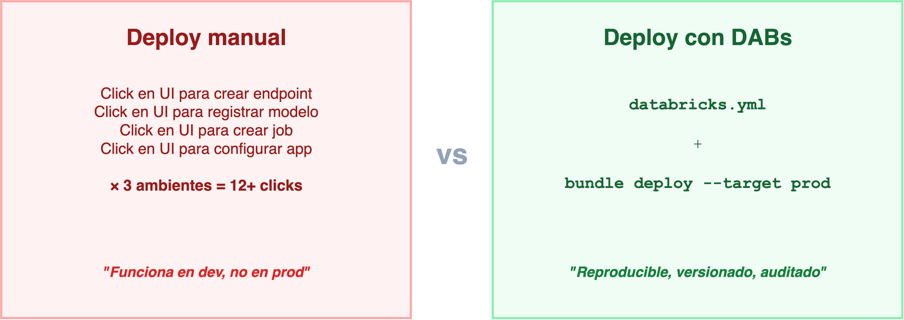
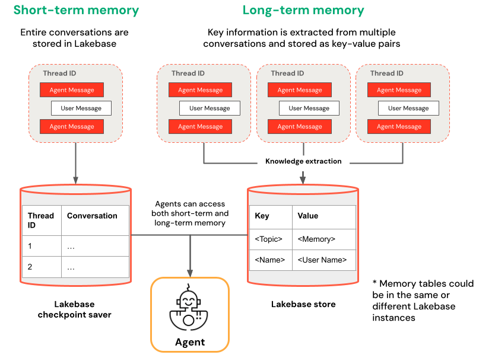
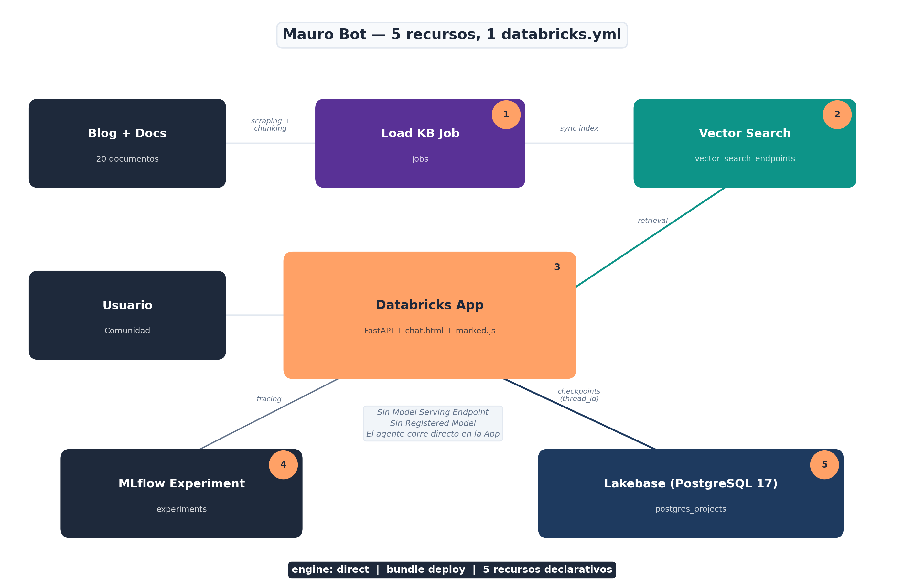

##  {data-background-color="#1e293b" visibility="uncounted"}

::: {style="color: white; text-align: center; margin-top: 2em;"}
[De YAML a producción]{style="font-size: 2.4em; font-weight: 700; letter-spacing: -0.02em; line-height: 1.1;"}

[Deploy de AI Agents con]{style="color: #94a3b8; font-size: 1.1em; display: block; margin-top: 0.6em;"}
[**Declarative Automation Bundles**]{style="color: #FFA166; font-size: 1.4em;"}

::: {style="margin-top: 1.5em; padding-top: 1em; border-top: 1px solid rgba(148,163,184,0.3);"}
[Databricks Meetup Uruguay · 25 de junio 2026]{style="color: #94a3b8; font-size: 0.8em;"}

[Mauro Loprete]{style="color: #cbd5e1; font-size: 0.9em; display: block; margin-top: 0.3em;"}
:::
:::

::: notes
El objetivo de esta charla: quiero hacer una réplica de mí mismo — un bot que responda preguntas sobre Databricks basado en mi blog y documentación oficial. Para eso necesito 7+ recursos en producción. Vamos a ver cómo DABs resuelve eso con un solo YAML, con CI/CD y demo en vivo.
:::

##  {data-background-color="#1e293b"}

::: {style="color: white; text-align: center; margin-top: 0.5em;"}
### Mauro Loprete

[Data Engineer \@ F1rst · Docente \@ UDELAR]{style="font-size: 0.95em;"}

{width="120" style="display: inline-block; margin: 0.3em 0.5em;"}

[ Blog **Spark de Ideas** — databricks, data engineering, MLOps]{style="color: #FFA166; font-size: 0.85em; display: block; margin-top: 0.4em;"}

[ Podcast **Spark de Ideas** — data en español, desde Uruguay]{style="color: #FFA166; font-size: 0.85em; display: block; margin-top: 0.2em;"}

[DABs en producción desde 2024]{style="color: #94a3b8; font-size: 0.8em; display: block; margin-top: 0.4em;"}
:::

::: notes
Presentarme brevemente. Data Engineer en F1rst, donde usamos DABs para gestionar todos los deployments en Databricks. Docente en UDELAR. Tengo el blog y podcast Spark de Ideas donde publico sobre Databricks, Data Engineering y MLOps.
:::

## Agenda

1.  **El problema**: deployar un agente no es solo servir un modelo
2.  **El ecosistema agéntico**: Agent Bricks, Lakebase, Databricks Apps
3.  **DABs en 2026**: qué cambió (y por qué importa)
4.  **Ejemplo real**: un `databricks.yml` completo para un agente RAG con memoria
5.  **CI/CD**: de push a producción
6.  **Gotchas**: lo que no está en la documentación
7.  **Demo en vivo**

. . .

> Todo el código de la charla está disponible en el blog.

::: notes
7 bloques en 35 minutos. Arrancamos con el problema, el ecosistema, las novedades de DABs, el plato fuerte con el ejemplo real (Spark de Ideas Bot — una réplica mía), CI/CD, gotchas, y cerramos con demo en vivo. Preguntas al final o me interrumpen.
:::

##  {data-background-color="#dc2626"}

::: {style="color: white; text-align: center;"}
[**1**]{style="font-size: 3em; opacity: 0.4;"}

### El problema

[Tu agente funciona en un notebook. ¿Y ahora?]{style="font-size: 0.9em;"}
:::

::: notes
Todos hemos estado acá. El agente funciona en un notebook, la demo sale genial, y el PM dice "perfecto, ponelo en producción para el lunes". Y ahí arranca el dolor.
:::

## Qué necesita un agente en producción

-   **MLflow Experiment** — tracking de runs y métricas
-   **Registered Model** en Unity Catalog — versionado
-   **Model Serving Endpoint** — con AI Gateway, rate limits, guardrails
-   **Vector Search Index** — retrieval de documentos
-   **Job de refresh** — actualizar el índice periódicamente
-   **Databricks App** — interfaz de chat para los usuarios
-   **Permisos, secrets, monitoring...**

. . .

> Eso son **7+ recursos** para UN agente. Ahora multiplicá por 3 ambientes.

::: notes
Un agente en producción no es solo un endpoint. Es un ecosistema de recursos que tienen que estar coordinados. Y cada uno tiene su propia configuración, permisos, y lifecycle. Si hacés esto a mano, vas a tener drift entre ambientes, deployments inconsistentes, y nadie va a saber qué está deployado dónde. Dato: los equipos que adoptan DABs usan solo el 20% de lo que la herramienta ofrece — el problema no es el tooling sino la adopción incompleta de las prácticas de ingeniería que Bundles soporta. Resultado: "mejora incremental sin confiabilidad real".
:::

## La pesadilla del deploy manual

{fig-align="center" width="80%"}

::: notes
A la izquierda: la realidad de muchos equipos. Click en la UI, repetir por cada ambiente, y rezar para que quede igual. A la derecha: todo definido en un archivo YAML, versionado en Git, deployado con un comando. La diferencia no es solo de velocidad — es de confiabilidad.
:::

##  {data-background-color="#593196"}

::: {style="color: white; text-align: center;"}
[**2**]{style="font-size: 3em; opacity: 0.4;"}

### El ecosistema agéntico de Databricks

[Agent Bricks · Lakebase · Databricks Apps]{style="font-size: 0.9em;"}
:::

::: notes
Antes de meternos en DABs, necesitamos entender el ecosistema de agentes que Databricks está construyendo. Hay tres piezas clave: Agent Bricks para construir agentes, Lakebase para darles memoria, y Databricks Apps para la interfaz de usuario.
:::

## El ecosistema

{fig-align="center" width="80%"}

::: notes
El ecosistema tiene tres pilares. Agent Bricks para construir agentes de forma task-first, con auto-optimización y benchmarks sintéticos. Lakebase como la memoria — PostgreSQL serverless con pgvector para que los agentes recuerden entre sesiones. Y Databricks Apps para servir la interfaz de chat con auth integrada y resource bindings. Todo corre sobre Mosaic AI, Unity Catalog, MLflow 3.0 y AI Gateway.
:::

## Agent Bricks: construir sin code-first

Invierte el flujo clásico (code → prompt → evaluate):

1.  **Tarea** en lenguaje natural + datos de UC
2.  **Benchmarks sintéticos** generados automáticamente
3.  **Auto-optimización** de modelo, prompts y retrieval
4.  **Agent-as-a-Judge** para evaluación continua

. . .

Incluye **Supervisor Agent** para orquestar multi-agente con MCP.

> No reemplaza el code-first — lo complementa para iterar rápido.

::: notes
Agent Bricks es el approach "no-code" para construir agentes. Le decís qué querés que haga, le apuntás a los datos en Unity Catalog, y el sistema genera benchmarks, optimiza automáticamente, y te da un agente evaluado. Lo interesante es el Supervisor Agent: podés orquestar múltiples agentes con Model Context Protocol. Para producción, estos agentes se deployean como Model Serving endpoints, y ahí es donde DABs entra. Baja la barrera de entrada, pero todavía sacrifica flexibilidad (por ahora, Beta).
:::

## Lakebase: la memoria que les faltaba

**Lakebase** = PostgreSQL 17 serverless + managed por Databricks.

{fig-align="center" width="75%"}

::: {style="font-size: 0.6em; color: #94a3b8; text-align: center;"}
Fuente: [Azure Databricks — AI Agent Memory](https://learn.microsoft.com/en-us/azure/databricks/generative-ai/agent-framework/stateful-agents)
:::

::: notes
Lakebase es la pieza que faltaba para agentes stateful. Este diagrama de la documentación oficial muestra los dos tipos de memoria. A la izquierda: short-term — cada thread ID tiene su conversación completa guardada como checkpoints en Lakebase. Es lo que usamos en el bot con PostgresSaver de LangGraph. A la derecha: long-term — el agente extrae insights clave de múltiples conversaciones y los guarda como key-value pairs. Ambos tipos pueden vivir en la misma instancia de Lakebase o en instancias separadas. El agente accede a ambos tipos de memoria.
:::

## ¿Por qué Lakebase y no otra cosa?

|   | Delta | Postgres externo | **Lakebase** |
|---|-------|------------------|----------|
| **Tipo** | OLAP (batch) | OLTP | **OLTP** |
| **Latencia** | Segundos | Milisegundos | **Milisegundos** |
| **En DABs** | N/A para checkpoints | No | **Si** |
| **Gobernanza** | Unity Catalog | Externa | **Unity Catalog** |
| **Costo idle** | Storage | 24/7 | **Scale to zero** |
| **Branching** | No | Manual | **Fork instantáneo** |

> Lakebase no es "mejor Postgres" — es Postgres que **vive dentro del ecosistema**.

::: notes
Esta pregunta la van a hacer. Delta no sirve para checkpoints porque es OLAP — los checkpoints necesitan operaciones OLTP rápidas por fila. Un Postgres externo funciona, pero sumás infra fuera del ecosistema, sin gobernanza ni scale to zero. Con Lakebase, la base de datos es parte del bundle, la deployás con el agente, y no pagás cuando nadie la usa. Además: branching instantáneo para testing sin tocar datos reales, pgvector nativo para embeddings sin pipeline separado. Si ya tenés un Postgres externo funcionando, no necesitás migrar. Pero si arrancás de cero, Lakebase te ahorra toda la infra.
:::

##  {data-background-color="#0369a1"}

::: {style="color: white; text-align: center;"}
[**3**]{style="font-size: 3em; opacity: 0.4;"}

### DABs en 2026: qué cambió

[Spoiler: se renombraron y dejaron Terraform]{style="font-size: 0.9em;"}
:::

::: notes
Ahora que entendemos el ecosistema de agentes, veamos qué cambió en DABs este año. Hay 3 novedades importantes que cambian cómo trabajamos.
:::

## Declarative Automation Bundles

Desde **marzo 2026**, Databricks renombró DABs:

[**Databricks** Asset Bundles]{style="font-size: 1.1em; text-decoration: line-through; color: #94a3b8;"} → [**Declarative** Automation Bundles]{style="font-size: 1.1em; color: #FFA166; font-weight: 600;"}

. . .

-   Mismos comandos: `bundle validate`, `bundle deploy`, `bundle run`
-   Mismo `databricks.yml` — 100% retrocompatible
-   El nombre refleja lo que realmente son: **automatización declarativa**

> Ya no es solo "assets" — es toda tu plataforma como código.

::: notes
El renombre es cosmético pero significativo. Ya no estamos hablando solo de manejar assets individuales — DABs maneja jobs, pipelines, endpoints, apps, schemas, volumes, Lakebase. Es automatización declarativa de toda la plataforma. Thoughtworks los puso en "Adopt" en el Technology Radar de abril.
:::

## Direct Deployment Engine

El cambio más importante de 2026: **DABs ya no usa Terraform por debajo**.

|   | Antes (Terraform) | Ahora (Direct) |
|------------------------|------------------------|------------------------|
| **Dependencia** | Descargaba `terraform` + provider | Solo el CLI de Databricks |
| **Estado** | `terraform.tfstate` | `resources.json` |
| **Errores** | Referenciaban HCL/Terraform | Referencia a `databricks.yml` |
| **Firewalls** | Necesitaba registry.terraform.io | Sin dependencias externas |

. . .

``` bash
# Migración (idempotente, segura)
databricks bundle deployment migrate -t prod
```

::: notes
Esto es un game changer. Antes DABs usaba Terraform internamente para manejar el estado, lo que significaba que necesitabas descargar Terraform y el provider de Databricks. Eso causaba problemas con firewalls, proxies, y los errores eran confusos porque referenciaban HCL. Ahora el engine es directo, los errores son claros, y no necesitás nada más que el CLI.
:::

## `bundle plan`: preview antes de deployar

``` bash
databricks bundle plan -t prod
```

. . .

``` text
Plan:

  ~ apps.mauro_bot_app
    ~ config.env[4].value: "dev_bronze.labs.mauro_bot_vs_index"
      → "pro_bronze.labs.mauro_bot_vs_index"

  + jobs.evaluation_job (new)
    name: "[prod] Agent Evaluation"
    schedule: "0 0 8 * * ?"

  Summary: 1 to create, 1 to update, 0 to destroy.
```

> Como `terraform plan` — pero para tu `databricks.yml`.

::: notes
Esto es nuevo y es espectacular. Antes hacías bundle deploy y rezabas. Ahora podés hacer bundle plan y ver exactamente qué va a cambiar antes de aplicar. En el ejemplo: va a actualizar la versión del modelo en el endpoint y crear un job nuevo. Esto en CI/CD es invaluable — podés poner un step de plan en el PR y revisar los cambios antes de mergear.
:::

## Python bundles (pyDABs) — GA

Desde **abril 2026**, podés definir recursos en Python:

``` python
from databricks.bundles import Bundle, Job, Task

bundle = Bundle(name="my-agent")

bundle.add_resource(
    Job(
        name="agent-training",
        tasks=[
            Task(
                key="train",
                notebook_path="./notebooks/train.py"
            )
        ]
    )
)
```

. . .

Útil para bundles dinámicos. Pero para esta charla nos quedamos con **YAML** — es más legible para equipos.

::: notes
Python bundles son GA desde abril 2026. Te permiten generar configuración dinámicamente — por ejemplo, crear un job por cada tabla en un schema. Pero para el 90% de los casos, YAML es más legible y más fácil de revisar en PRs. Lo menciono para que sepan que existe.
:::

##  {data-background-color="#FFA166"}

::: {style="color: #7c2d12; text-align: center;"}
[**4**]{style="font-size: 3em; opacity: 0.4;"}

### Ejemplo real

[Un `databricks.yml` completo para un agente RAG con memoria]{style="font-size: 0.9em;"}
:::

::: notes
El plato fuerte. Quiero hacer una réplica de mí mismo — un bot que responda preguntas sobre Databricks basado en mi blog "Spark de Ideas" y documentación oficial. 20 documentos de buenas prácticas, memoria conversacional con Lakebase, y deployado con un solo databricks.yml. Lo llamé "Spark de Ideas Bot".
:::

## El escenario: Mauro Bot

{fig-align="center" width="50%"}

::: notes
Esta es la arquitectura de Mauro Bot. Arriba: el pipeline de conocimiento — un Job scrapea el blog con BeautifulSoup, genera chunks y los escribe a Delta. Vector Search indexa automáticamente. En el medio: la Databricks App corre el agente directamente usando el patrón agent-langgraph-advanced — sin Model Serving Endpoint de por medio. Abajo: Lakebase con PostgreSQL 17 para memoria conversacional — cada thread_id persiste entre sesiones. El frontend es un chat.html custom servido por FastAPI con marked.js para renderizar markdown. Todo en un solo databricks.yml.
:::

## Estructura del proyecto

``` text
mauro-bot/
├── databricks.yml              # Todo el deploy
├── app.yaml                    # Runtime config (command + env)
├── pyproject.toml              # Deps (uv)
├── agent_server/
│   ├── agent.py                # LangGraph + ResponsesAgent
│   ├── start_server.py         # FastAPI + Lakebase init
│   ├── utils_memory.py         # CheckpointSaver + Store
│   └── chat.html               # Chat UI (marked.js)
├── src/
│   ├── load_knowledge_base.py  # Carga de la KB
│   └── refresh_index.py        # Sync del vector index
└── .github/
    └── workflows/deploy.yml    # CI/CD
```

::: notes
Estructura del template agent-langgraph-advanced. El databricks.yml define todos los recursos. app.yaml define el runtime: comando de inicio y variables de entorno (con valueFrom para Lakebase). agent_server tiene el agente con ResponsesAgent, el servidor FastAPI con Lakebase init, y un chat.html custom que renderiza markdown con marked.js. src tiene los notebooks del pipeline de conocimiento. Y el workflow de GitHub Actions para CI/CD.
:::

## Ingesta de la base de conocimiento

{fig-align="center" width="80%"}

::: notes
Antes de meternos en el YAML, veamos cómo se ingesta la base de conocimiento. Un Job scrapea el blog con requests y BeautifulSoup — extrae las URLs de todos los posts, descarga cada uno, y genera chunks de ~2000 caracteres con título, categoría y fuente. Se escriben a una tabla Delta en Unity Catalog. Vector Search sincroniza automáticamente y genera el índice con embeddings. Si mañana publico un post nuevo, el job lo levanta solo en el próximo run. Ahora veamos el YAML sección por sección.
:::

## `databricks.yml` — base {auto-animate="true"}

``` yaml
bundle:
  name: mauro-bot

variables:
  catalog: { default: dev_bronze }  # dev_bronze | pro_bronze por target
  schema:  { default: labs }

resources:
  experiments:
    agent_experiment:
      name: /Users/${workspace.current_user.userName}/mauro-bot

  vector_search_endpoints:
    mauro_bot_vs:
      name: mauro-bot-vs
      endpoint_type: STANDARD

  postgres_projects:
    mauro_bot_memory:
      project_id: maurobot-memory
      display_name: Mauro Bot Memory Store
```

> `${var.catalog}` se resuelve por target: `dev_bronze` en dev, `pro_bronze` en prod.

::: notes
Arrancamos con lo básico: nombre del bundle y variables. El catalog cambia entre dev_bronze y pro_bronze según el target. Abajo, el experiment de MLflow para tracing, el Vector Search endpoint para RAG, y Lakebase para memoria conversacional — PostgreSQL 17 serverless. Noten que no hay registered_models ni model_serving_endpoints — el agente corre directamente en la App, no detrás de un serving endpoint. Es el patrón agent-langgraph-advanced de Databricks.
:::

## `databricks.yml` — app (el agente) {auto-animate="true"}

``` yaml
  apps:
    mauro_bot_app:
      name: mauro-bot
      source_code_path: ./
      config:
        command: ["uv", "run", "start-app"]
        env:
          - name: LAKEBASE_AUTOSCALING_ENDPOINT
            value_from: postgres
          - name: MLFLOW_EXPERIMENT_NAME
            value: ${resources.experiments.agent_experiment.name}
          - name: VS_INDEX_NAME
            value: ${var.catalog}.${var.schema}.mauro_bot_vs_index
          - name: LLM_ENDPOINT
            value: ${var.llm_endpoint}
      resources:
        - name: postgres
          postgres:
            branch: "projects/${var.lakebase_project_id}/branches/production"
            database: "projects/.../databases/databricks-postgres"
            permission: CAN_CONNECT_AND_CREATE
```

> `value_from` inyecta el endpoint de Lakebase automáticamente — sin connection strings.

::: notes
La app ES el agente — no hay Model Serving Endpoint de por medio. El código del agente corre directamente dentro de la Databricks App con FastAPI y un chat.html custom que renderiza markdown. Lakebase se bindea como recurso postgres: value_from inyecta el autoscaling endpoint automáticamente via OAuth. El VS index y el LLM endpoint se pasan como env vars que varían por target. Importante: el app.yaml en el source root también define valueFrom (camelCase) — es el runtime config que la plataforma lee al deployar.
:::

## `databricks.yml` — job {auto-animate="true"}

``` yaml
  jobs:
    load_knowledge_base:
      name: "[${bundle.target}] Load Knowledge Base"
      tasks:
        - task_key: load
          notebook_task:
            notebook_path: ./src/load_knowledge_base.py
            base_parameters:
              catalog: ${var.catalog}
              schema: ${var.schema}
        - task_key: refresh_index
          depends_on: [{ task_key: load }]
          notebook_task:
            notebook_path: ./src/refresh_index.py
      schedule:
        quartz_cron_expression: "0 0 6 * * ?"
        timezone_id: "America/Montevideo"
```

::: notes
El job tiene 2 tasks encadenadas: primero carga la KB scrapeando el blog, luego sincroniza el Vector Search index. Ya no hay register_model — el agente es code-first, no necesita registrarse como modelo en Unity Catalog. Corre todos los días a las 6 AM Montevideo.
:::

## `databricks.yml` — targets {auto-animate="true"}

``` yaml
targets:
  dev:
    mode: development
    default: true
    workspace:
      host: https://adb-XXX.azuredatabricks.net
      profile: mauro_premium
    variables:
      catalog: dev_bronze

  prod:
    mode: production
    workspace:
      host: https://adb-XXX.azuredatabricks.net
    run_as:
      user_name: mauro@empresa.onmicrosoft.com
    variables:
      catalog: pro_bronze
```

::: notes
Los targets son la magia. En dev, todo se prefija con tu usuario y los triggers se pausan automáticamente — no hay riesgo de conflictos entre developers. En prod, corre como un usuario específico con run_as y DABs valida que esté definido. El catalog cambia entre dev_bronze y pro_bronze. Misma infra, misma config, distinto ambiente.
:::

## Un deploy completo

``` bash
databricks bundle validate -t prod   # Validar sintaxis y config
databricks bundle plan -t prod       # Preview de cambios
databricks bundle deploy -t prod     # Deployar recursos
databricks bundle run mauro_bot_app  # Iniciar/reiniciar la app
```

. . .

**Eso es todo.** 4 comandos → 5 recursos en producción.

[experiment · vector search · Lakebase · app · job]{style="color: #94a3b8; font-size: 0.85em;"}

::: notes
Cuatro comandos: validate chequea sintaxis, plan muestra los cambios, deploy sube código y configura recursos, y run inicia o reinicia la app. Deploy solo sube archivos y configura — run es necesario para que la app arranque con el código nuevo. En un solo deploy tenés todo el stack del agente en producción. Y si algo sale mal, el estado es idempotente.
:::

## El agente: `agent-langgraph-advanced`

``` {.python code-line-numbers="1-5|7-12|14-18|20-27"}
from databricks_langchain import ChatDatabricks
from langgraph.graph import END, StateGraph
from mlflow.genai.agent_server import invoke, stream
from mlflow.types.responses import *

graph = StateGraph(AgentState)
graph.add_node("retrieve", retrieve)   # Vector Search → context
graph.add_node("generate", generate)   # ChatDatabricks → respuesta
graph.set_entry_point("retrieve")
graph.add_edge("retrieve", "generate")
graph.add_edge("generate", END)

@invoke()
async def invoke_handler(request: ResponsesAgentRequest) -> ResponsesAgentResponse:
    outputs = [e.item async for e in stream_handler(request)
               if e.type == "response.output_item.done"]
    return ResponsesAgentResponse(output=outputs)

@stream()
async def stream_handler(request: ResponsesAgentRequest):
    checkpointer, _ = get_lakebase_resources()  # Global desde lifespan
    agent = graph.compile(checkpointer=checkpointer)
    config = {"configurable": {"thread_id": get_thread_id(request)}}
    async for event in agent.astream(input_state, config,
                                     stream_mode=["updates", "messages"]):
        # Emite ResponsesAgentStreamEvent token a token
        yield delta_event(event)
```

::: notes
El agente sigue el patrón agent-langgraph-advanced. Dos nodos: retrieve busca en Vector Search, generate llama al LLM. La clave es el patrón @invoke delega a @stream: invoke consume el stream completo y devuelve la respuesta final, stream emite tokens de a uno para la UI. El checkpointer viene del lifespan del server (se inicializa una vez al startup conectando a Lakebase). Cada thread_id persiste la conversación completa. stream_mode=["updates", "messages"] permite emitir deltas por token sin esperar a que termine el nodo.
:::

##  {data-background-color="#0d9488"}

::: {style="color: white; text-align: center;"}
[**5**]{style="font-size: 3em; opacity: 0.4;"}

### CI/CD: de push a producción

[`git push` → validate → plan → deploy]{style="font-size: 0.9em;"}
:::

::: notes
Ahora que tenemos el bundle, necesitamos automatizar el deploy. No queremos que alguien haga bundle deploy desde su laptop un viernes a las 6 de la tarde.
:::

## GitHub Actions

``` {.yaml code-line-numbers="1-5|7-15|17-26"}
name: Deploy Mauro Bot
on:
  push: { branches: [main] }
  pull_request: { branches: [main] }
env:
  DATABRICKS_HOST: ${{ secrets.DATABRICKS_HOST }}
  DATABRICKS_TOKEN: ${{ secrets.DATABRICKS_TOKEN }}
jobs:
  validate:
    runs-on: ubuntu-latest
    steps:
      - uses: actions/checkout@v4
      - uses: databricks/setup-cli@main
      - run: databricks bundle validate -t prod
      - run: databricks bundle plan -t prod
  deploy:
    needs: validate
    if: github.ref == 'refs/heads/main'
    runs-on: ubuntu-latest
    environment: production
    steps:
      - uses: actions/checkout@v4
      - uses: databricks/setup-cli@main
      - run: databricks bundle deploy -t prod
      - run: databricks bundle run mauro_bot_app -t prod
```

::: notes
El workflow tiene dos jobs. Validate corre en PRs — valida el bundle y muestra el plan. En el repo real hay un step extra con actions/github-script que comenta el plan como comentario en el PR — lo simplifiqué acá para que entre en la slide. Deploy corre solo en main: primero deploy sube código y configura recursos, luego run inicia o reinicia la app con el código nuevo. Sin el run, la app sigue corriendo con el código anterior. Dos secrets: host y token del workspace.
:::

## El flujo completo

{fig-align="center" width="80%"}

. . .

**El plan del PR muestra exactamente qué va a cambiar en prod** — reviewable como cualquier diff.

::: notes
Este es el flujo ideal. El developer crea un PR, el CI valida el bundle y muestra el plan (qué recursos se crean, actualizan o destruyen). El reviewer mira el diff del YAML Y el plan de cambios. Después del merge, el deploy corre automáticamente con approval. Es el mismo flujo que usarían para código de aplicación, pero para infraestructura de datos.
:::

##  {data-background-color="#dc2626"}

::: {style="color: white; text-align: center;"}
[**6**]{style="font-size: 3em; opacity: 0.4;"}

### Gotchas

[Lo que me hubiese gustado saber antes]{style="font-size: 0.9em;"}
:::

## Gotchas

| # | Gotcha | Tip |
|---|--------|-----|
| 1 | Apps tienen cold start de ~30 seg | Usar `scale_to_zero: false` si hay SLA |
| 2 | Un bundle por dominio, no un mega-bundle | Separar por dominio: ingesta, agente, analytics |
| 3 | Migrá al Direct Engine ya | `bundle deployment migrate` — seguro e idempotente |
| 4 | `bundle plan` es tu mejor amigo | Corré plan antes de cada deploy |
| 5 | `uv` > `pip` en Databricks Apps | Startup 10x más rápido, lockfile reproducible |
| 6 | `app.yaml` usa `valueFrom` (camelCase) | En `databricks.yml` es `value_from` (snake) |

::: notes
Estos son los que me costaron horas. El de cold start afecta la primera request después de un deploy. Mega-bundle es un anti-patrón que vi en varios equipos. Bundle plan — usalo siempre. El de valueFrom es sutil: en app.yaml (que la plataforma lee en runtime) es camelCase, en databricks.yml (que el bundle resuelve en deploy time) es snake_case. Me costó una hora de debugging. Otros anti-patrones: extraer metadata vía dbutils.notebook.entry_point (roto en serverless), sacar tokens del contexto del notebook. Para rollbacks: revertí el commit en Git y deployeá de nuevo.
:::

## Gotcha #7: Direct Engine — issues abiertos

{fig-align="center" width="70%"}

`postgres_projects` no es idempotente — el re-deploy falla con *"project slug already exists"* porque el CLI siempre hace POST.

. . .

> El repo `databricks/cli` es abierto y el equipo responde rápido. Contribuir issues es parte de la adopción.

::: notes
Este es un issue real. postgres_projects no soporta re-deploy — siempre hace POST en vez de PUT. El workaround: crear el proyecto Lakebase una vez (via UI o CLI) y no incluirlo en el YAML. Otro gotcha de Lakebase: el SP de la app con CAN_CONNECT_AND_CREATE no recibe CREATE ON SCHEMA public — tuve que crear las tablas como superuser y luego conceder permisos al SP. Estos gaps van a mejorar, pero por ahora hay que hacer setup manual la primera vez. El Direct Engine funciona muy bien para el 95% de los recursos.
:::

##  {data-background-color="#FFA166"}

::: {style="color: #7c2d12; text-align: center;"}
[**7**]{style="font-size: 3em; opacity: 0.4;"}

### Demo en vivo

[Spark de Ideas Bot en acción]{style="font-size: 0.9em;"}
:::

::: notes
Y ahora lo que estaban esperando — demo en vivo. Les presento a mi réplica: Spark de Ideas Bot. Un chatbot que responde sobre buenas prácticas de Databricks basándose en mi blog y documentación oficial. Tiene humor, tiene links a la documentación, y tiene memoria entre conversaciones gracias a Lakebase.
:::

## Probemos el bot

1. *"¿Qué es Liquid Clustering?"*
2. *"Tengo 500 particiones, ¿cómo migro?"*
3. *"¿Cómo configuro CI/CD para DABs?"*
4. *"¿Cuál es la diferencia entre DLT y Lakeflow?"*
5. *"Dame 3 tips para reducir costos"*

. . .

> El código completo va a estar disponible en el blog post de la charla.

::: notes
Preguntas para probar en vivo. La primera sobre Liquid Clustering muestra que el bot conoce los contenidos del blog a fondo. La segunda es un caso práctico. La cuarta testea la diferenciación entre productos que Databricks renombró. Hago la demo yo desde mi cuenta porque la app requiere auth de Databricks.
:::

## Qué está listo para producción (junio 2026)

| Feature | Estado |
|---------|--------|
| YAML bundles (jobs, pipelines, models, endpoints) |  **GA** |
| Direct Deployment Engine |  **GA** |
| Python bundles (pyDABs) |  **GA** |
| Bundles en Workspace UI |  **GA** |
| Databricks Apps en bundles |  **GA** |
| Lakebase Postgres en bundles |  **GA** |
| `bundle plan` (JSON output) |  **GA** |
| `model_serving_endpoints` en pyDABs |  Preview |
| Thoughtworks Technology Radar |  **Adopt** |

::: notes
Para el que pregunta "¿está maduro?": sí. Está en GA, Thoughtworks lo puso en Adopt, y el Direct Engine elimina las dependencias de Terraform que eran el mayor punto de fricción. Si estás empezando, arrancá hoy.
:::

## Lo que viene del DAIS 2026

| Anuncio | Qué cambia | Estado |
|---------|-----------|--------|
| **ResponsesAgent** (MLflow) | Nueva interfaz para agentes — wrappea cualquier framework |  GA |
| **Unity AI Gateway** | Gobernanza runtime: cost caps, smart routing, guardrails |  GA |
| **MCP en Databricks** | Agentes se conectan a Genie, SQL, GitHub, Slack via MCP |  Preview |
| **CLEARS Framework** | 6 dimensiones para evaluar agentes como quality gate en CI |  GA |
| **Lakebase Search** | Retrieval híbrido vector + full-text nativo en Postgres |  Beta |
| **LTAP** | OLTP + OLAP en una sola copia — elimina ETL para agentes |  Coming soon |
| **Migrate Serving → Apps** | Databricks recomienda mover agentes de endpoints a Apps | Docs disponibles |

::: notes
Estos anuncios son del Data + AI Summit 2026, la semana pasada. ResponsesAgent reemplaza el patrón PyFunc que usamos en el bot — permite wrappear cualquier framework (LangGraph, OpenAI, CrewAI) y obtener tracing, eval y monitoring automático. Unity AI Gateway ya lo usamos para rate limits, pero ahora incluye cost caps y smart routing entre modelos. MCP permite que los agentes se conecten a tools externos — GitHub, Slack, Jira — declarativamente. CLEARS es el framework de evaluación estandarizado: Correctness, Latency, Execution, Adherence, Relevance, Safety. Lakebase Search es el futuro del Vector Search: retrieval híbrido dentro de Postgres con 32x compresión. Y LTAP es la visión a largo plazo — que los agentes lean, razonen y escriban sobre una sola capa de storage sin cruzar fronteras OLTP/OLAP.
:::

## El stack: `agent-langgraph-advanced`

``` text
Agent (LangGraph + RAG)
  → MLflow ResponsesAgent (@invoke / @stream)
    → Databricks App (FastAPI + chat.html con marked.js)
      → Lakebase (AsyncCheckpointSaver — memoria por thread_id)
      → Vector Search (RAG del blog)
      → MLflow Experiment (tracing automático)
```

. . .

- **Sin Model Serving Endpoint** — el agente corre en la App directamente
- **Sin registrar modelo** en UC — es code-first, versionado en Git
- **Chat HTML custom** — streaming SSE + markdown rendering

> Template oficial: `databricks apps init --template agent-langgraph-advanced`

::: notes
Este es el stack que usamos. El agente sigue el template oficial agent-langgraph-advanced de Databricks. LangGraph para el grafo RAG, ResponsesAgent de MLflow para la interfaz con @stream que genera tokens de a uno, y la App corre todo directamente — sin pasar por Model Serving. La memoria conversacional usa AsyncCheckpointSaver de databricks_langchain que conecta a Lakebase via OAuth automático. El chat es un HTML custom que consume el endpoint /responses con streaming SSE y renderiza markdown con marked.js. Todo se deploya con un solo databricks.yml.
:::

##  {data-background-color="#1e293b"}

::: {style="color: white; text-align: center; margin-top: 2em;"}

[Si tu agente no se deploya con]{style="font-size: 1.2em;"}

[`bundle deploy`]{style="color: #FFA166; font-size: 2.2em; font-weight: 700; display: block; margin: 0.3em 0;"}

[no está listo para producción.]{style="font-size: 1.2em;"}

::: {style="margin-top: 1.5em; border-top: 1px solid rgba(148,163,184,0.3); padding-top: 1em;"}
[IaC no es opcional. Es la diferencia entre una demo y un producto.]{style="color: #94a3b8; font-size: 0.9em;"}
:::
:::

::: notes
Este es el mensaje. Un agente que se deploya manualmente es una demo. Un agente que se deploya con DABs, versionado en Git, con CI/CD, con permisos y monitoring — eso es un producto. La diferencia no es técnica, es de madurez. El agente más inteligente se cae si no tiene deploy reproducible, governance, y memoria persistente. DABs te da todo eso en un archivo.
:::

## Para seguir

::: columns
::: {.column width="50%"}
**Documentación y herramientas**

- [ DevHub](https://developers.databricks.com) — Portal de developers con templates y guías
- [ AppKit](https://github.com/databricks/appkit) — SDK TypeScript/React para Databricks Apps
- [ DABs docs](https://docs.databricks.com/aws/en/dev-tools/bundles)
- [ Agent memory](https://learn.microsoft.com/en-us/azure/databricks/generative-ai/agent-framework/stateful-agents)
- [ Direct Engine](https://docs.databricks.com/aws/en/dev-tools/bundles/direct)
:::

::: {.column width="50%"}
**Blog y comunidad**

- [Tips #1: Asset Bundles](https://mauroloprete.github.io/mauroloprete/blog/posts/databricks-asset-bundles-advanced/) — Spark de Ideas
- [Tips #10: AI Gateway](https://mauroloprete.github.io/mauroloprete/blog/posts/databricks-tips-10-ai-gateway/) — Spark de Ideas
- [Production-Ready Bundles](https://www.sunnydata.ai/blog/production-ready-databricks-projects-databricks-bundles) — SunnyData
- [Thoughtworks Radar](https://www.thoughtworks.com/en-us/radar/languages-and-frameworks/declarative-automation-bundles)
:::
:::

::: notes
A la izquierda la documentación oficial — empezar por DABs docs y Lakebase con DABs. A la derecha, posts del blog y de la comunidad. Tips #1 cubre DABs en profundidad, Tips #10 cubre AI Gateway. SunnyData tiene excelentes posts sobre patrones de producción.
:::

##  {data-background-color="#1e293b" visibility="uncounted"}

::: {style="color: white; text-align: center; margin-top: 1.5em;"}
{width="140" style="border-radius: 20px; box-shadow: 0 10px 30px rgba(0,0,0,0.5);"}

[**Gracias!**]{style="font-size: 2em; color: #FFA166; display: block; margin-top: 0.4em;"}

[Preguntas, feedback, puteadas — todo vale]{style="font-size: 0.95em; display: block; margin-top: 0.2em;"}

::: {style="margin-top: 1em;"}
[ sparkdeideas.com](https://mauroloprete.github.io/mauroloprete/){style="color: #FFA166; margin-right: 1.2em; font-size: 0.9em;"} [ mauroloprete](https://github.com/mauroloprete){style="color: #FFA166; margin-right: 1.2em; font-size: 0.9em;"} [ mauroloprete](https://linkedin.com/in/mauroloprete){style="color: #FFA166; font-size: 0.9em;"}
:::

[Databricks Meetup Uruguay · Junio 2026]{style="font-size: 0.75em; color: #64748b; display: block; margin-top: 1em;"}
:::

## Backup: DABs vs Terraform {visibility="uncounted"}

|   | DABs | Terraform |
|------------------------|------------------------|------------------------|
| **Para qué** | Recursos **dentro** del workspace | Infraestructura **del** workspace |
| **Ejemplos** | Jobs, endpoints, modelos, apps | VPCs, clusters policies, Unity Catalog setup |
| **State** | Automático (en workspace) | Necesitás backend (S3/GCS) |
| **Curva** | Baja (YAML + CLI) | Alta (HCL + providers + state) |
| **Patrón** | 1 bundle por dominio | 1 módulo por workspace/región |

. . .

> **Terraform provisiona el workspace. DABs deploya lo que corre adentro.**

::: notes
Slide de backup para la pregunta que siempre hacen. No son competidores — son complementarios. Terraform crea los workspaces, las VNets, los metastores de Unity Catalog, las cluster policies. DABs deploya los jobs, pipelines, endpoints, modelos, apps. Terraform es infra, DABs es aplicación. Un patrón útil para conectarlos: Terraform emite outputs como JSON, DABs los consume como variable-overrides.json en deploy time — cero pasos manuales, cero IDs hardcodeados entre equipos. El tracking manual de IDs de Azure Key Vault entre equipos es una bomba de tiempo operativa.
:::