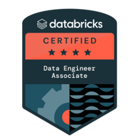

## {data-background-color="#1e293b" visibility="uncounted"}

::: {style="color: white; text-align: center; margin-top: 0.5em;"}

{width=180 style="border-radius: 20px; box-shadow: 0 10px 30px rgba(0,0,0,0.5);"}

[**Spark de Ideas**]{style="font-size: 1.6em; color: #FFA166; display: block; margin-top: 0.3em;"}

[La chispa de la ingeniería de datos en español]{style="font-size: 0.9em; color: #94a3b8;"}

:::

## {data-background-color="#1e293b"}

::: {style="color: white; text-align: center; margin-top: 1em;"}

### Mauro Loprete

[Data Engineer]{style="font-size: 1.1em;"}

{width=120 style="display: inline-block; margin: 0.3em 0.5em;"} {width=120 style="display: inline-block; margin: 0.3em 0.5em;"}

[Yendo por el MVP]{style="color: #94a3b8; font-size: 0.9em;"}

:::

## {data-background-color="#1e293b"}

::: {style="color: white; text-align: center; margin-top: 1em;"}

[Si arrancara de cero]{style="font-size: 1.8em; font-weight: bold;"}

[**¿qué priorizaría aprender en Data Engineering?**]{style="color: #FFA166; font-size: 1.3em;"}

[Para un perfil de ingeniero de datos]{style="color: #94a3b8; font-size: 0.9em;"}

:::

## La pirámide: de abajo hacia arriba

```{r}
#| echo: false
#| warning: false
#| message: false
#| fig-width: 9
#| fig-height: 3.5
#| fig-align: center

library(ggplot2)

levels <- data.frame(
  label = c("Python + SQL", "Apache Spark", "dbt", "Databricks"),
  sub   = c("Los fundamentos — no hay atajo",
            "Procesamiento distribuido",
            "Transformación modular en SQL",
            "Unity Catalog · DABs · LDP"),
  y     = c(1, 2, 3, 4),
  width = c(6.0, 4.5, 3.0, 1.8),
  color = c("#0d9488", "#2563eb", "#ea580c", "#7c3aed")
)

ggplot(levels) +
  geom_tile(aes(x = 0, y = y, width = width, height = 1.0, fill = color),
            color = NA, show.legend = FALSE) +
  geom_text(aes(x = 0, y = y + 0.07, label = label),
            color = "white", fontface = "bold", size = 6) +
  geom_text(aes(x = 0, y = y - 0.2, label = sub),
            color = "white", size = 3.5, alpha = 0.85) +
  scale_fill_identity() +
  scale_y_continuous(expand = expansion(mult = 0.02)) +
  theme_void() +
  theme(plot.margin = margin(2, 2, 2, 2))
```

::: {.notes}
La idea es simple: hay un orden lógico para aprender. Python y SQL son la base, sin eso no podés hacer nada. Después Spark para escalar, dbt para modularizar, y Databricks como plataforma. No es que uno sea más importante que otro, sino que cada nivel se apoya en el anterior.
:::

## {data-background-color="#0d9488"}

::: {style="color: white; text-align: center;"}

[**1**]{style="font-size: 3em; opacity: 0.4;"}

### Python: la base de todo

[No estoy hablando de `print("Hola mundo")`]{style="font-size: 0.9em;"}

:::

::: {.notes}
Acá arrancamos con Python, pero ojo — no es el Python de un curso introductorio. Es el Python que usás todos los días en data engineering: leer archivos, parsear configs, modelar datos, testear.
:::

## Python — lo que realmente necesitás

- **Estructuras de datos**: listas, diccionarios, sets, tuplas
- **Funciones y decoradores**: composición de funciones
- **Manejo de archivos**: JSON, CSV, YAML, Parquet
- **Entornos virtuales**: `venv`, `pip`, `pyproject.toml`
- **Testing básico**: `pytest`

. . .

> El 80% de lo que hacés en data es manipular estructuras.

::: {.notes}
Esto es lo que necesitás para el día a día. No hace falta ser experto en todo, pero sí tener soltura. Lo de testing con pytest es clave — muchos data engineers no testean nada y después pagan las consecuencias en producción.
:::

## Python — dataclasses {auto-animate=true}

```python
from dataclasses import dataclass
from typing import List, Optional

@dataclass
class DataProduct:
    name: str
    owner: str
    tables: List[str]
    sla_hours: Optional[int] = None
```

## Python — dataclasses {auto-animate=true}

```python
from dataclasses import dataclass
from typing import List, Optional

@dataclass
class DataProduct:
    name: str
    owner: str
    tables: List[str]
    sla_hours: Optional[int] = None

    def is_critical(self) -> bool:
        return self.sla_hours is not None and self.sla_hours <= 4

# Leer config, parsear, validar — el 60% del laburo real
with open("products.json") as f:
    products = [DataProduct(**p) for p in json.load(f)]

critical = [p for p in products if p.is_critical()]
```

::: {.notes}
Dataclasses son la opción por defecto. Antes de escribir un diccionario para modelar algo, pensá si no es mejor una dataclass. Tenés autocompletado, type hints, y el código queda mucho más legible. El ejemplo de leer un JSON y convertirlo a objetos tipados es algo que hacemos todo el tiempo.
:::

## Python — inmutabilidad {auto-animate=true}

El problema de los objetos mutables:

```python
@dataclass
class Config:
    host: str
    port: int
    timeout: int = 30

config = Config("db.prod.internal", 5432)
```

## Python — inmutabilidad {auto-animate=true}

El problema de los objetos mutables:

```python
@dataclass
class Config:
    host: str
    port: int
    timeout: int = 30

config = Config("db.prod.internal", 5432)

# Función B modifica la config sin que te des cuenta
def add_debug_settings(config):
    config.host = "localhost"  # ← cambió producción

connect(config)           # → "db.prod.internal:5432" ✓
add_debug_settings(config)
connect(config)           # → "localhost:5432" ← BUG
```

::: {.notes}
Este es un bug real que vi en producción. Una función auxiliar modificaba la config y afectaba a todo el pipeline. El problema es que Python por defecto te deja mutar todo. En data engineering, donde pasás configs y DataFrames entre funciones, esto es una fuente constante de bugs silenciosos.
:::

## Python — la solución: frozen {auto-animate=true}

```python
@dataclass(frozen=True)
class Config:
    host: str
    port: int
    timeout: int = 30

config = Config("db.prod.internal", 5432)

config.host = "localhost"  # ← FrozenInstanceError

# Si necesitás una versión modificada, creás una nueva:
from dataclasses import replace
debug_config = replace(config, host="localhost", timeout=999)

print(config.host)        # → "db.prod.internal"
print(debug_config.host)  # → "localhost"
```

> **Crear en vez de mutar** — la forma más segura de trabajar con datos.

::: {.notes}
frozen=True te protege en tiempo de ejecución. Si alguien intenta modificar el objeto, explota con un error claro. Y si necesitás una variante, usás replace() que te crea una copia nueva. Es el mismo principio de inmutabilidad que usa Spark internamente con los DataFrames.
:::

## Python — Pydantic para validación

```python
from pydantic import BaseModel, field_validator

class DataContract(BaseModel):
    name: str
    owner: str
    sla_hours: int
    columns: list[str]

    @field_validator("sla_hours")
    @classmethod
    def sla_must_be_positive(cls, v):
        if v <= 0:
            raise ValueError("SLA debe ser mayor a 0")
        return v

# Valida automáticamente al crear:
contract = DataContract(
    name="transactions", owner="backend-team",
    sla_hours=4, columns=["id", "amount", "date"]
)
```

::: {.notes}
Pydantic es para cuando necesitás validación. Un data contract, un schema de API, una configuración que viene de un YAML externo. La diferencia con dataclass es que Pydantic valida al crear el objeto — si el SLA es negativo, te lo dice ahí mismo en vez de fallar 3 horas después en producción.
:::

## Python — ¿cuándo usar cada tipo?

| Situación | Tipo |
|-----------|------|
| Modelo de datos simple (mayoría) | `@dataclass` |
| Config que no debe cambiar | `@dataclass(frozen=True)` |
| Resultado liviano, desempaquetable | `NamedTuple` |
| Parsing JSON/YAML con validación | Pydantic `BaseModel` |
| Lógica de negocio compleja | Clase tradicional |
| Dato descartable, se usa una vez | `dict` |

. . .

> Arrancá con `@dataclass`. Si necesitás inmutabilidad → `frozen=True`. Si necesitás validación → Pydantic.

::: {.notes}
Esta tabla es la cheat sheet. La regla es simple: arrancá siempre con dataclass. Solo subí de complejidad cuando lo necesitás. El error más común es usar clases tradicionales con herencia para todo, o peor, diccionarios para todo.
:::

## {data-background-color="#0d9488"}

::: {style="color: white; text-align: center;"}

[**2**]{style="font-size: 3em; opacity: 0.4;"}

### SQL: el lenguaje que nunca muere

[+50 años y sigue siendo el más usado en datos]{style="font-size: 0.9em;"}

:::

::: {.notes}
SQL lleva más de 50 años y sigue siendo el lenguaje más usado en datos. Databricks, Snowflake, BigQuery — todos usan SQL como interfaz principal. No importa qué herramienta uses, vas a necesitar SQL.
:::

## SQL — lo que tenés que dominar

- **Window functions**: `ROW_NUMBER()`, `LAG()`, `LEAD()`, `RANK()`
- **CTEs**: queries legibles, no anidados de 200 líneas
- **JOINs**: `CROSS`, `ANTI`, `SEMI` — no solo `INNER` y `LEFT`
- **Aggregations**: `HAVING`, `GROUPING SETS`
- **Subqueries correlacionadas**: para saber cuándo evitarlas

. . .

> Cuando dominás window functions, resolvés en una query lo que antes te llevaba 3 scripts de Python.

::: {.notes}
Las window functions son lo que separa a alguien que sabe SQL básico de alguien que lo domina. ROW_NUMBER, LAG, LEAD — con eso resolvés el 80% de los problemas analíticos. Los CTEs hacen que las queries sean legibles en vez de tener subqueries anidados imposibles de mantener.
:::

## SQL — ejemplo real {auto-animate=true}

```{.sql code-line-numbers="1-8|9-20|21-28"}
WITH daily_sales AS (
    SELECT
        customer_id,
        sale_date AS sale_day,
        SUM(amount) AS daily_total,
        COUNT(*) AS txn_count
    FROM sales
    WHERE status = 'COMPLETED'
    GROUP BY 1, 2
),
ranked AS (
    SELECT *,
        ROW_NUMBER() OVER (
            PARTITION BY customer_id
            ORDER BY daily_total DESC
        ) AS rn,
        LAG(daily_total) OVER (
            PARTITION BY customer_id
            ORDER BY sale_day
        ) AS prev_day_total
    FROM daily_sales
)
SELECT customer_id, sale_day, daily_total,
    prev_day_total,
    ROUND((daily_total - prev_day_total)
          / prev_day_total * 100, 2) AS pct_change
FROM ranked WHERE rn <= 5
ORDER BY customer_id, rn
```

::: {.notes}
Este ejemplo es real. Primero agrupamos por día con un CTE, después aplicamos ROW_NUMBER para rankear y LAG para comparar con el día anterior. Fíjense cómo con 3 funciones resolvemos ranking + comparación temporal. Sin window functions esto serían múltiples queries o un script de Python.
:::

## {data-background-color="#2563eb"}

::: {style="color: white; text-align: center;"}

[**3**]{style="font-size: 3em; opacity: 0.4;"}

### Spark: pensar en distribuido

[No es "pandas grande" — es un paradigma distinto]{style="font-size: 0.9em;"}

:::

::: {.notes}
Mucha gente viene de pandas y piensa que Spark es lo mismo pero más grande. No. Spark es computación distribuida — tus datos están repartidos en múltiples nodos y eso cambia completamente cómo tenés que pensar.
:::

## Spark — lo esencial

- **Lazy evaluation**: nada se ejecuta hasta `collect()`, `count()`, `write()`
- **Particiones**: datos distribuidos — `coalesce(1)` en 500GB mata el cluster
- **Shuffle**: la operación más cara — cada `JOIN`, `GROUP BY` puede generar uno
- **Broadcast joins**: tabla chica (< 10MB) → broadcasteala
- **Catalyst optimizer**: optimiza tu plan... si usás funciones nativas

::: {.notes}
Estos 5 conceptos son el core de Spark. Si entendés lazy evaluation, particiones y shuffle, ya estás por encima del 80% de la gente que usa Spark. Lo del Catalyst optimizer es clave: si usás funciones nativas, Spark puede optimizar tu query. Si usás UDFs, no puede.
:::

## Spark — funciones nativas vs UDF {auto-animate=true}

```{.python code-line-numbers="1-2|3-12"}
from pyspark.sql import functions as F
from pyspark.sql.window import Window
# Bien: funciones nativas de Spark
df = (
    spark.read.table("sales.transactions")
    .filter(F.col("status") == "completed")
    .withColumn(
        "running_total",
        F.sum("amount").over(
            Window.partitionBy("customer_id")
            .orderBy("transaction_date")
            .rowsBetween(Window.unboundedPreceding,
                         Window.currentRow)
        )
    )
)
```

::: {.notes}
Fíjense que acá estamos usando F.col, F.sum, Window — todo API nativa de Spark. Esto es lo que el optimizador entiende y puede pushdown, reordenar, paralelizar. El running total con window function es un caso de uso super común en pipelines financieros.
:::

## Spark — la diferencia clave

```{r}
#| echo: false
#| warning: false
#| message: false
#| fig-width: 9
#| fig-height: 3.5
#| fig-align: center

library(ggplot2)

native <- data.frame(
  x = 1:4,
  label = c("DataFrame", "withColumn\n+ F.when", "Catalyst\noptimiza", "Resultado"),
  group = "Spark nativo"
)
udf <- data.frame(
  x = 1:4,
  label = c("DataFrame", "Serializar\nfila a Python", "Ejecutar\nfunción Python", "Serializar\nresultado a JVM"),
  group = "UDF por fila"
)
steps <- rbind(
  transform(native, y = 2),
  transform(udf, y = 0.7)
)

arrows <- data.frame(
  x = rep(1:3, 2),
  xend = rep(2:4, 2),
  y = c(rep(2, 3), rep(0.7, 3))
)

ggplot() +
  annotate("rect", xmin = 0.4, xmax = 4.6, ymin = 1.55, ymax = 2.45,
           fill = "#f0fdf4", color = "#86efac", linewidth = 0.5, radius = grid::unit(6, "pt")) +
  annotate("rect", xmin = 0.4, xmax = 4.6, ymin = 0.25, ymax = 1.15,
           fill = "#fef2f2", color = "#fca5a5", linewidth = 0.5, radius = grid::unit(6, "pt")) +
  annotate("text", x = 0.55, y = 2.4, label = "Spark nativo", hjust = 0,
           fontface = "bold", size = 4, color = "#166534") +
  annotate("text", x = 0.55, y = 1.1, label = "UDF por fila", hjust = 0,
           fontface = "bold", size = 4, color = "#991b1b") +
  geom_tile(data = steps[steps$y == 2,], aes(x = x, y = y),
            width = 0.75, height = 0.55, fill = "#22c55e", color = NA) +
  geom_tile(data = steps[steps$y == 0.7,], aes(x = x, y = y),
            width = 0.75, height = 0.55, fill = "#ef4444", color = NA) +
  geom_text(data = steps, aes(x = x, y = y, label = label),
            color = "white", size = 3.5, fontface = "bold", lineheight = 0.9) +
  geom_segment(data = arrows, aes(x = x + 0.4, xend = xend - 0.4, y = y, yend = y),
               arrow = arrow(length = unit(0.15, "cm"), type = "closed"),
               color = "#94a3b8", linewidth = 0.6) +
  coord_cartesian(xlim = c(0.3, 4.7), ylim = c(0.1, 2.55)) +
  theme_void() +
  theme(plot.margin = margin(5, 5, 5, 5))
```

**Serde overhead**: serialización JVM ↔ Python fila por fila = lento.

::: {.notes}
Este gráfico muestra la diferencia fundamental. Con funciones nativas, Spark habla directamente con la JVM y Catalyst optimiza todo. Con UDFs, cada fila tiene que ir de la JVM a Python, ejecutar tu función, y volver. Esa serialización/deserialización (serde) es lo que mata el rendimiento. En el lab pueden ver el benchmark con números reales.
:::

## Spark — wrapper functions ≠ UDFs

```{.python code-line-numbers="1-6|8-12"}
# Wrapper: usa API nativa — Spark la entiende y optimiza
def add_revenue_flag(df, threshold=1000):
    return df.withColumn(
        "high_revenue",
        F.when(F.col("amount") > threshold, True)
         .otherwise(False)
    )

# UDF: Python puro — fila por fila, sin optimización
@udf(returnType=BooleanType())
def high_revenue_udf(amount):
    return amount > 1000
```

. . .

> Si no te queda otra, usá **Pandas UDFs** — procesan por batch, no fila por fila.

::: {.notes}
Esto es super importante: un wrapper function NO es una UDF. Un wrapper usa la API nativa internamente, Spark lo entiende y optimiza. Una UDF es Python puro que corre fila por fila. Si realmente necesitás una UDF — por ejemplo para llamar a una API externa o usar una librería que no tiene equivalente en Spark — usá Pandas UDFs que procesan por batch y son mucho más eficientes.
:::

## {data-background-color="#ea580c"}

::: {style="color: white; text-align: center;"}

[**4**]{style="font-size: 3em; opacity: 0.4;"}

### dbt: SQL con ingeniería de software

[Modularidad, testing, documentación, linaje]{style="font-size: 0.9em;"}

:::

::: {.notes}
dbt le trajo ingeniería de software al mundo SQL. Antes las transformaciones SQL eran scripts sueltos sin tests, sin documentación, sin versionamiento. dbt cambió eso completamente.
:::

## dbt — por qué importa

- **Modularidad**: cada modelo es un `SELECT`, se referencian con `{{ ref() }}`
- **Testing**: `not_null`, `unique`, `relationships`, tests custom
- **Documentación**: se genera automáticamente desde YAML
- **Linaje**: sabés qué modelo depende de qué
- **Versionamiento**: todo es código, todo va a Git

::: {.notes}
Lo de ref() es genial — en vez de hardcodear nombres de tablas, referenciás otros modelos y dbt arma el DAG automáticamente. Sabés exactamente qué depende de qué, y si algo cambia, sabés qué se ve afectado. Los tests son first-class citizens: not_null, unique, valores aceptados.
:::

## dbt — modelo + tests {auto-animate=true}

```{.sql code-line-numbers="1-13"}
-- models/staging/stg_transactions.sql
WITH source AS (
    SELECT * FROM {{ source('raw', 'transactions') }}
),
cleaned AS (
    SELECT
        transaction_id,
        customer_id,
        CAST(amount AS DECIMAL(18,2)) AS amount,
        CAST(transaction_date AS DATE) AS transaction_date,
        UPPER(TRIM(status)) AS status
    FROM source
    WHERE transaction_id IS NOT NULL
)
SELECT * FROM cleaned
```

## dbt — modelo + tests {auto-animate=true}

```{.yaml}
# models/staging/stg_transactions.yml
version: 2
models:
  - name: stg_transactions
    description: "Transacciones limpias del core bancario"
    columns:
      - name: transaction_id
        tests: [not_null, unique]
      - name: amount
        tests:
          - not_null
          - dbt_utils.accepted_range:
              min_value: 0
              max_value: 1000000
      - name: status
        tests:
          - accepted_values:
              values: ['COMPLETED', 'PENDING', 'FAILED']
```

::: {.notes}
Miren el YAML de tests. Con 10 líneas tenés: validación de not_null, unique, rango de valores y valores aceptados. En un pipeline de PySpark eso serían 50 líneas de asserts manuales. dbt además genera documentación automática de todo esto.
:::

## dbt — ¿cuándo dbt y cuándo PySpark?

| Caso | Herramienta |
|------|------------|
| Transformaciones SQL (limpieza, joins, agg) | **dbt** |
| Lógica con APIs externas | **PySpark** |
| ML pipelines | **PySpark + MLflow** |
| Archivos no estructurados (JSON, XML) | **PySpark** |
| Modelos dimensionales (Kimball) | **dbt** |
| Streaming / near-real-time | **Structured Streaming** |

. . .

> Si tu transformación es SQL puro, usá dbt. Si necesitás lógica compleja, PySpark.

::: {.notes}
La pregunta que siempre hacen: ¿cuándo uso dbt y cuándo PySpark? La regla es simple: si tu transformación se puede expresar en SQL puro — limpieza, joins, aggregations, modelos dimensionales — usá dbt. Si necesitás llamar APIs, hacer ML, procesar archivos no estructurados o streaming — PySpark. No son excluyentes, se complementan.
:::

## {data-background-color="#7c3aed"}

::: {style="color: white; text-align: center;"}

[**5**]{style="font-size: 3em; opacity: 0.4;"}

### Databricks: la plataforma que lo une todo

[No es solo "Spark en la nube"]{style="font-size: 0.9em;"}

:::

::: {.notes}
Databricks es mucho más que Spark en la nube. Es una plataforma completa de datos con gobernanza, orquestación, serving, y herramientas de desarrollo. Hay que aprender a usar la plataforma, no solo el motor de procesamiento.
:::

## Databricks — lo que priorizaría

1. **Unity Catalog** — gobernanza de 3 niveles: `catalog.schema.table`
2. **Lakeflow Declarative Pipelines** — Bronze → Silver → Gold con expectations
3. **Databricks Asset Bundles** — infra como código, todo en YAML + Git
4. **Workflows** — orquestación nativa con triggers y retry
5. **SQL Warehouses** — serverless para analistas y dashboards

::: {.notes}
Estos 5 son los que priorizaría. Unity Catalog es fundamental — sin gobernanza no hay data platform seria. LDP para pipelines de calidad. DABs para infra como código — el próximo Databricks Tips va a profundizar en esto. Workflows para orquestación. Y SQL Warehouses para que los analistas consulten sin tocar clusters.
:::

## Databricks — desde el día 1 {auto-animate=true}

```{.sql code-line-numbers="1-3|5-13|15-18"}
-- Crear catalog y schema
CREATE CATALOG IF NOT EXISTS analytics;
CREATE SCHEMA IF NOT EXISTS analytics.sales;

-- Tabla con Liquid Clustering
CREATE TABLE analytics.sales.transactions (
    transaction_id BIGINT,
    customer_id BIGINT,
    amount DECIMAL(18,2),
    transaction_date DATE
)
USING DELTA
CLUSTER BY (transaction_date, customer_id);

-- Gobernanza básica
GRANT USE CATALOG ON CATALOG analytics TO `analysts`;
GRANT USE SCHEMA ON SCHEMA analytics.sales TO `analysts`;
GRANT SELECT ON TABLE analytics.sales.transactions TO `analysts`;
```

::: {.notes}
Desde el día 1 deberías pensar en catalog.schema.table. Liquid Clustering es una mejora enorme sobre el particionamiento clásico — Databricks optimiza los archivos automáticamente. Y los GRANTs son gobernanza básica: quién puede ver qué. Todo esto es SQL, no necesitás Python para configurarlo.
:::

## {data-background-color="#dc2626"}

::: {style="color: white; text-align: center;"}

[**BONUS**]{style="font-size: 2em; opacity: 0.5;"}

### Los notebooks NO son para producción

[El error más común — y el que más cuesta corregir]{style="font-size: 0.9em;"}

:::

::: {.notes}
Este es un tema que me apasiona. Los notebooks son geniales para explorar, pero son un desastre en producción. Lo he visto en todos lados — pipelines enteros corriendo en notebooks sin tests, sin code review, sin módulos. Y después cuando algo falla, nadie sabe por qué.
:::

## Notebooks — el problema real

```{r}
#| echo: false
#| warning: false
#| message: false
#| fig-width: 7
#| fig-height: 3.5
#| fig-align: center

library(ggplot2)

problems <- data.frame(
  label = c("Sin testing", "Code review imposible",
            "Estado compartido entre celdas",
            "Sin manejo de dependencias",
            "Copy-paste sin módulos",
            "'Funciona en mi notebook'"),
  y = 6:1
)

ggplot(problems) +
  annotate("rect", xmin = -0.3, xmax = 5.5, ymin = 6.65, ymax = 7.25,
           fill = "#dc2626", color = NA) +
  annotate("text", x = 2.6, y = 6.95, label = "Notebook en producción",
           color = "white", fontface = "bold", size = 5.5) +
  geom_tile(aes(x = 2.6, y = y, width = 5.8, height = 0.75),
            fill = "#fee2e2", color = "#fca5a5", linewidth = 0.3) +
  geom_text(aes(x = 2.6, y = y, label = label),
            color = "#991b1b", size = 4.5, fontface = "bold") +
  scale_y_continuous(expand = expansion(mult = 0.02)) +
  coord_cartesian(xlim = c(-0.3, 5.5)) +
  theme_void() +
  theme(plot.margin = margin(2, 5, 2, 5))
```

## Notebooks — cómo se hace bien

```{r}
#| echo: false
#| warning: false
#| message: false
#| fig-width: 9
#| fig-height: 1.8
#| fig-align: center

library(ggplot2)

flow <- data.frame(
  x = 1:5,
  label = c("Notebook\nExplorar", "Módulo .py\nExtraer lógica", "Tests\npytest",
            "DABs\nDeploy CI/CD", "Notebook\nArchivar"),
  color = c("#f59e0b", "#2563eb", "#16a34a", "#7c3aed", "#6b7280")
)

arrows <- data.frame(x = 1:4, xend = 2:5)

ggplot(flow) +
  geom_tile(aes(x = x, y = 0, fill = color), width = 0.85, height = 0.7,
            color = NA, show.legend = FALSE) +
  geom_text(aes(x = x, y = 0, label = label), color = "white",
            fontface = "bold", size = 4, lineheight = 0.9) +
  geom_segment(data = arrows, aes(x = x + 0.45, xend = xend - 0.45, y = 0, yend = 0),
               arrow = arrow(length = unit(0.15, "cm"), type = "closed"),
               color = "#94a3b8", linewidth = 0.7) +
  scale_fill_identity() +
  coord_cartesian(ylim = c(-0.5, 0.5)) +
  theme_void() +
  theme(plot.margin = margin(2, 2, 2, 2))
```

. . .

> **La regla**: si algo corre más de una vez, no debería estar en un notebook.

::: {.notes}
El flujo correcto: explorás en un notebook, cuando la lógica funciona la extraés a un módulo .py, le escribís tests con pytest, lo deployás con DABs y CI/CD, y el notebook original queda como documentación. El notebook no desaparece, pero deja de ser el código de producción.
:::

## Notebooks — el código que sí va a producción

```{.python code-line-numbers="1-10|12-19"}
# src/transformations/clean_sales.py
def clean_transactions(df):
    return (
        df
        .filter(F.col("transaction_id").isNotNull())
        .withColumn("amount",
            F.col("amount").cast("decimal(18,2)"))
        .withColumn("status",
            F.upper(F.trim(F.col("status"))))
        .filter(F.col("amount") > 0)
    )

# tests/test_clean_sales.py
def test_clean_removes_nulls(spark):
    input_df = spark.createDataFrame([
        (1, 100.0, "completed"),
        (None, 200.0, "pending"),
    ], ["transaction_id", "amount", "status"])
    result = clean_transactions(input_df)
    assert result.count() == 1
```

::: {.notes}
Miren la diferencia: la función de transformación es pura — recibe un DataFrame, devuelve un DataFrame. Se puede testear fácilmente con un DataFrame de prueba. El test verifica que los nulls se eliminan. Esto es lo que va a producción: código testeable, modular, sin estado compartido.
:::

## El roadmap: en qué orden

```{r}
#| echo: false
#| warning: false
#| message: false
#| fig-width: 9
#| fig-height: 3.5
#| fig-align: center

library(ggplot2)

gantt <- data.frame(
  task  = c("Python", "SQL", "Spark", "dbt", "Databricks", "Especialización"),
  detail = c("Python puro, no pandas", "Window functions, CTEs",
             "Lazy eval, particiones, shuffle", "Modularidad, testing, docs",
             "Unity Catalog, DABs, Workflows", "Streaming, ML, Arquitectura"),
  start = c(1, 3, 4, 5, 6, 7),
  end   = c(3, 4, 5, 6, 7, 9),
  color = c("#0d9488", "#0d9488", "#2563eb", "#ea580c", "#7c3aed", "#6b7280"),
  y     = 6:1
)

ggplot(gantt) +
  geom_rect(aes(xmin = start, xmax = end, ymin = y - 0.35, ymax = y + 0.35, fill = color),
            color = NA, show.legend = FALSE) +
  geom_text(aes(x = (start + end) / 2, y = y + 0.05, label = task),
            color = "white", fontface = "bold", size = 4.5) +
  geom_text(aes(x = (start + end) / 2, y = y - 0.18, label = detail),
            color = "white", size = 3, alpha = 0.85) +
  scale_x_continuous(
    breaks = 1:9,
    labels = c("Mes 1", "2", "3", "4", "5", "6", "7", "8", "9+"),
    position = "top", expand = expansion(mult = 0.02)
  ) +
  scale_fill_identity() +
  theme_void() +
  theme(
    axis.text.x.top = element_text(size = 10, color = "#64748b", face = "bold"),
    plot.margin = margin(5, 10, 5, 10)
  )
```

::: {.notes}
Este es el roadmap sugerido de 9 meses. Python y SQL primero — mínimo 2-3 meses para tener soltura. Después Spark, que requiere entender un paradigma nuevo. dbt y Databricks pueden ir en paralelo si ya tenés la base. La especialización viene al final: streaming, ML, arquitectura. No intenten hacer todo al mismo tiempo.
:::

## Lo que NO priorizaría

- **Airflow** — Databricks Workflows cubre el 90% de los casos
- **Kafka** — Auto Loader + Structured Streaming resuelve la mayoría
- **Kubernetes** — sabé lo básico, no te metas en ese rabbit hole
- **Todos los clouds a la vez** — elegí uno y dominalo

. . .

> Los conceptos se transfieren. No necesitás aprenderlos todos al mismo tiempo.

::: {.notes}
Esto es importante: no estoy diciendo que estas herramientas no sirvan. Airflow es genial, Kafka es fundamental en ciertos contextos. Pero si estás arrancando, no las necesitás todavía. Dominá los fundamentos primero. Los conceptos se transfieren — si sabés orquestar con Databricks Workflows, aprender Airflow después es mucho más fácil.
:::

## {data-background-color="#1e293b"}

::: {style="color: white; text-align: center; margin-top: 1em;"}

### Lo más importante

[**Construí algo.**]{style="color: #FFA166; font-size: 1.5em;"}

[Agarrá un dataset público, armá un pipeline de punta a punta,]{style="font-size: 0.9em;"}
[deployalo, rompelo, arreglalo.]{style="font-size: 0.9em;"}

[Eso vale más que 10 cursos.]{style="color: #94a3b8; font-size: 0.85em;"}

:::

::: {.notes}
Este es el mensaje final y el más importante. Construir algo real te enseña más que cualquier curso. Agarrá un dataset público, armá un pipeline completo: ingesta, transformación, tests, deploy. Rompelo, arreglalo. Eso es experiencia real.
:::

## Links y recursos

- [Episodio del podcast](https://open.spotify.com/show/20WqZma0iLDYbg9wAEfv0w) — la charla completa
- [Notebooks del episodio](https://github.com/mauroloprete/spark-de-ideas-labs/tree/main/episodios/si-arrancara-de-cero) — ejecutalos en Databricks Free Edition
- [Fundamentals of Data Engineering](https://www.oreilly.com/library/view/fundamentals-of-data/9781098108298/) — el mejor libro para arrancar
- [dbt Learn](https://courses.getdbt.com/) — curso gratuito oficial
- [Databricks Academy](https://www.databricks.com/learn) — cursos oficiales

::: {.notes}
Estos son los links. El libro de Reis y Housley es el mejor para arrancar en data engineering. dbt Learn es gratuito y excelente. Y Databricks Academy tiene cursos oficiales — algunos gratuitos. Los notebooks del episodio están en GitHub para que los ejecuten en Free Edition.
:::

## {data-background-color="#1e293b"}

:::: {style="color: white; display: flex; align-items: center; justify-content: center; gap: 3em; margin-top: 1em;"}

::: {style="text-align: center;"}
{width=320 style="border-radius: 16px; box-shadow: 0 10px 30px rgba(0,0,0,0.4);"}
:::

::: {style="text-align: left; max-width: 500px;"}
[**Material disponible**]{style="color: #FFA166; font-size: 1.3em; display: block; margin-bottom: 0.4em;"}

A partir de ahora, las slides, notebooks y recursos de cada episodio van a estar en mi página web y en GitHub.

[ **spark-de-ideas-labs** — notebooks para ejecutar en Databricks Free Edition]{style="font-size: 0.8em; display: block; margin-top: 0.5em;"}

[Blog con contenido expandido + slides para revisar a tu ritmo.]{style="font-size: 0.75em; color: #94a3b8; display: block; margin-top: 0.3em;"}
:::

::::

## {data-background-color="#1e293b" visibility="uncounted"}

::: {style="color: white; text-align: center; margin-top: 0.5em;"}

{width=160 style="border-radius: 20px; box-shadow: 0 10px 30px rgba(0,0,0,0.5);"}

[**Spark de Ideas**]{style="font-size: 1.5em; color: #FFA166; display: block; margin-top: 0.3em;"}

[Gracias por escuchar]{style="font-size: 1em;"}

[ Spotify](https://open.spotify.com/show/20WqZma0iLDYbg9wAEfv0w){style="color: #1DB954; margin-right: 1.5em;"}
[ Web](https://mauroloprete.github.io/mauroloprete/){style="color: #FFA166;"}

[Ya disponible: **Databricks Tips #1 — Asset Bundles**]{style="font-size: 0.8em; color: #94a3b8; display: block; margin-top: 1em;"}
[Cada miércoles un nuevo tip — el próximo: **#2 Delta Lake**]{style="font-size: 0.8em; color: #94a3b8;"}

:::
