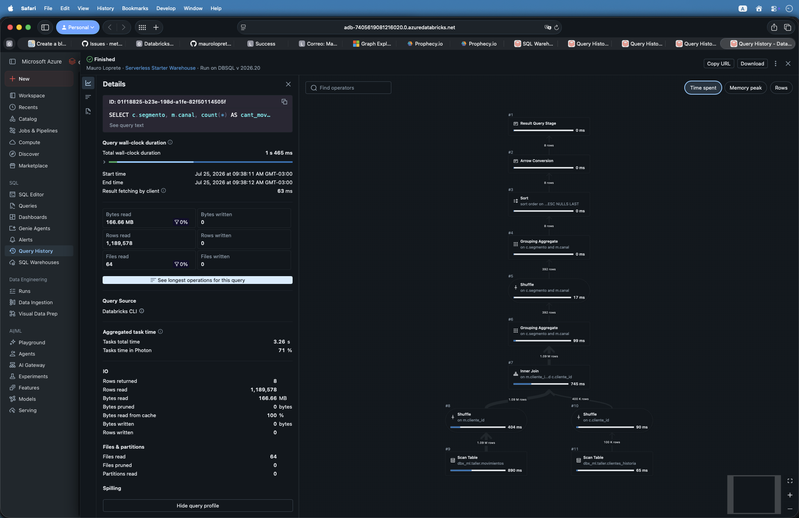
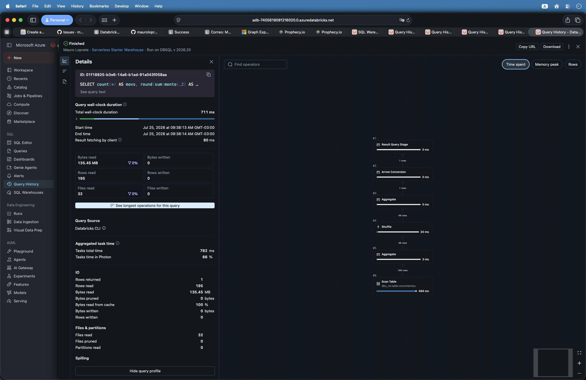
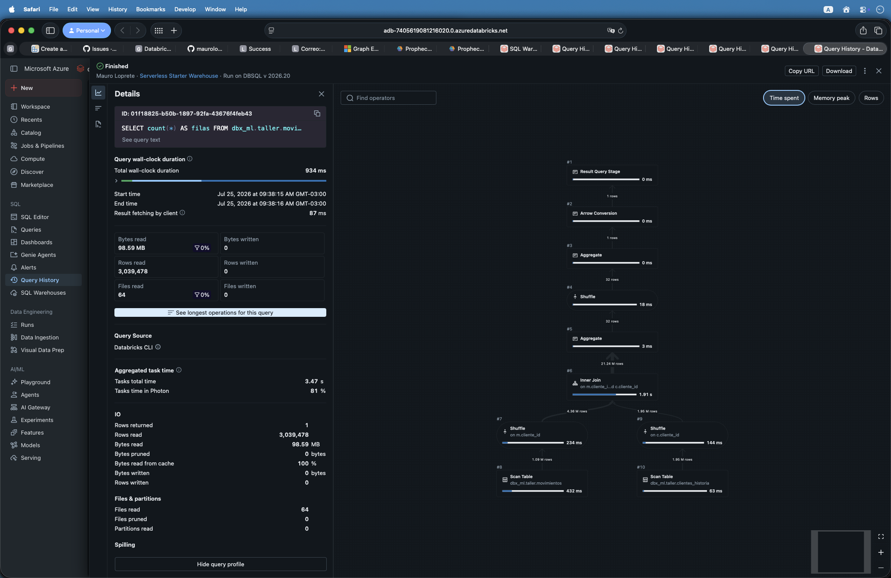

##  {data-background-color="#1e293b" visibility="uncounted"}

:::: {style="color: white; text-align: center; margin-top: 2em;"}
[Buenas prácticas de datos]{style="color: #94a3b8; font-size: 1.1em; display: block;"}

[El **Query Profile**]{style="font-size: 2.2em; font-weight: 700; letter-spacing: -0.02em; line-height: 1.1;"}

[Qué hizo tu query de verdad]{style="color: #FFA166; font-size: 1.2em; display: block; margin-top: 0.4em;"}

::: {style="margin-top: 1.5em; padding-top: 1em; border-top: 1px solid rgba(148,163,184,0.3);"}
[Taller semanal · Sesión 1]{style="color: #94a3b8; font-size: 0.8em;"}

[Mauro Loprete]{style="color: #cbd5e1; font-size: 0.9em; display: block; margin-top: 0.3em;"}
:::
::::

::: notes
Arranque de la serie. La idea de hoy: que todos salgan sabiendo abrir el Query Profile y encontrar el operador que se lleva el tiempo. Nada más.
:::

## Por qué este taller

- Todos escribimos SQL: en **Prophecy**, en dbt, en el editor de Databricks
- Ese SQL corre en Databricks, y ahí hay cosas que **no se ven desde Prophecy**
- Una query lenta o un warehouse saturado casi siempre viene de **cómo está escrita la query** o de **cómo están guardados los datos**

. . .

> Nada de esto se arregla adivinando: hay que mirar qué ejecutó Databricks.

::: notes
La idea es agarrar casos nuestros, reales, y entender qué pasa abajo. Prophecy nos abstrae mucho, y eso está bien para producir rápido, pero cuando algo anda lento nadie sabe dónde mirar. Eso es lo que vamos a resolver.
:::

## La serie

| Sesión      | Tema                                                 |
|-------------|------------------------------------------------------|
| **1 (hoy)** | El Query Profile: leer qué hizo tu query             |
| **2**       | Queries mal optimizadas: los patrones que más duelen |
| **3**       | Window functions: potencia y costo                   |
| **4**       | Liquid Clustering: ordenar los datos para leer menos |

. . .

Cada sesión: **un tema, casos que fui viendo con ustedes, algo para probar en la semana**.

::: notes
Mostrar el plan completo para que se vea que hay un hilo: primero aprendemos a diagnosticar (hoy), después vemos los patrones de queries problemáticas, después una herramienta que usamos mal o de menos (window functions), y cerramos con optimización de layout de datos.
:::

##  {data-background-color="#dc2626"}

::: {style="color: white; text-align: center;"}
[**1**]{style="font-size: 3em; opacity: 0.4;"}

### De Prophecy a los archivos

[Qué corre abajo cuando ejecutás]{style="font-size: 0.9em;"}
:::

## De Prophecy a Databricks

1.  **Prophecy** genera un proyecto **dbt**: cada "pipeline" visual es SQL versionado
2.  Ese SQL se ejecuta en un **SQL Warehouse**: el cómputo de Databricks para queries SQL
3.  Las tablas viven en **Delta Lake**: archivos Parquet más un log de transacciones
4.  El motor que ejecuta es **Photon**: procesa columnas en bloque, no fila por fila

. . .

> Vos escribís (o dibujás) la query. Databricks decide **el plan**: en qué orden filtrar, unir y agregar. El Query Profile muestra ese plan, ejecutado, con números reales.

::: notes
Vocabulario mínimo para toda la serie, sin entrar en detalle: dbt es la capa de SQL versionado que genera Prophecy, SQL Warehouse es el cómputo, Delta Lake es el formato de las tablas, Photon es el motor. La idea clave está en la cita: entre tu SQL y los datos hay un plan de ejecución que decide el motor, y ese plan es lo que vamos a aprender a leer.
:::

##  {data-background-color="#593196"}

::: {style="color: white; text-align: center;"}
[**2**]{style="font-size: 3em; opacity: 0.4;"}

### El monitor

[Query History y Query Profile]{style="font-size: 0.9em;"}
:::

## Query History: todo queda registrado

En el menú lateral de Databricks: **SQL → Query History**

- **Todas** las queries que corrieron contra un SQL Warehouse
- Venga de **Prophecy, de un job de dbt o del editor SQL**: todo aparece acá
- Filtros por usuario, warehouse, duración, estado y fecha
- Ordenás por duración y arriba quedan las que hay que mirar primero

. . .

> Cuando algo anda lento, lo primero es abrir Query History y ver qué pasó. Por ahí empieza cualquier diagnóstico.

::: notes
Demo en vivo acá: abrir Query History del workspace, filtrar por el warehouse del equipo, ordenar por duración descendente. Mostrar que las queries de los jobs de Prophecy aparecen con su statement completo. Elegir una query lenta conocida para usar en la siguiente sección.
:::

## Query Profile

Click en una query → **Query Profile**. Tres partes:

1.  **Resumen**: cuánto tardó y en qué se fue el tiempo (compilar, encolar, ejecutar)
2.  **Grafo de operadores**: los pasos que ejecutó el motor, conectados
3.  **Métricas por operador**: tiempo, filas, bytes leídos, memoria

::: notes
Las tres zonas se ven en la slide siguiente, que es una captura real. Señalarlas con el mouse antes de pasar a los operadores.
:::

## Así se ve en el workspace

``` sql
SELECT c.segmento, m.canal, count(*) AS cant_movs, round(sum(m.monto), 2) AS total
FROM dbx_ml.taller.movimientos m
JOIN (SELECT cliente_id, segmento FROM dbx_ml.taller.clientes_historia WHERE es_vigente) c
  ON m.cliente_id = c.cliente_id
WHERE m.fecha >= '2024-06-01' AND m.fecha < '2024-07-01'
GROUP BY 1, 2 ORDER BY total DESC
```

{fig-align="center" width="54%"}


##  {data-background-color="#1e293b"}

::: {style="color: white; text-align: center;"}
[**3**]{style="font-size: 3em; opacity: 0.4;"}

### Los operadores

[Scan, Join, Shuffle y compañía]{style="font-size: 0.9em;"}
:::

## Los operadores que vas a ver siempre

| Operador      | Qué hace                                       |
|---------------|------------------------------------------------|
| **Scan**      | Lee los archivos de una tabla Delta            |
| **Filter**    | Aplica el `WHERE`                              |
| **Project**   | Selecciona y calcula columnas                  |
| **Join**      | Une dos fuentes (casi siempre hash join)       |
| **Shuffle**   | Redistribuye filas entre workers por una clave |
| **Aggregate** | El `GROUP BY`: agrupa y calcula                |
| **Sort**      | Ordena filas                                   |
| **Window**    | Funciones de ventana (sesión 3)                |

::: notes
No memorizar: esta tabla va a estar en todas las sesiones. El único no obvio es Shuffle: cuando el motor necesita juntar todas las filas de una misma clave en el mismo worker (para un join o un group by), tiene que mover datos por la red. Es el operador caro por naturaleza, y va a aparecer en casi todos los problemas que veamos.
:::

## Cómo se lee

- El plan se lee **desde los Scan hacia el resultado**
- Cada operador muestra **filas que entran y filas que salen**
- El Query Profile te marca **dónde se fue el tiempo**: buscá el operador que concentra la mayoría

. . .

Tres preguntas, en orden:

1.  ¿**Cuánto leyó** cada Scan? ¿Era necesario leer todo eso?
2.  ¿Algún operador **multiplica filas** en vez de reducirlas?
3.  ¿**Dónde** se concentra el tiempo?

::: notes
Este es el método que quiero que se lleven: tres preguntas, siempre las mismas, siempre en ese orden. Leyó de más, multiplicó filas, o hay un operador cuello de botella. Con esas tres preguntas se diagnostica el 90 por ciento de los casos que vamos a ver en la serie.
:::

## Las 5 señales de alarma

| Señal | Qué significa | Sesión |
|------------------|-----------------------------------|-------------------|
| Files pruned ≈ 0 con filtro selectivo | El layout no ayuda a podar archivos | 4 |
| Filas de salida ≫ filas de entrada en un Join | Claves duplicadas: cartesiano | 2 |
| Spill (disco) \> 0 | No entró en memoria: sort o join gigante | 2 y 3 |
| Un operador con \>80% del tiempo | Ahí está tu problema, no en el resto | hoy |
| Bytes leídos enormes para pocas columnas | `SELECT *` aguas arriba | 2 |

. . .

> Con estas cinco señales alcanza para arrancar: cubren casi todos los problemas que nos vamos a cruzar en el taller.

::: notes
Esta tabla es el mapa de la serie completa: cada señal apunta a una sesión donde la vamos a destripar. Hoy solo las presentamos. Files pruned: cuántos archivos descartó el motor sin leerlos gracias a las estadísticas min y max de cada archivo; si es cero con un filtro selectivo, los datos están desordenados, eso lo vemos en la sesión 4. Spill: cuando un operador se queda sin memoria y escribe a disco, es un orden de magnitud más lento.
:::

## Caso real 1: la query que lee todo

``` sql
SELECT count(*) AS movs, round(sum(monto), 2) AS total
FROM dbx_ml.taller.movimientos
WHERE cliente_id = 12034
```

{fig-align="center" width="46%"}

- Devuelve **195 filas** de un solo cliente, y para eso leyó **los 32 archivos** de la tabla: **files pruned 0**
- El filtro está bien escrito; por qué no pudo podar lo vemos en la sesión 4

::: notes
Query real del sandbox: dbx_ml.taller.movimientos filtrando cliente_id = 12034, etiqueta \[TALLER S1/S4\] en Query History. El filtro está bien escrito y aun así el Scan no descartó ningún archivo, porque los datos están desordenados: cada archivo contiene clientes de todo el rango. Dejar planteada la pregunta de por qué el motor no pudo podar, sin responderla: es el gancho para las sesiones 2 (filtros que no podan) y 4 (layout).
:::

## Caso real 2: el join que multiplica

``` sql
SELECT count(*) AS filas
FROM dbx_ml.taller.movimientos m
JOIN dbx_ml.taller.clientes_historia c ON m.cliente_id = c.cliente_id
WHERE m.fecha >= '2024-06-01' AND m.fecha < '2024-07-01'
```

{fig-align="center" width="46%"}

- Al Join entran **1,1 millones** de movimientos y salen **21,2 millones** de filas
- Cuando un join devuelve 20 veces lo que entró, **hay claves duplicadas** en algún lado

::: notes
Caso real del sandbox: movimientos de un mes contra dbx_ml.taller.clientes_historia, que tiene una fila por cliente y por versión. Etiqueta \[TALLER S1\] join que multiplica. La aritmética simple para el equipo: entran 1,1 millones de movimientos y cada uno matchea las \~20 versiones de su cliente, salen 21,2 millones. Eso casi nunca es intencional: es grano duplicado. El fix completo lo vemos en la sesión 2.
:::

## Un detalle: Photon no siempre puede

- Photon es el motor rápido, pero **no soporta todas las operaciones**
- Cuando encuentra algo que no soporta (una UDF, por ejemplo), esa parte **cae al motor clásico de Spark**: más lento, y **sin avisar**
- En el Query Profile se ve **qué porcentaje corrió en Photon**

. . .

> Si una query venía rápida y de golpe es lenta, revisá si algo la sacó de Photon.

::: notes
UDF: función definida por el usuario, código propio en Python o Scala que el motor no puede vectorizar. No profundizar hoy, solo dejar instalado que el porcentaje de Photon es una métrica a mirar cuando algo se degrada sin explicación.
:::

## Para esta semana

1.  Abrí **Query History** y filtrá por el job de tu pipeline
2.  Encontrá **tu query más lenta** de la semana
3.  Abrí el Query Profile y respondé las tres preguntas:
    - ¿Cuánto leyó? ¿Algo multiplicó filas? ¿Dónde se fue el tiempo?
4.  **Traé el caso la próxima sesión**: los mejores los vemos entre todos

. . .

> No hay que arreglar nada todavía. Solo mirar y contar qué encontraste.

::: notes
La tarea es deliberadamente chica: un solo profile, tres preguntas, sin arreglar nada. El objetivo de la semana es que pierdan el miedo a abrir la herramienta. Los casos que traigan alimentan la sesión 2, que es justamente sobre los patrones de queries mal optimizadas.
:::

##  {data-background-color="#1e293b"}

:::: {style="color: white; text-align: center; margin-top: 2em;"}
[Próxima sesión]{style="color: #94a3b8; font-size: 0.9em; display: block;"}

[**Queries mal optimizadas**]{style="font-size: 1.8em; font-weight: 700;"}

[SELECT \*, filtros que no podan, joins explosivos y otros clásicos]{style="color: #94a3b8; font-size: 0.9em; display: block; margin-top: 0.6em;"}

::: {style="margin-top: 2em; padding-top: 1em; border-top: 1px solid rgba(148,163,184,0.3);"}
[¿Preguntas? · Mauro Loprete]{style="color: #cbd5e1; font-size: 0.8em;"}
:::
::::
