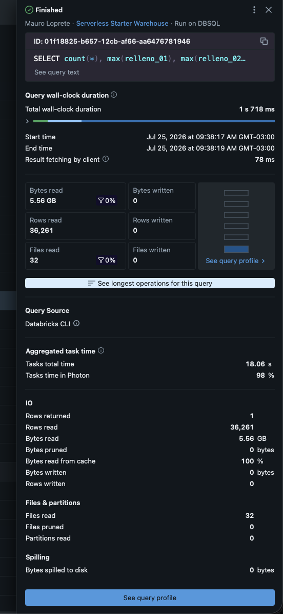
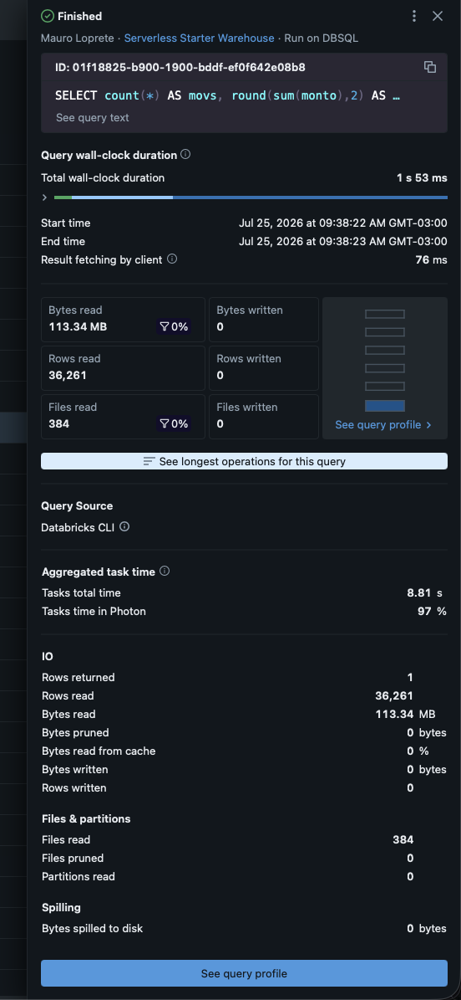
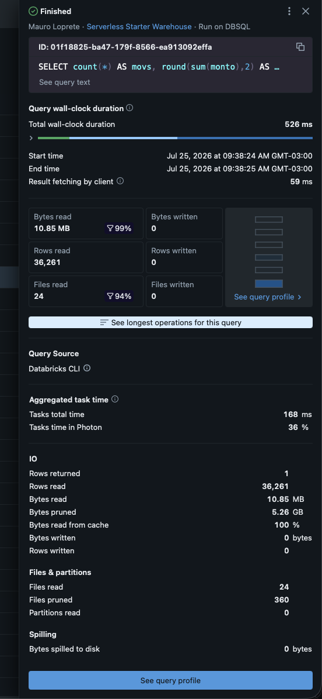
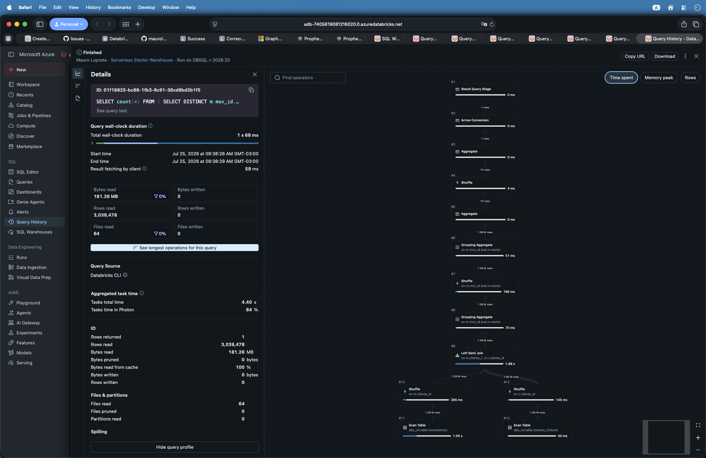

##  {data-background-color="#1e293b" visibility="uncounted"}

:::: {style="color: white; text-align: center; margin-top: 2em;"}
[Buenas prácticas de datos]{style="color: #94a3b8; font-size: 1.1em; display: block;"}

[**Queries mal optimizadas**]{style="font-size: 2.2em; font-weight: 700; letter-spacing: -0.02em; line-height: 1.1;"}

[Los patrones que más duelen]{style="color: #FFA166; font-size: 1.2em; display: block; margin-top: 0.4em;"}

::: {style="margin-top: 1.5em; padding-top: 1em; border-top: 1px solid rgba(148,163,184,0.3);"}
[Taller semanal · Sesión 2]{style="color: #94a3b8; font-size: 0.8em;"}

[Mauro Loprete]{style="color: #cbd5e1; font-size: 0.9em; display: block; margin-top: 0.3em;"}
:::
::::

::: notes
Sesión de patrones: cinco casos, cada uno con la señal en el Query Profile, el porqué y la versión corregida. Si trajeron casos de la tarea de la semana pasada, usarlos acá: un caso propio vale más que cinco de diapositiva.
:::

## Recap de la sesión 1

- **Query History**: todo lo que corre contra un warehouse queda registrado
- **Query Profile**: el plan ejecutado, con números reales por operador
- Las tres preguntas: ¿cuánto **leyó**?, ¿algo **multiplicó filas**?, ¿dónde se fue el **tiempo**?

. . .

> Hoy: los cinco patrones que explican la mayoría de los profiles feos.


##  {data-background-color="#dc2626"}

::: {style="color: white; text-align: center;"}
[**1**]{style="font-size: 3em; opacity: 0.4;"}

### SELECT \*

[Pagás por columnas que no usás]{style="font-size: 0.9em;"}
:::

## Por qué duele: el formato es columnar

- Delta Lake guarda los datos **por columna**, no por fila
- Si tu query pide 4 columnas, el motor lee **solo esas 4** del disco
- Con `SELECT *` leés **todas**: en una tabla ancha, eso es pagar 10 veces más por lo mismo

. . .

**Señal en el profile**: bytes leídos enormes en el Scan para una query que al final usa pocas columnas.

::: notes
Este es el patrón más común con Prophecy: cada paso arrastra todas las columnas por las dudas. La explicación de columnar es la clave para que el equipo entienda que no es una regla de estilo, es plata: bytes leídos es una de las variables que más pesa en el costo del warehouse.
:::

## SELECT \* en cadena

``` sql
-- Modelo intermedio: arrastra TODO
WITH movimientos AS (
  SELECT * FROM bronze.movimientos      -- 80 columnas
),
enriquecido AS (
  SELECT * FROM movimientos m
  JOIN dim.clientes c ON m.cliente_id = c.cliente_id
)
SELECT cliente_id, fecha, monto        -- usás 3
FROM enriquecido
```

. . .

``` sql
-- Proyectar temprano: el Scan lee 3 columnas, no 80
WITH movimientos AS (
  SELECT cliente_id, fecha, monto
  FROM bronze.movimientos
)
...
```

::: notes
Matiz honesto: dentro de una misma query, el optimizador muchas veces poda columnas solo. El problema real es cuando el SELECT \* queda materializado en un modelo intermedio de dbt o en un paso de Prophecy que escribe tabla: ahí las 80 columnas se escriben y se vuelven a leer en cada modelo de abajo. La regla práctica: en cada paso que persiste datos, proyectar solo lo que los pasos siguientes necesitan.
:::

## La señal, medida

``` sql
-- Izquierda: leer todas las columnas          -- Derecha: solo lo necesario
SELECT count(*), max(relleno_01), /* ... */    SELECT count(*), max(monto)
       max(relleno_16), max(canal), max(monto)
FROM dbx_ml.taller.movimientos WHERE fecha = DATE'2024-06-15'
```

::::: columns
::: {.column width="50%"}
{fig-align="center" height="370"}
:::

::: {.column width="50%"}
{fig-align="center" height="370"}
:::
:::::

Misma tabla, mismo filtro, mismas 36.261 filas: **5,56 GB vs 103 MB** leídos y **18 s vs 0,7 s** de CPU.

::: notes
Capturas reales del sandbox del taller: dbx_ml.taller.movimientos, 20 millones de filas y 21 columnas. Izquierda: leyendo todas las columnas, 5,56 gigas. Derecha: proyectando solo lo necesario, 103 megas, 54 veces menos. La tabla es columnar: las columnas que no pedís no se leen del disco. En vivo: Query History, etiquetas \[TALLER S2 P1\].
:::

##  {data-background-color="#593196"}

::: {style="color: white; text-align: center;"}
[**2**]{style="font-size: 3em; opacity: 0.4;"}

### Filtros que no podan

[El WHERE que obliga a leer todo]{style="font-size: 0.9em;"}
:::

## Data skipping: podar sin leer

- Delta guarda **estadísticas min y max por archivo** para cada columna
- Con `WHERE fecha = '2026-08-01'`, el motor descarta los archivos cuyo rango no incluye esa fecha: **eso es files pruned**
- Pero si envolvés la columna en una **función**, el motor ya no puede comparar contra las estadísticas

``` sql
-- No poda: la función tapa la columna
WHERE DATE_FORMAT(fecha_hora, 'yyyy-MM-dd') = '2026-08-01'

-- Poda: la columna queda limpia, comparás por rango
WHERE fecha_hora >= '2026-08-01'
  AND fecha_hora <  '2026-08-02'
```

::: notes
La regla nemotécnica: la columna del filtro va sola de un lado de la comparación, las funciones se aplican del lado del valor. Cualquier transformación sobre la columna, casteos, upper, date_format, substring, rompe la comparación contra las estadísticas min y max. La señal en el profile es la de la sesión 1: filtro selectivo con files pruned en cero.
:::

## Variantes del mismo problema

``` sql
-- Cast sobre la columna
WHERE CAST(cliente_id AS STRING) = '12034'
-- Mejor: comparar con el tipo real
WHERE cliente_id = 12034

-- Función de texto sobre la columna
WHERE UPPER(canal) = 'WEB'
-- Mejor: normalizar el dato al escribirlo, no al leerlo
WHERE canal = 'web'
```

. . .

> Si el dato necesita limpieza para poder filtrarlo, la limpieza va **una vez al escribir**, no en cada query que lee.

::: notes
El segundo ejemplo abre una conversación de calidad de datos: si canal viene con mayúsculas mezcladas, el problema es de la capa de ingesta, no de cada consumidor. Normalizar al escribir es una buena práctica de pipeline, no solo de performance.
:::

## La señal, medida

``` sql
SELECT count(*) AS movs, round(sum(monto), 2) AS total
FROM dbx_ml.taller.movimientos_liquid
WHERE date_format(fecha, 'yyyy-MM-dd') = '2024-06-15'   -- izquierda: no poda
WHERE fecha = DATE'2024-06-15'                          -- derecha: poda casi todo
```

::::: columns
::: {.column width="50%"}
{fig-align="center" height="380"}
:::

::: {.column width="50%"}
{fig-align="center" height="380"}
:::
:::::

Misma query: con la función encima, **384 archivos leídos y 0 podados**; con el filtro limpio, **24 leídos y 360 podados**.

::: notes
Capturas reales del sandbox sobre dbx_ml.taller.movimientos_liquid, que está clusterizada por fecha: por eso el filtro limpio poda el 94 por ciento de los archivos. La versión con date_format encima de la columna lee la tabla entera, 113 megas contra 10,8, y usa 50 veces más CPU: 8,8 segundos contra 0,17. Etiquetas \[TALLER S2 P2\] en Query History.
:::

##  {data-background-color="#1e293b"}

::: {style="color: white; text-align: center;"}
[**3**]{style="font-size: 3em; opacity: 0.4;"}

### El join explosivo

[Cuando la granularidad es incorrecta]{style="font-size: 0.9em;"}
:::

## Claves duplicadas multiplican filas

``` sql
SELECT m.*, c.segmento
FROM movimientos m
LEFT JOIN clientes_historia c
  ON m.cliente_id = c.cliente_id
```

- `clientes_historia` tiene **una fila por cliente y por versión** (historia completa)
- Cada movimiento matchea **todas las versiones** del cliente: 1M de movimientos → 20M de filas
- **Señal en el profile**: el Join saca muchas más filas de las que entran

. . .

``` sql
-- Fijar el grano antes del join: una fila por cliente
LEFT JOIN (
  SELECT cliente_id, segmento
  FROM clientes_historia
  WHERE es_vigente = true
) c ON m.cliente_id = c.cliente_id
```

::: notes
El ejemplo con tabla de historia es deliberado: es el caso más común en equipos que manejan dimensiones historizadas. La pregunta que hay que hacerse antes de todo join: cuál es el grano de cada lado, una fila por qué cosa. Si la respuesta no es clara, el join va a sorprender.
:::

## Que la granularidad sea una **garantía**, no una suposición

En dbt (y por lo tanto en Prophecy) el grano se **declara y se testea**:

``` yaml
models:
  - name: clientes_vigentes
    columns:
      - name: cliente_id
        data_tests:
          - unique
          - not_null
```

. . .

- El test corre en cada ejecución: si aparece un duplicado, **falla el pipeline**, no el job
- Un join contra una tabla con `unique` testeado **no puede explotar** por ese lado

::: notes
Conectar con el flujo que ya usan: Prophecy genera proyectos dbt, y dbt tiene tests de esquema nativos. La idea de contrato es potente: el test de unicidad convierte una suposición implícita, esta tabla tiene una fila por cliente, en una garantía que se verifica en cada corrida. Vale la pena mostrar dónde se configura en la interfaz de Prophecy si da el tiempo.
:::

##  {data-background-color="#dc2626"}

::: {style="color: white; text-align: center;"}
[**4**]{style="font-size: 3em; opacity: 0.4;"}

### Filtrar tarde

[El optimizador no ve a través de las tablas]{style="font-size: 0.9em;"}
:::

## Cada tabla materializada corta la optimización

- Dentro de **una** query, el optimizador empuja los filtros hacia abajo solo
- Pero cuando un modelo **escribe una tabla** y otro la lee, son **queries separadas**: el filtro del modelo 3 no le llega al Scan del modelo 1

``` text
modelo_1: lee 500M de movimientos (histórico completo)   ← acá se paga
modelo_2: enriquece esos 500M con 4 joins                ← y acá
modelo_3: WHERE fecha >= '2026-01-01'  → quedan 30M      ← el filtro llegó tarde
```

. . .

> El filtro va en el **primer modelo que toca la tabla grande**, no tres modelos después.

::: notes
Este es el patrón más caro y el más invisible, porque cada modelo por separado se ve razonable. Solo se detecta mirando el pipeline completo: cuántas filas procesa cada paso contra cuántas sobreviven al final. En pipelines visuales es facilísimo que pase: se encadenan pasos y el filtro queda donde a alguien le resultó cómodo ponerlo, no donde corresponde.
:::

## La versión incremental

Si el pipeline corre todos los días, ¿hace falta reprocesar **todo el histórico** cada vez?

``` sql
-- Modelo incremental en dbt: solo lo nuevo
{{ config(materialized='incremental') }}

SELECT ...
FROM bronze.movimientos

WHERE fecha >= (SELECT MAX(fecha) FROM {{ this }})

```

- Primera corrida: procesa todo. Las siguientes: **solo lo nuevo**
- Prophecy lo soporta: es la materialización **incremental** de dbt

::: notes
No profundizar en las estrategias de merge hoy, solo instalar la pregunta: cada vez que un pipeline diario reprocesa años de historia para producir el mismo resultado que ayer más un día, hay un incremental esperando a ser configurado. Si genera interés, es candidato firme a sesión propia de la serie.
:::

##  {data-background-color="#593196"}

::: {style="color: white; text-align: center;"}
[**5**]{style="font-size: 3em; opacity: 0.4;"}

### DISTINCT como parche

[Tapar el síntoma sale caro]{style="font-size: 0.9em;"}
:::

## El combo join explosivo + DISTINCT

``` sql
SELECT DISTINCT m.mov_id, m.monto, c.segmento
FROM movimientos m
JOIN clientes_historia c ON m.cliente_id = c.cliente_id
```

Lo que ejecuta el motor:

1.  El join **explota** filas (patrón 3): 1M → 20M
2.  El `DISTINCT` agrupa **las 20M** para volver a 1M: shuffle y aggregate gigantes, y ahí suele aparecer el **spill**

. . .

> Pagaste dos veces: una por explotar, otra por desexplotar. El fix del patrón 3 (arreglar el grano) hace ambas cosas gratis.

::: notes
El DISTINCT que hace falta de verdad es rarísimo en modelos bien granados. Cuando aparezca uno en un code review, la pregunta automática es: qué duplicado está tapando. Mención rápida al ORDER BY en modelos intermedios, que es el otro parche caro: las tablas no garantizan orden, así que ordenar al escribir es puro costo de sort global; el orden va en la query final o en el dashboard.
:::

## El combo, visto en el profile

``` sql
SELECT count(*) FROM (
  SELECT DISTINCT m.mov_id, m.monto
  FROM dbx_ml.taller.movimientos m
  JOIN dbx_ml.taller.clientes_historia c ON m.cliente_id = c.cliente_id
  WHERE m.fecha >= '2024-06-01' AND m.fecha < '2024-07-01'
)
```

{fig-align="center" width="44%"}

- El Join **explota** a 21,2 millones de filas y el Aggregate del `DISTINCT` las vuelve a comprimir
- Todo ese trabajo para volver al **1,1 millón** que ya tenías antes del join

::: notes
Profile real del sandbox, etiqueta \[TALLER S2 P5\]. Mostrar el grafo: el ancho del flujo entre el Join y el Aggregate es el costo de tapar el síntoma. Comparar en vivo con la versión de grano arreglado, etiqueta \[TALLER S2 P3\], que devuelve exactamente las mismas filas sin la doble pasada.
:::

## El checklist de la sesión

| Antes de mandar el PR | Patrón |
|----------------------------------------------------|--------------------|
| ¿Proyecto solo las columnas que necesito? | 1 |
| ¿Mis filtros dejan la columna limpia (sin funciones encima)? | 2 |
| ¿Sé la granularidad de cada lado de cada join? ¿Está testeado con `unique`? | 3 |
| ¿Filtro en el primer modelo que toca la tabla grande? | 4 |
| ¿Ese DISTINCT tapa un duplicado que debería arreglar? | 5 |


## Para esta semana

1.  Agarrá **un pipeline tuyo** que corra a diario
2.  Pasale el checklist de los 5 patrones
3.  Si encontrás uno: **arreglalo y compará el antes y el después** en el Query Profile
4.  Traé los números: duración, bytes leídos, filas por operador

. . .

> Un solo patrón arreglado con evidencia vale más que los cinco anotados.

::: notes
Esta semana ya hay acción, no solo observación. Pedir el antes y el después con números concretos: esas capturas van a servir además para armar el caso interno de por qué estas prácticas importan, con ahorros medidos en el propio workspace.
:::

##  {data-background-color="#1e293b"}

:::: {style="color: white; text-align: center; margin-top: 2em;"}
[Próxima sesión]{style="color: #94a3b8; font-size: 0.9em; display: block;"}

[**Window functions**]{style="font-size: 1.8em; font-weight: 700;"}

[La herramienta más potente que estamos subusando (y cómo no pagarla cara)]{style="color: #94a3b8; font-size: 0.9em; display: block; margin-top: 0.6em;"}

::: {style="margin-top: 2em; padding-top: 1em; border-top: 1px solid rgba(148,163,184,0.3);"}
[¿Preguntas? · Mauro Loprete]{style="color: #cbd5e1; font-size: 0.8em;"}
:::
::::
