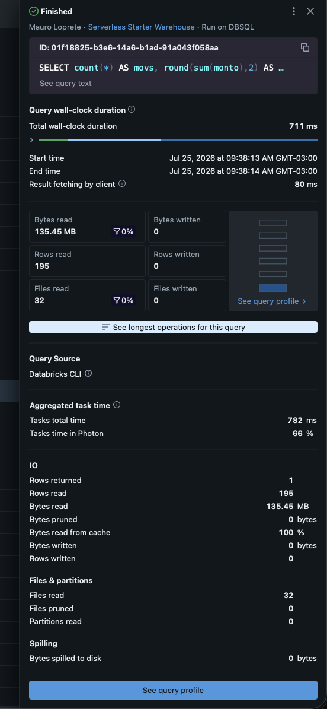

##  {data-background-color="#1e293b" visibility="uncounted"}

:::: {style="color: white; text-align: center; margin-top: 2em;"}
[Buenas prácticas de datos]{style="color: #94a3b8; font-size: 1.1em; display: block;"}

[**Liquid Clustering**]{style="font-size: 2.2em; font-weight: 700; letter-spacing: -0.02em; line-height: 1.1;"}

[Cuando el problema no es la query: es cómo están guardados los datos]{style="color: #FFA166; font-size: 1.1em; display: block; margin-top: 0.4em;"}

::: {style="margin-top: 1.5em; padding-top: 1em; border-top: 1px solid rgba(148,163,184,0.3);"}
[Taller semanal · Sesión 4]{style="color: #94a3b8; font-size: 0.8em;"}

[Mauro Loprete]{style="color: #cbd5e1; font-size: 0.9em; display: block; margin-top: 0.3em;"}
:::
::::

::: notes
Cierre de la serie. Hasta ahora todo fue arreglar queries; hoy es el caso donde la query está bien y el problema es el layout físico de la tabla. Retomamos la señal que dejamos abierta en la sesión 1: filtro selectivo con files pruned en cero.
:::

## La señal que venimos arrastrando

Desde la sesión 1, en la tabla de alarmas:

> **Files pruned ≈ 0 con filtro selectivo** → el layout no ayuda a podar archivos

- La query filtra por `cliente_id` y devuelve 200 filas
- Pero el Scan leyó **todos** los archivos de la tabla
- El filtro está **bien escrito** (sesión 2): la columna limpia, sin funciones encima

. . .

Hoy: por qué pasa, y qué se hace.

::: notes
Si alguien trajo un caso así en las tareas de las semanas anteriores, este es el momento de proyectarlo. La condición para esta sesión: primero descartar los patrones de la sesión 2. Si el filtro tiene una función encima, no es un problema de layout, es la sesión 2.
:::

## El experimento del taller

``` sql
SELECT count(*) AS movs, round(sum(monto), 2) AS total
FROM dbx_ml.taller.movimientos          -- izquierda: sin clustering
FROM dbx_ml.taller.movimientos_liquid   -- derecha: CLUSTER BY (cliente_id, fecha)
WHERE cliente_id = 12034
```

::::: columns
::: {.column width="50%"}
{fig-align="center" height="380"}
:::

::: {.column width="50%"}
{fig-align="center" height="380"}
:::
:::::

Misma query, mismos datos, **mismas 195 filas de respuesta**: sin clustering lee **135 MB y poda 0**; con Liquid lee **8 MB y poda 368 de 384 archivos**.

::: notes
Las dos tablas del sandbox: dbx_ml.taller.movimientos sin clustering y movimientos_liquid con CLUSTER BY cliente_id y fecha. La query filtra cliente_id = 12034. A la izquierda files pruned 0; a la derecha files pruned 368 y bytes pruned 5,37 gigas, con 95 por ciento del tiempo en Photon. Este es el after que vamos a construir en el resto de la sesión. Etiquetas \[TALLER S1/S4\] y \[TALLER S4\] en Query History.
:::

## Por qué el motor no puede podar

- Delta guarda **estadísticas min y max por archivo** (sesión 2)
- Si los datos llegaron **en orden de llegada**, cada archivo tiene clientes mezclados: el rango de `cliente_id` de **cada archivo cubre casi todo**
- El filtro pregunta "¿puede estar el cliente 12034 acá?" y **todos los archivos responden que sí**

. . .

``` text
archivo_1: cliente_id entre 3     y 99871   ← puede estar acá
archivo_2: cliente_id entre 11    y 99904   ← y acá
archivo_3: cliente_id entre 7     y 99899   ← y acá... se lee todo
```

> Las estadísticas están, pero **no discriminan**. El problema es físico: los datos están desordenados.

::: notes
Este es el concepto central de la sesión: data skipping funciona solo si los rangos de los archivos son angostos. El diagrama de los tres archivos con rangos casi idénticos suele ser el momento en que hace click. Contrastar mentalmente con el mundo ideal: si los archivos estuvieran ordenados por cliente, cada uno tendría un rango angosto y el filtro descartaría casi todos.
:::

## Cómo se arreglaba esto antes

Dos técnicas venían a resolver el mismo problema, cada una con su peaje:

- **Particionado Hive-style**: una carpeta por cada valor de la clave (`fecha=2024-01-15/`)
  - Solo rendía en tablas grandes: la guía clásica pedía **más de 1 TB** y particiones de **al menos 1 GB**
  - Alta cardinalidad prohibida (una carpeta por `cliente_id` son miles de carpetas con archivos chiquitos), y si elegiste mal la clave: **reescribir toda la tabla**
- **Z-ORDER**: `OPTIMIZE tabla ZORDER BY (cliente_id)` agrupa los valores cercanos de varias columnas en los mismos archivos
  - Mejoraba la poda, pero era un **job a mano** que había que correr cada vez que entraban datos
  - No es incremental: para incorporar un lote nuevo **reescribe casi toda la tabla**

. . .

> El orden se lograba, pero pagando mantenimiento manual para siempre. Eso es lo que viene a jubilar Liquid Clustering.

::: notes
Contexto para quien venga de otros stacks: el particionado clásico es el de Hive y el Spark de hace diez años, y Z-ORDER fue el parche de Delta para agrupar por columnas de alta cardinalidad sin explotar en carpetas. Las dos convivían: el combo típico de la época era particionar por fecha y correr Z-ORDER adentro de cada partición. La regla del terabyte explica por qué particionar la mayoría de nuestras tablas nunca tuvo sentido. Si en el inventario del equipo aparecen tablas particionadas viejas o jobs de OPTIMIZE ZORDER agendados, son candidatos directos a migrar.
:::

##  {data-background-color="#dc2626"}

::: {style="color: white; text-align: center;"}
[**1**]{style="font-size: 3em; opacity: 0.4;"}

### Liquid Clustering

[Ordenar los archivos según cómo consultás]{style="font-size: 0.9em;"}
:::

## Qué es

- Reorganiza físicamente los archivos de la tabla según **clustering keys** que definís
- Con los archivos agrupados por esas claves, los rangos min y max **se vuelven angostos** → el data skipping empieza a funcionar
- **Reemplaza** a las dos técnicas viejas, y **no se combina** con ellas: es una cosa o la otra
- Lo que ninguna de las dos tenía:
  - Las claves se pueden **cambiar sin reescribir** los datos existentes
  - El mantenimiento es **incremental**: cada `OPTIMIZE` ordena solo lo que falta, no reescribe la tabla como Z-ORDER

. . .

> Databricks lo recomienda hoy para **todas las tablas nuevas**.

::: notes
No entrar en la interna del algoritmo salvo que pregunten: usa curvas de Hilbert, una curva que recorre el espacio multidimensional manteniendo cerca lo que está cerca, y cada OPTIMIZE agrupa archivos ya clusterizados para no reescribirlos de nuevo. El mensaje ejecutivo es la comparación con particionado y Z-ORDER: mismas metas, sin la rigidez ni el mantenimiento manual.
:::

## Cómo se usa

``` sql
-- Tabla nueva
CREATE TABLE plata.movimientos (
  mov_id BIGINT, cliente_id BIGINT, fecha DATE, monto DECIMAL(18,2)
)
CLUSTER BY (cliente_id, fecha);

-- Tabla existente
ALTER TABLE plata.movimientos CLUSTER BY (cliente_id, fecha);

-- Reorganizar: el clustering es INCREMENTAL, esto lo dispara
OPTIMIZE plata.movimientos;

-- Primera vez o cambio de claves: forzar el recluster completo
OPTIMIZE plata.movimientos FULL;
```

. . .

> Gotcha número 1: `ALTER TABLE ... CLUSTER BY` **no reordena nada por sí solo**. Sin el `OPTIMIZE FULL` inicial, el histórico queda como estaba.

::: notes
El gotcha del OPTIMIZE FULL es el error más común al adoptar liquid clustering: se habilita, no se nota mejora, se concluye que no sirve. Habilitar solo define las claves para los datos nuevos; el histórico se reordena recién con OPTIMIZE FULL, que está disponible en runtimes recientes. Si el workspace tiene predictive optimization activo, Databricks corre los OPTIMIZE solo, y los jobs de OPTIMIZE programados a mano pasan a sobrar. Detalle si preguntan por el costo de los OPTIMIZE: en Databricks los lotes grandes ya se clusterizan al escribir, lo que llaman eager clustering; el umbral depende de la cantidad de claves, arranca en 64 MB con una clave en tablas gestionadas de Unity Catalog. Los lotes chicos entran desordenados y los levanta el próximo OPTIMIZE, que por eso suele tener poco trabajo. Y si preguntan qué hace OPTIMIZE en una tabla sin clustering: compacta archivos chicos hacia el tamaño objetivo (bin-packing), tema que conecta con la sesión de archivos chicos del backlog.
:::

## Cómo elegir las claves

| Criterio | Por qué |
|--------------------------------------|----------------------------------|
| Columnas por las que **filtrás seguido** | Son las que activan la poda |
| **Alta cardinalidad** (ids, timestamps) | Con particiones viejas eran inviables; acá son ideales |
| Hasta **4 claves**, pero **menos suele ser mejor** | En tablas medianas, 2 claves podan mejor que 4 |

. . .

- La evidencia está en **Query History**: ¿por qué columnas filtran de verdad las queries del equipo?
- Existe `CLUSTER BY AUTO`: Databricks elige las claves **según los patrones de consulta**. Requiere tablas gestionadas por Unity Catalog y predictive optimization activo

::: notes
Punto pedagógico fuerte: alta cardinalidad era el criterio prohibido del particionado clásico, un directorio por cliente era un desastre de archivos chicos, y acá es exactamente al revés. La fuente para elegir claves es el propio Query History de la sesión 1: las columnas de filtro reales, no las que suponemos. Sobre AUTO: donde esté disponible es la opción sin mantenimiento; verificar antes qué tablas del equipo son managed de Unity Catalog.
:::

##  {data-background-color="#593196"}

::: {style="color: white; text-align: center;"}
[**2**]{style="font-size: 3em; opacity: 0.4;"}

### En nuestro flujo

[Desde dbt y Prophecy]{style="font-size: 0.9em;"}
:::

## Activarlo desde dbt

El adapter de dbt para Databricks lo expone como config del modelo:

``` yaml
models:
  - name: movimientos
    config:
      liquid_clustered_by: [cliente_id, fecha]
```

O en el propio modelo:

``` sql
{{ config(
    materialized='incremental',
    liquid_clustered_by=['cliente_id', 'fecha']
) }}
```

. . .

> No hace falta salir del flujo de Prophecy y dbt: el clustering queda **declarado en el proyecto**, versionado como todo lo demás.

**Nota:** También se puede y se debe hacer en el contrato.

::: notes
Verificar antes de la sesión la versión del adapter dbt-databricks que usa Prophecy en nuestros proyectos: el config liquid_clustered_by existe desde las versiones 1.6 y el soporte fue mejorando en las siguientes. Hacer la prueba en un modelo de sandbox antes de mostrarlo en vivo. El mensaje importante es el de la cita: la optimización queda en el repo, no es un script suelto que alguien corrió una vez.
:::

## Casos comunes

1.  **Habilitar no reordena**: sin `OPTIMIZE FULL`, el histórico sigue desordenado
2.  **No convive** con particionado clásico ni Z-ORDER: es una cosa o la otra
3.  Sube la **versión de protocolo** de la tabla y **no se puede bajar**: clientes Delta muy viejos pueden dejar de poder leerla
4.  Las claves deben estar entre las columnas **con estadísticas** (por defecto, las primeras 32 de la tabla)
5.  Más claves no es mejor: en tablas medianas, **4 claves podan peor que 2**

::: notes
El gotcha 3 es el único con riesgo real de incidente: si alguna herramienta externa lee las tablas con un cliente Delta viejo, probar en una tabla no crítica primero. El 4 es sutil: si la columna de filtro está más allá de la posición 32, no tiene estadísticas y no puede ser clave sin ajustar la configuración de estadísticas de la tabla.
:::

## El método completo

1.  **Medí** (sesión 1): Query History → Query Profile → las tres preguntas
2.  **Arreglá la query** (sesión 2): columnas, filtros limpios, grano testeado, filtrar temprano
3.  **Usá la herramienta correcta** (sesión 3): window functions donde corresponde, con PARTITION BY sano
4.  **Y si la query está bien y el Scan igual lee todo** (hoy): el problema es el layout → clustering keys según los filtros reales

. . .

> Siempre en ese orden. Clusterizar una tabla para salvar una query mal escrita es esconder el problema.

::: notes
Esta slide es el resumen de toda la serie y el criterio de decisión que quiero que quede: primero medir, después la query, después la herramienta, y recién al final el layout físico. El orden importa porque el clustering es la solución más cara de mantener y la más fácil de usar como excusa para no arreglar el SQL.
:::

## Para esta semana

1.  Buscá en Query History la tabla **más consultada** por el equipo
2.  Anotá **por qué columnas filtran** las queries reales que le pegan
3.  Mirá un Query Profile de esas queries: ¿**files pruned** dice cero?
4.  Si dice cero: armá la propuesta de clustering keys y la charlamos la próxima

. . .

> No clusterices nada todavía: primero la evidencia, después el cambio (y el `OPTIMIZE FULL` se coordina, no se lanza un viernes).

::: notes
Tarea de cierre con entregable concreto: una propuesta de claves con evidencia del Query History. La advertencia del viernes es medio en broma pero real: el OPTIMIZE FULL de una tabla grande consume cómputo en serio y conviene coordinarlo fuera de horario pico del warehouse.
:::

##  {data-background-color="#1e293b"}

:::: {style="color: white; text-align: center; margin-top: 2em;"}
[Fin de la primera vuelta]{style="color: #94a3b8; font-size: 0.9em; display: block;"}

[**¿Y ahora qué?**]{style="font-size: 1.8em; font-weight: 700;"}

[Candidatos para las próximas sesiones: modelos incrementales, MERGE, archivos chicos, caching en warehouses...]{style="color: #94a3b8; font-size: 0.85em; display: block; margin-top: 0.6em; padding: 0 2em;"}

::: {style="margin-top: 2em; padding-top: 1em; border-top: 1px solid rgba(148,163,184,0.3);"}
[¿Preguntas? · Mauro Loprete]{style="color: #cbd5e1; font-size: 0.8em;"}
:::
::::

::: notes
Cierre de la primera vuelta de la serie. Proponer que el backlog de temas lo alimente el equipo: los casos de las tareas semanales son la mejor fuente. Los cuatro candidatos listados salen naturalmente de lo visto: incrementales apareció en la sesión 2, MERGE y archivos chicos aparecen apenas se toca ingesta, y el caching explica misterios de queries que vuelan la segunda vez.
:::

## Referencias {visibility="uncounted"}

- [Use liquid clustering for tables — doc oficial de Databricks](https://docs.databricks.com/aws/en/tables/clustering)
- [Delta Lake Liquid Clustering — blog de delta.io](https://delta.io/blog/liquid-clustering/)
- [Delta Lake Z-Order — blog de delta.io](https://delta.io/blog/2023-06-03-delta-lake-z-order/)
- [Optimizing Delta Tables: OPTIMIZE and Z-Order — Conduktor](https://www.conduktor.io/glossary/optimizing-delta-tables-optimize-and-z-order)
- [Configure Delta Lake to control data file size — doc oficial de Databricks](https://docs.databricks.com/aws/en/delta/tune-file-size)